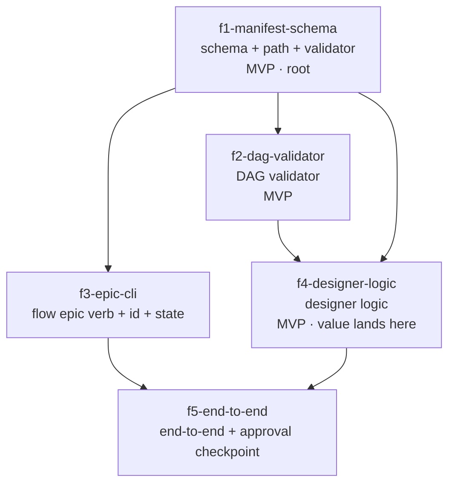

# Epic design — build the epic designer

> **The recursion, made literal.** This is a committed worked example: the
> "build the epic designer" epic decomposed by the very one-shot epic-grain
> designer methodology it documents (`skills/pipeline/product-planning/references/epic-discovery-instructions.md`).
> It is the golden artifact the acceptance test reads — `manifest.json`
> (next to this file) passes both validators (`flow-epic-manifest-schema`
> and `flow-epic-dag`, exit 0), and this `design.md` carries the six numbered
> backbone sections plus an always-present critique layer. If this DAG were a
> flat list, the methodology would have failed
> its own test; it is not — it has a walking-skeleton root, a parallel pair,
> a core-value feature, and a diamond-closing integration.

## 1. Problem & intent

flow can design _one feature_ (`/product-planning`) and execute _one
feature_ (`/flow-pipeline`). It has no way to take a body of work larger
than one PR — an "epic" — and turn it into a reviewed, dependency-ordered
set of PR-sized features. Today the developer decomposes by hand, holds the
sequencing in their head, and runs `flow new` N times in a remembered order.
The underlying need is a **trustworthy decomposition**: one reviewed
high-level design plus a mechanically-validated feature DAG, produced once,
that each existing per-feature pipeline can then build. Orchestrating the
_execution_ of that DAG is explicitly deferred and out of scope — the
designer produces artifacts and stops.

## 2. Clarified requirements

Epic-level, EARS-shaped (`WHEN <trigger> THE SYSTEM SHALL <response>`).
Per-feature acceptance lives in each feature's `acceptanceCriteria[]` in
`manifest.json`.

- **R1** — WHEN the developer runs the designer on an epic prompt THE SYSTEM
  SHALL emit a committed `design.md` and a schema-valid `manifest.json` under
  `.flow/epics/<slug>/`, then stop (no launch, no merge).
- **R2** — WHEN the designer emits a `manifest.json` THE SYSTEM SHALL
  guarantee its feature graph is acyclic and free of orphan dependency edges,
  validated mechanically by `flow-epic-manifest-schema` and `flow-epic-dag`
  (both exit 0), not by inspection.
- **R3** — WHEN the epic prompt contains residual ambiguity THE SYSTEM SHALL
  proceed autonomously (informed assumptions) and surface that ambiguity as
  Open Questions; the materiality-gated clarification round is the caller's
  concern (F5), since a one-shot discovery subagent cannot ask the user.
- **R4** — WHEN the design is emitted THE SYSTEM SHALL present it at an
  approval checkpoint and SHALL NOT proceed to any execution.
- **R5** — WHEN any feature in the manifest is later handed to `flow new` THE
  SYSTEM SHALL have given it a self-contained `description` sufficient to run
  one standard pipeline.

## 3. High-level design

ADR-shaped key decisions (Context / Decision / Consequences). Per `02` §4,
this list of decisions **IS** the Parnas list of likely-to-change decisions
— each volatile decision (each "secret") becomes one feature boundary in §4.
Five decisions, five secrets, five features.

- **D1 — Manifest shape & storage path.** _Context:_ every other piece reads
  or writes the manifest. _Decision:_ a typed `manifest.json` (mirroring
  `bin/lib/state.ts` + the four `*-schema.ts` validators) committed under
  `.flow/epics/<slug>/`. _Consequences:_ the shape is the most-depended-on
  contract, so it is the root feature; changing it later ripples, which is
  exactly why it is hidden behind a schema + validator. → **f1-manifest-schema**
- **D2 — DAG correctness algorithm.** _Context:_ a decomposition is only
  trustworthy if the graph is provably well-formed. _Decision:_ a pure
  Kahn's-algorithm helper (acyclic / orphan / ready-set), unit-tested in
  isolation. _Consequences:_ the graph-theory choice is hidden from
  everything else behind a `--validate` CLI. → **f2-dag-validator**
- **D3 — CLI surface & epic identity.** _Context:_ the designer needs an
  invocation verb and a stable id for the future `run`/`status`. _Decision:_
  a `flow epic` verb (`bin/lib/epic.ts` + `verbs.ts` + dispatch + completion)
  minting an epic-id via the existing `slug.ts`. _Consequences:_ CLI wiring
  and id/state storage are hidden behind one verb module. → **f3-epic-cli**
- **D4 — The design methodology itself.** _Context:_ turning a prompt into
  requirements + design + a decomposition is the actual intelligence.
  _Decision:_ a one-shot epic-grain extension of `/product-planning`'s
  discovery (a sibling `references/epic-discovery-instructions.md` selected
  by a `MODE: epic` flag) implementing `02` §4 pipeline ① — EARS criteria,
  ADR-shaped Parnas decisions, Parnas/Simon vertical-slice decomposition, a
  Mermaid DAG, Open Questions. _Consequences:_ the methodology is the most
  volatile part (it will be tuned often), so it is isolated in one discovery
  surface that emits the stable manifest contract. → **f4-designer-logic**
- **D5 — End-to-end flow & the human checkpoint.** _Context:_ the pieces
  must compose into `flow epic create "<prompt>"` with a review gate.
  _Decision:_ wire CLI → the materiality-gated clarification round
  (`AskUserQuestion`, fired by the caller) → designer → validators-as-gate →
  an `epic-design-pending-review` checkpoint mirroring `plan-pending-review`.
  _Consequences:_ the approval contract is hidden behind the integration
  feature, which closes the DAG. → **f5-end-to-end**

**Why these cuts (Parnas + Simon):** each feature hides exactly one volatile
decision (D1–D5); the edges between them are the _stable_ interfaces (the
manifest shape, the validator CLI, the verb surface). Inter-feature coupling
is sparse by construction — every edge is a concrete produced/consumed
artifact, never a "feels-later."

## 4. Feature decomposition

Five features. Each is one `flow new` pipeline / one PR (a vertical slice
that passes its own gate). For each: the secret it hides, its produced/
consumed dependency edges, and its EARS acceptance criteria (full text in
`manifest.json`). Ids, titles, and edges here match `manifest.json` exactly.

### f1-manifest-schema · Epic manifest schema + path contract + validator — **[MVP · walking-skeleton root]**

- **Secret hidden (D1):** the shape of epic/feature data and where artifacts
  live.
- **Depends on:** nothing (the walking-skeleton root).
- **Produces (edge artifacts consumed downstream):** `bin/lib/epic-manifest-schema.ts`
  (`EpicManifest`/`Feature` types + `isEpicManifest` guard); a bare-name CLI
  validator in `discoverValidators`; the `.flow/epics/<slug>/{design.md,manifest.json}`
  path contract.

### f2-dag-validator · DAG validation helper (acyclic / orphan / ready-set) — **[MVP]**

- **Secret hidden (D2):** the graph algorithm for DAG correctness.
- **Depends on:** **f1-manifest-schema** — _edge artifact: the
  `Feature[]` / `dependsOn` shape it operates over._
- **Produces:** `bin/flow-epic-dag.ts` (cycle / orphan / unique-id /
  self-dep checks + a ready-set; `--validate` exits non-zero naming the
  offending cycle/edge).

### f3-epic-cli · flow epic CLI verb + epic-id + epic state

- **Secret hidden (D3):** CLI invocation surface + epic identity/state
  storage.
- **Depends on:** **f1-manifest-schema** — _edge artifact: the manifest/path
  contract it reads and writes._
- **Produces:** `"epic"` in `verbs.ts`; `bin/lib/epic.ts` (`runEpicCli`
  dispatching `design`/`run`/`status`/`ls`, the latter three loud deferred
  stubs); epic-id minting via `slug.ts`; completion entries.

### f4-designer-logic · Epic-grain designer logic → design.md + manifest.json — **[MVP · first real user value]**

- **Secret hidden (D4):** the design methodology (prompt → requirements →
  design → decomposition → DAG).
- **Depends on:** **f1-manifest-schema** — _edge artifact: it must emit a
  schema-valid manifest;_ and **f2-dag-validator** — _edge artifact: it
  self-checks its own DAG before writing._
- **Produces:** the one-shot epic-grain discovery methodology
  (`references/epic-discovery-instructions.md` + the `MODE: epic` spawn
  branch) that writes a `design.md` (six numbered backbone sections plus an
  always-present critique layer) + a schema-valid `manifest.json`,
  self-validating via both checkers in a fix-and-re-run loop.
- **MVP marker:** **f1 + f2 + f4 is the minimal valuable designer** —
  invokable as a skill, producing a reviewed, validated decomposition,
  before any `flow epic` CLI ergonomics exist.

### f5-end-to-end · flow epic create end-to-end + approval checkpoint

- **Secret hidden (D5):** the end-to-end invocation + the human approval
  contract.
- **Depends on:** **f3-epic-cli** — _edge artifact: the `flow epic create`
  verb entry;_ and **f4-designer-logic** — _edge artifact: the designer that
  produces the artifacts._
- **Produces:** the wiring `flow epic create "<prompt>"` → mint id (f3) →
  fire the materiality-gated clarification round (`AskUserQuestion`, the
  caller's own authorized form) → run designer (f4) → write artifacts → run
  the f1 + f2 validators as a gate → surface `design.md` at an
  `epic-design-pending-review` checkpoint.

## 5. Dependency DAG

- **Topological build order:** `f1 → (f2 ∥ f3) → f4 → f5`. After f1,
  **f2 and f3 are independent and can be built in parallel** (Simon
  near-decomposability: no edge between them).
- **MVP path (thinnest valuable slice):** `f1 → f2 → f4`. Ships a
  manually-invokable designer that produces a reviewed,
  mechanically-validated decomposition. **f3 + f5 add CLI ergonomics and the
  formal checkpoint** — in scope, but the core value lands at f4.
- **DAG well-formedness:** 5 nodes, 6 edges, every `dependsOn` id resolves
  (no orphans), no cycle (the topo order proves it), no node disconnected —
  exactly what `flow-epic-dag` asserts about `manifest.json` (exit 0).

## 6. Open Questions

- **Divergence from `02` §3 (clarification round → caller).** Assumed final:
  the materiality-gated clarification round moves from "the designer" to F5's
  `flow epic create` caller, because a one-shot discovery subagent cannot
  fire `AskUserQuestion`. `02` §3's HYBRID prose is annotated, not rewritten;
  confirm you are content with that relocation.
- **Manifest id form.** Assumed the descriptive ids `03` §B encodes
  (`f1-manifest-schema` … `f5-end-to-end`) rather than the bare `f1..f5`
  shorthand, so this worked example matches the doc it dogfoods. Confirm, or
  prefer the short form.
- **Worked-example slug.** Assumed the deliberate, readable
  `build-the-epic-designer` (matching `epicId`), not `slugify`'s truncated
  output. Confirm the slug.
- **`design.md` requirements granularity.** Assumed epic-level EARS here in
  §2 and per-feature acceptance in each manifest feature's
  `acceptanceCriteria[]`. Confirm the split.

## Recommendation

**Proceed** — the five-feature decomposition has a clean walking-skeleton root
(f1), a genuinely-parallel pair (f2 ∥ f3), the core value landing at f4, and a
diamond-closing integration (f5); the DAG validates (5 nodes, 6 edges, acyclic,
no orphans) and every feature is a vertical slice that passes its own gate.
Build it as scoped.

## Plan risks

The single weakest assumption is that **f2 and f3 are genuinely independent** —
the `f2 ∥ f3` parallel pair assumes no hidden coupling between the DAG validator
and the `flow epic` CLI verb. If f3's verb turns out to need f2's DAG validator
(e.g. to report a ready-set at invocation time), the parallelism collapses: f3
gains a `dependsOn: [f2-dag-validator]` edge and the DAG re-cuts. A
decomposition-grain pre-mortem, not a restatement of the Open Questions above.
