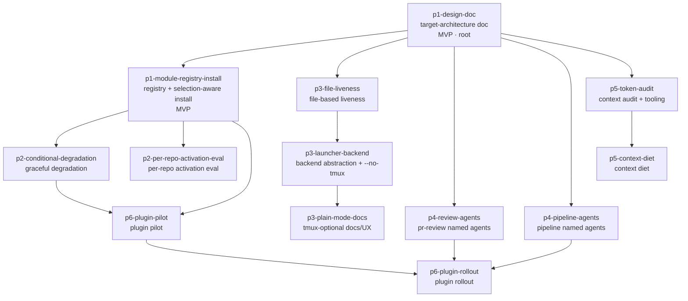

# Epic design — major refactor: flow → modular plugin design

> **Prior art, reused not re-derived.** A completed `/flow-pipeline` discovery
> for this same request produced, in this worktree, a Phase-1-scoped PRD
> (`.flow-tmp/plan.md`) with a design-blind ideal-flow section, a gap-analysis
> table with file evidence, a six-phase roadmap, an AGY-cross-reviewed decision
> analysis (D1 module-layer-now-plugins-later, D2 global-selectable-now,
> D3 tmux-optional-backend-default-on, D4 measure-then-tighten), and a full
> feature-grain task breakdown for Phase 1 — plus web-grounded research
> findings (`.flow-tmp/research-findings.md`). This design treats those
> artifacts as ratified inputs and does only what they did not: the epic-grain
> decomposition of the six-phase roadmap into PR-sized feature nodes with a
> dependency DAG. `.flow-tmp/` is worktree-transient — the first node
> (`p1-design-doc`) lands the durable carrier, `docs/plugin-architecture.md`.

## 1. Problem & intent

flow today is a personal, hard-wired toolchain: `flow install` symlinks all
20 skills, 2 agents, ~40 PATH helpers, and 4 validators globally and
unconditionally — a Go-only user gets the Svelte/Tailwind/Supabase/Cloudflare
skills in every Claude session's routing table, a user without agy inherits
the research stack, and tmux is a hard prerequisite even for a single
pipeline in a plain terminal. There is no module boundary, no install-time
choice, and no written statement of core vs stack-specific. The underlying
need: turn flow into a **professional, modular product** — each user installs
only what their stack needs (conditional stack/integration modules), tmux
becomes an optional launcher backend, context usage is aggressively
optimized, remaining recurring fan-outs become named Claude Code custom
sub-agents with pinned model routing, and the end-state is Claude Code
plugin/marketplace packaging with per-repo enablement. This epic covers the
full redesign, Phase 1 included; execution of the DAG is the orchestrator's
job, not this design's.

## 2. Clarified requirements

Epic-level, EARS-shaped (`WHEN <trigger> THE SYSTEM SHALL <response>`).
Per-feature acceptance lives in each feature's `acceptanceCriteria[]` in
`manifest.json`.

- **R1** — WHEN a user runs `flow install --modules <csv>` (or `--all` /
  `--core-only`) THE SYSTEM SHALL link only the named modules' artifacts
  (core always included), prune previously-linked deselected artifacts, and
  reject unknown module ids non-zero — asserted by vitest specs with
  injectable targets.
- **R2** — WHEN `flow install` runs on a TTY with no recorded selection THE
  SYSTEM SHALL ask once per optional module and persist the answer to
  `~/.flow/config.json` `modules`; non-TTY SHALL default to core with a
  one-line notice; `--upgrade` SHALL never re-ask.
- **R3** — WHEN a pipeline step needs a deselected (or, post-plugins,
  repo-absent) module THE SYSTEM SHALL skip gracefully with a named notice
  instead of failing mid-pipeline.
- **R4** — WHEN a pipeline is launched with `--no-tmux` (or tmux is absent)
  THE SYSTEM SHALL run it without tmux, and `flow ls` / `flow done` /
  collision detection SHALL report correctly via a crash-safe file-based
  liveness signal (PID + process-start-time), not window existence.
- **R5** — WHEN a recurring pipeline fan-out fires THE SYSTEM SHALL spawn a
  named `agents/*.md` custom-agent definition with pinned model/effort
  routing, not an inline anonymous spawn prompt.
- **R6** — WHEN the context-economy phase completes THE SYSTEM SHALL have a
  measured per-phase token baseline and a re-measured before/after delta for
  each diet change, recorded in a committed report.
- **R7** — WHEN plugin packaging lands THE SYSTEM SHALL let a user enable a
  module per-repo via Claude Code plugin/marketplace machinery with
  namespaced skills.
- **R8** — WHEN `flow install --all` runs at any point before the Phase-6
  switchover THE SYSTEM SHALL produce the same artifact set as today's
  unconditional install (no regression for the existing user).

## 3. High-level design

ADR-shaped key decisions (Context / Decision / Consequences). This list IS
the Parnas volatile-decision list — each secret is a feature boundary in §4.
Nine decisions map to thirteen features: D7–D9 each split across two features
along a natural internal seam (two skill surfaces; measure/act; pilot/rollout),
stated per decision.

- **D1 — Target architecture recorded design-first.** _Context:_ five later
  phases need one authoritative statement of the ideal, the gaps, the module
  map, and the roadmap; `.flow-tmp` prior art is transient. _Decision:_ land
  `docs/plugin-architecture.md` first, carrying the ratified PRD content
  forward durably. _Consequences:_ the doc is the epic's seam artifact — its
  Module map and per-phase specs are the consumed edge for every
  phase-opening node; content is the most-tuned-at-review part, so it is
  isolated in a docs-only PR. → **p1-design-doc**
- **D2 — Distribution mechanism: flow-native module layer now, plugins
  last.** _Context:_ plugins don't manage arbitrary PATH binaries; migrating
  ~40 bare-name helper invocations now is a heavy, ecosystem-tracking lift
  (AGY-ratified). _Decision:_ a typed, pure-data module registry
  (`bin/lib/modules.ts`) + selection-aware `flow install` on the existing
  symlink/manifest machinery; module boundaries are drawn to become the
  plugin boundaries. _Consequences:_ conditionality lands early; Phase 6
  becomes a re-packaging, not a redesign; `--all` stays byte-identical.
  → **p1-module-registry-install**
- **D3 — Install scope: global-selectable now, per-repo granularity
  evaluated before plugins.** _Context:_ per-repo copies rot on update;
  pipeline state/helpers are machine-global; AGY surfaced a middle branch —
  global install, per-repo *activation*. _Decision:_ selection is
  global-per-machine now; the activation middle branch gets an explicit
  Phase-2 evaluation with a recorded verdict. _Consequences:_ the
  multi-stack context-tax question is answered by evidence, not deferred
  silently. → **p2-per-repo-activation-eval**
- **D4 — Module-absence behaviour: graceful, named degradation.** _Context:_
  once modules are deselectable, every pipeline step that assumes copilot/
  research/stack presence is a latent failure. _Decision:_ each dependent
  step skips cleanly with a named notice (mirroring the existing
  graceful-skip-sans-agy pattern), plus a doctor-style summary naming what
  is off and why. _Consequences:_ deselection (and later per-repo absence)
  is safe end-to-end; Phase 6 reuses this contract unchanged.
  → **p2-conditional-degradation**
- **D5 — Liveness representation: crash-safe file signal, not window
  existence.** _Context:_ state is already fully file-based; the only
  tmux-coupled semantics are liveness/collision (`windowExists` in
  `bin/lib/feature.ts`, `bin/lib/done.ts`) and launch/attach. AGY pre-mortem:
  bare heartbeats go stale. _Decision:_ PID + process-start-time in
  `~/.flow/state/<slug>.json` with an alive/dead/stale helper.
  _Consequences:_ liveness works under any launcher; the recycled-PID case
  is testable in isolation. → **p3-file-liveness**
- **D6 — Launch mechanics: backend abstraction, tmux default, plain
  fallback.** _Context:_ removing tmux loses parallel-pipeline supervision
  and walk-away/attach (the signature UX); requiring it blocks plain-shell
  users. _Decision:_ a launcher-backend interface with tmux (default) and
  plain-terminal implementations, selected by `--no-tmux` / config / tmux
  absence. _Consequences:_ tmux demotes to one implementation; the
  user-facing docs/UX surface follows once the backend ships.
  → **p3-launcher-backend**, docs/UX completed by **p3-plain-mode-docs**
- **D7 — Agent topology: recurring fan-outs become named custom agents.**
  _Context:_ only 2 of ~9 recurring fan-out roles are `agents/*.md`
  (`flow-verify`, `flow-fix-applier`); the rest are inline spawn prompts
  with model pins buried in prose. _Decision:_ promote them to named
  definitions with frontmatter model/effort/tools pins, artifact contracts
  unchanged, exemption set renamed in place and never widened.
  _Consequences:_ routing is declarative and auditable; plugins can later
  bundle agents as first-class files. Split along the two skill surfaces:
  → **p4-review-agents** (pr-review's lenses/gatekeeper/consolidator),
  **p4-pipeline-agents** (scout/discovery/merge-resolver).
- **D8 — Context economy: measure, then tighten.** _Context:_ the in-process
  edit-threshold question (should the supervisor ever edit code?) and the
  AGENTS.md/SKILL.md size question need data, not dogma (ratified D4 of the
  PRD). _Decision:_ build transcript-analysis tooling and a baseline first;
  then execute the highest-value cuts and re-measure. _Consequences:_ the
  diet is falsifiable; the edit-cap alternative (AGY branch) is judged on
  evidence. Split measure/act: → **p5-token-audit**, **p5-context-diet**
- **D9 — Plugin packaging: pilot one module, then roll out by playbook.**
  _Context:_ the plugin/marketplace surface is still moving; a mass
  migration bet is the epic's biggest rework risk (PRD `## Plan risks`).
  _Decision:_ package exactly one stack module end-to-end first (manifest,
  marketplace repo, namespacing, per-repo enablement, symlink-coexistence
  rules), land a written playbook, then migrate the rest including
  flow-core + the named agents and the helper-binary strategy.
  _Consequences:_ ecosystem drift is discovered on one module, not ten;
  the rollout is mechanical. Split pilot/rollout: → **p6-plugin-pilot**,
  **p6-plugin-rollout**

**Why these cuts (Parnas + Simon):** each feature hides one volatile decision
(or one half of a decision along its stated internal seam) behind a stable
interface — the module map, the registry table, the selection contract, the
liveness helper, the backend interface, the agent-definition files, the audit
report, the packaging playbook. Every edge in §4/§5 is a concrete
produced/consumed artifact; the five strands that unlock after the root are
mutually edge-free by construction.

## 4. Feature decomposition

Thirteen features. Each is one `flow feature create` pipeline = one mergeable
PR = one vertical slice that passes its own gate. Ids, titles, and edges
match `manifest.json` exactly; full acceptance criteria live there.

### Phase 1 — module layer

**p1-design-doc · Target-architecture doc (ideal, gap analysis, module map, roadmap) — [MVP · walking-skeleton root]**
- _Secret hidden (D1):_ the target-architecture content itself.
- _Depends on:_ nothing (root).
- _Produces:_ `docs/plugin-architecture.md` — `## Ideal flow`,
  `## Gap analysis`, `## Module map` (every skill/agent/helper → exactly one
  module; v1 set: `core`, `stack-svelte` (incl. `testing`),
  `stack-tailwind-shadcn`, `stack-supabase`, `stack-cloudflare-pages`,
  `copilot`, `research`), `## Roadmap` (phases 1–6 with entry/exit criteria,
  incl. the D5 crash-safe-liveness requirement and the D7 consolidation map).
  Reuses `.flow-tmp/plan.md` content directly (see Open Questions).

**p1-module-registry-install · Module registry + selection-aware flow install — [MVP]**
- _Secret hidden (D2):_ the distribution mechanism (module layer as pure data).
- _Depends on:_ **p1-design-doc** — _edge artifact: the `## Module map`
  section it encodes as the registry table._
- _Produces:_ `bin/lib/modules.ts` (pure-data registry + completeness lint:
  no orphan, no double assignment), selection-aware `flow install`
  (`--modules`/`--all`/`--core-only`, TTY Q&A via the `confirm.ts` seam,
  persisted `~/.flow/config.json` `modules`, `--upgrade` no-re-ask, prune via
  the existing manifest), `--all` byte-identical to today.

### Phase 2 — conditional behaviour

**p2-conditional-degradation · Graceful degradation for deselected modules**
- _Secret hidden (D4):_ module-absence behaviour.
- _Depends on:_ **p1-module-registry-install** — _edge artifact: the registry
  + recorded-selection contract it reads to decide what is active._
- _Produces:_ named skip-notices on every module-dependent pipeline path
  (copilot request/classify, research/AGY paths, plan review), a
  doctor-style "what's off and why" summary, tests per skip path.

**p2-per-repo-activation-eval · Per-repo activation evaluation (global install, repo-local activation)**
- _Secret hidden (D3):_ per-repo granularity before plugins.
- _Depends on:_ **p1-module-registry-install** — _edge artifact: the registry
  as the unit of activation the eval prototypes against._
- _Produces:_ a Context/Decision/Consequences addendum to
  `docs/plugin-architecture.md` with a verdict; if affirmative, the minimal
  activation mechanism + tests; if negative, the recorded requirement on
  Phase 6. May resolve docs-only (see Open Questions).

### Phase 3 — tmux-optional runtime

**p3-file-liveness · Crash-safe file-based pipeline liveness signal**
- _Secret hidden (D5):_ the liveness representation.
- _Depends on:_ **p1-design-doc** — _edge artifact: the Roadmap's Phase-3
  spec (crash-safe PID + process-start-time design, per the AGY pre-mortem)._
- _Produces:_ liveness fields in `~/.flow/state/<slug>.json`, an
  alive/dead/stale helper, `flow ls`/`done`/collision checks consulting the
  file signal (windowExists retained as secondary during transition), tests
  incl. recycled-PID.

**p3-launcher-backend · Launcher backend abstraction + --no-tmux**
- _Secret hidden (D6):_ launch mechanics.
- _Depends on:_ **p3-file-liveness** — _edge artifact: the liveness-helper
  API both backends share for ls/done/collision._
- _Produces:_ backend interface + tmux (default) and plain-terminal
  implementations, `flow feature create --no-tmux`, selection precedence
  (flag > config > tmux absence), tests.

**p3-plain-mode-docs · tmux-optional docs + plain-mode UX polish**
- _Secret hidden (D6, user-facing half):_ the onboarding story.
- _Depends on:_ **p3-launcher-backend** — _edge artifact: the shipped
  backend surface (flags, notices) it documents._
- _Produces:_ README quickstart with tmux as recommended default (not
  prerequisite), plain-shell run/monitor/resume doc, notice copy polish.

### Phase 4 — custom-agent consolidation

**p4-review-agents · Named custom agents for /pr-review fan-outs**
- _Secret hidden (D7, review surface):_ review-fan-out routing.
- _Depends on:_ **p1-design-doc** — _edge artifact: the Roadmap's Phase-4
  consolidation map (which fan-out → which agent, which model pin)._
- _Produces:_ `agents/*.md` for the six review lenses, the gatekeeper
  (haiku pin), and the consolidator-validator, following the
  `flow-verify`/`flow-fix-applier` pattern; spawn sites reference them;
  artifact contracts unchanged.

**p4-pipeline-agents · Named custom agents for pipeline-side fan-outs**
- _Secret hidden (D7, pipeline surface):_ pipeline-fan-out routing.
- _Depends on:_ **p1-design-doc** — _edge artifact: the same Phase-4
  consolidation map._
- _Produces:_ `agents/*.md` for scout, discovery (feature + epic modes), and
  the merge-conflict resolver (edit-applier and epic-judgment evaluated);
  bidirectional exemption docs updated; the nine-exemption set renamed in
  place, never widened.

### Phase 5 — context economy

**p5-token-audit · Per-phase context/token audit + measurement tooling**
- _Secret hidden (D8, measurement half):_ where context is actually spent.
- _Depends on:_ **p1-design-doc** — _edge artifact: the Roadmap's Phase-5
  measurement plan (what to measure, exit criteria)._
- _Produces:_ a transcript-analysis helper (tested on a fixture) attributing
  spend per phase and tool-call class, a real-pipeline baseline report
  (`docs/context-economy-audit.md`) incl. the in-process edit-size
  distribution and the cost of installed-but-irrelevant skill frontmatter.

**p5-context-diet · Context diet: AGENTS.md + skill splits + edit-threshold tuning**
- _Secret hidden (D8, action half):_ which cuts are worth making.
- _Depends on:_ **p5-token-audit** — _edge artifact: the audit report whose
  data ranks the cuts._
- _Produces:_ AGENTS.md diet toward the <200-line guidance (procedural
  detail → lazy references), further lean-body/lazy-reference SKILL.md
  splits, edit-threshold tightening or the mechanical edit-cap guard if the
  data supports it, re-measured before/after delta; structural lints stay
  green.

### Phase 6 — plugin packaging

**p6-plugin-pilot · Plugin packaging pilot: one stack module end-to-end**
- _Secret hidden (D9, pilot half):_ the packaging mechanics.
- _Depends on:_ **p1-module-registry-install** — _edge artifact: the module
  boundary (registry rows) being packaged;_ **p2-conditional-degradation** —
  _edge artifact: the absence-behaviour contract per-repo enablement relies
  on._
- _Produces:_ one stack module (recommend `stack-svelte`) as a Claude Code
  plugin — `.claude-plugin/plugin.json`, `marketplace.json` repo, namespaced
  skills, per-repo enablement, symlink-coexistence precedence rules — plus a
  written packaging playbook.

**p6-plugin-rollout · Plugin rollout: all modules, marketplace, helper strategy**
- _Secret hidden (D9, rollout half):_ the full-migration + switchover story.
- _Depends on:_ **p6-plugin-pilot** — _edge artifact: the proven playbook;_
  **p4-review-agents** and **p4-pipeline-agents** — _edge artifacts: the
  named `agents/*.md` files flow-core's plugin bundles._
- _Produces:_ remaining modules + flow-core as plugins, the decided
  helper-binary strategy (PATH vs `${CLAUDE_PLUGIN_ROOT}`), marketplace
  docs/versioning, the `flow install` switchover/coexistence story (the
  first sanctioned break with `--all` byte-parity).

## 5. Dependency DAG

- **Shape:** 13 nodes, 15 edges, one root (`p1-design-doc`). After the root,
  **five strands unlock in parallel** (Simon near-decomposability — no edges
  between them until Phase 6 closes the diamond): the module strand
  (n2 → n3/n4), the tmux strand (n5 → n6 → n7), the two agent nodes
  (n8 ∥ n9), and the audit strand (n10 → n11).
- **Longest chain:** `p1-design-doc → p1-module-registry-install →
  p2-conditional-degradation → p6-plugin-pilot → p6-plugin-rollout`
  (5 nodes).
- **MVP path (thinnest valuable slice):** `p1-design-doc →
  p1-module-registry-install` — Phase 1 exactly: a stated target
  architecture plus an installer that acts on it; every later strand is
  independent value on top.
- **Phases are labels, not sequencing:** the DAG is the truth — e.g. Phase-4
  and Phase-5 strands can land before Phase 3 finishes.
- **Well-formedness:** every `dependsOn` id resolves, no cycles (the topo
  order above proves it) — exactly what `flow-epic-dag` asserts against
  `manifest.json` (exit 0).

## 6. Open Questions

- **Phase-1 prior art reuse (supervisor-directed, surfaced for the
  reviewer).** Phase-1 scope was already planned at *feature grain* in this
  worktree's `.flow-tmp/plan.md` (full 6-task breakdown with acceptance
  criteria, AGY-reviewed decision analysis, PR-description draft). The first
  two nodes must **reuse it, not re-derive it** — their descriptions say so
  explicitly. `.flow-tmp/` does not survive the worktree, so
  `p1-design-doc`'s whole job is landing that content durably as
  `docs/plugin-architecture.md`; until it merges, this design.md carries the
  summary. Confirm the reuse pointer is acceptable as the handoff.
- **D1/D2 assumptions ratified-by-plan, reviewable here.** Plugins deferred
  to the last phase (module layer now; boundaries drawn to become plugin
  boundaries) and selection global-per-machine now (per-repo enablement
  arrives with plugins; the activation middle branch gets a Phase-2 eval).
  Both were pressure-tested by the AGY cross-model review in the prior PRD;
  redirect at this design PR if you want plugins earlier or per-repo
  granularity sooner.
- **Phase-1 grain.** Per supervisor guidance, Phase 1 splits into exactly
  two nodes (doc; registry + selection-aware install). The second node
  covers Tasks 2–6 of the prior PRD — plausibly large. If its feature
  pipeline finds it oversized, the natural sub-split is registry+flags vs
  Q&A+prune; deliberately not pre-split here to keep the walking skeleton
  thin.
- **`p2-per-repo-activation-eval` is spike-shaped.** Its scope is
  conditional: a decision addendum always, an implementation only on an
  affirmative verdict. It may resolve docs-only; that is intended, not a
  scoping failure.
- **Phase-6 decomposition is deliberately coarse and speculative.** The
  plugin/marketplace surface is still moving (the prior PRD's `## Plan
  risks`); the pilot/rollout cut de-risks it, but `p6-plugin-rollout` may
  warrant re-decomposition (potentially its own epic) once the pilot's
  playbook exists. Expect a redirect there, not here.
- **tmux stays the default backend; plain mode is opt-in** (ratified D3).
  Redirect if you want plain-terminal as the default.
- **Phase-4 split is by skill surface** (pr-review vs pipeline-side), and
  assumes model pins move verbatim from prose to agent frontmatter
  (gatekeeper haiku, consolidator sonnet, verify/fix-applier low effort
  unchanged). The `/coder` edit-applier and `/epic-run` judgment agent are
  *evaluated* in `p4-pipeline-agents`, not committed.
- **Scope check:** genuinely epic-sized — six phases, 13 PR-sized nodes,
  code + docs + skills + distribution surfaces; not a single feature.
