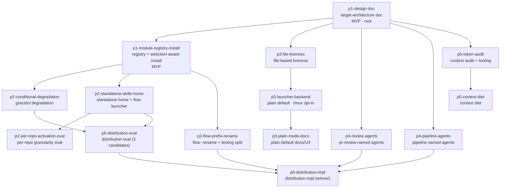

# Epic design — major refactor: flow → modular "plugin" design

> **"Plugin" is conceptual, not Claude-plugin.** Per the user's design-review
> redirect: "plugin" in this epic means a modular, plugin-_style_ architecture —
> not a commitment to Claude Code plugins. Claude-plugin/marketplace packaging
> is one of three candidate distribution end-states evaluated in Phase 6 (D9),
> no longer the assumed terminus.

> **Prior art, reused not re-derived — with redirect deltas.** A completed
> `/flow-pipeline` discovery for this same request produced, in this worktree, a
> Phase-1-scoped PRD (`.flow-tmp/plan.md`) with a design-blind ideal-flow
> section, a gap-analysis table with file evidence, a six-phase roadmap, an
> AGY-cross-reviewed decision analysis, and a full feature-grain task breakdown
> for Phase 1 — plus web-grounded research findings
> (`.flow-tmp/research-findings.md`). This design treats those artifacts as
> ratified inputs **except where the user's redirect (2026-07-05) amends
> them**: Claude plugins de-assumed as the end-state (D1/D2/D9), a standalone
> skills home + `flow` launcher added (D10), a global `flow-` skill rename +
> testing-skill split added (D11 + module map), and the tmux default **flipped**
> to plain-shell (D6 — an explicit user override of the prior PRD's
> tmux-default assumption). D4 measure-then-tighten is upheld unchanged.
> `.flow-tmp/` is worktree-transient — the first node (`p1-design-doc`) lands
> the durable carrier, `docs/target-architecture.md` (renamed from the PRD's
> draft name `plugin-architecture.md` so the seam artifact doesn't bake in an
> unratified end-state).

## 1. Problem & intent

flow today is a personal, hard-wired toolchain: `flow install` symlinks all
20 skills, 2 agents, ~40 PATH helpers, and 4 validators globally and
unconditionally — a Go-only user gets the Svelte/Tailwind/Supabase/Cloudflare
skills in every Claude session's routing table, a user without agy inherits
the research stack, every plain `claude` session on the machine pays flow's
skill-frontmatter tax whether or not the session has anything to do with flow,
and tmux is a hard prerequisite even for a single pipeline in a plain
terminal. There is no module boundary, no install-time choice, and no written
statement of core vs stack-specific. The underlying need: turn flow into a
**professional, modular product** — each user installs only what their stack
needs (conditional stack/integration modules), flow skills load only in
flow-launched sessions (plain `claude` stays flow-free), skills carry a
`flow-` provenance prefix, the default runtime is a plain shell with tmux as
an installer-selected opt-in, context usage is aggressively optimized,
remaining recurring fan-outs become named Claude Code custom sub-agents with
pinned model routing, and the distribution end-state (Claude plugins vs
launcher + standalone dir vs filtered symlinks) is **chosen on evidence, not
assumed**. This epic covers the full redesign, Phase 1 included; execution of
the DAG is the orchestrator's job, not this design's.

## 2. Clarified requirements

Epic-level, EARS-shaped (`WHEN <trigger> THE SYSTEM SHALL <response>`).
Per-feature acceptance lives in each feature's `acceptanceCriteria[]` in
`manifest.json`.

- **R1** — WHEN a user runs `flow install --modules <csv>` (or `--all` /
  `--core-only`) THE SYSTEM SHALL link only the named modules' artifacts
  (core always included), prune previously-linked deselected artifacts, and
  reject unknown module ids non-zero — asserted by vitest specs with
  injectable targets.
- **R2** — WHEN `flow install` runs on a TTY with no recorded selection THE
  SYSTEM SHALL ask once per optional module and persist the answer to
  `~/.flow/config.json` `modules`; non-TTY SHALL default to core with a
  one-line notice; `--upgrade` SHALL never re-ask.
- **R3** — WHEN a pipeline step needs a deselected (or repo-absent) module
  THE SYSTEM SHALL skip gracefully with a named notice instead of failing
  mid-pipeline.
- **R4** — WHEN a pipeline is launched with no tmux opt-in in effect (no
  flag, no recorded install-time choice) THE SYSTEM SHALL run it in a plain
  shell, and `flow ls` / `flow done` / collision detection SHALL report
  correctly under every launcher via a crash-safe file-based liveness signal
  (PID + process-start-time), not window existence.
- **R5** — WHEN a recurring pipeline fan-out fires THE SYSTEM SHALL spawn a
  named `agents/*.md` custom-agent definition with declarative routing per
  the D7 frontmatter policy (`effort` pinned only for mechanical roles;
  judgment roles inherit session effort), not an inline anonymous spawn
  prompt.
- **R6** — WHEN the context-economy phase completes THE SYSTEM SHALL have a
  measured per-phase token baseline and a re-measured before/after delta for
  each diet change, recorded in a committed report.
- **R7** — WHEN the distribution end-state evaluation completes THE SYSTEM
  SHALL have recorded an evidence-backed ADR verdict choosing among
  (a) Claude Code plugin/marketplace packaging, (b) launcher +
  standalone-dir distribution, (c) module-filtered symlinks — and the
  implementation node SHALL deliver the winning mechanism.
- **R8** — WHEN `flow install --all` runs at any point before the Phase-6
  switchover THE SYSTEM SHALL produce the same artifact set as today's
  unconditional install (no regression for the existing user).
- **R9** — WHEN a user runs plain `claude` THE SYSTEM SHALL contribute zero
  flow skills to the session's routing table; WHEN a session is launched via
  the `flow` launcher verb THE SYSTEM SHALL load the installed flow skills
  from the standalone home via `--add-dir`.
- **R10** — WHEN flow skills are installed THE SYSTEM SHALL expose every
  skill under a `flow-`-prefixed name (directory name = command name), with
  zero stale references to old names in shipped artifacts.

## 3. High-level design

ADR-shaped key decisions (Context / Decision / Consequences). This list IS
the Parnas volatile-decision list — each secret is a feature boundary in §4.
Eleven decisions map to fifteen features: D6–D9 each split across two
features along a natural internal seam (backend/docs; two skill surfaces;
measure/act; evaluate/implement), stated per decision.

- **D1 — Target architecture recorded design-first.** _Context:_ five later
  phases need one authoritative statement of the ideal, the gaps, the module
  map, and the roadmap; `.flow-tmp` prior art is transient — and the user's
  redirect amends parts of it (plugins de-assumed, tmux flipped, standalone
  home + rename + testing split added). _Decision:_ land
  `docs/target-architecture.md` first, carrying the ratified PRD content
  forward durably **with the redirect deltas applied** — Claude plugins
  appear as one candidate end-state, never the ratified one.
  _Consequences:_ the doc is the epic's seam artifact — its Module map
  (including target `flow-` names and the testing split) and per-phase specs
  are the consumed edge for every phase-opening node; content is the
  most-tuned-at-review part, so it is isolated in a docs-only PR.
  → **p1-design-doc**
- **D2 — Module layer now; distribution end-state deferred to evidence.**
  _Context:_ plugins don't manage arbitrary PATH binaries; migrating ~40
  bare-name helper invocations now is a heavy, ecosystem-tracking lift
  (AGY-ratified) — and per the redirect, the user never mandated Claude
  plugins at all ("plugin" = conceptual modularity). _Decision:_ a typed,
  pure-data module registry (`bin/lib/modules.ts`) + selection-aware
  `flow install` on the existing symlink/manifest machinery now; module
  boundaries are drawn so they can _become_ plugin boundaries IF the Phase-6
  evaluation picks plugins. _Consequences:_ conditionality lands early;
  Phase 6 becomes evaluate-then-implement, not a foregone re-packaging;
  `--all` stays byte-identical until a ratified switchover.
  → **p1-module-registry-install**
- **D3 — Install scope: global-selectable now; session scoping via the
  launcher; per-repo granularity evaluated.** _Context:_ per-repo copies rot
  on update; pipeline state/helpers are machine-global; AGY surfaced a
  middle branch — global install, per-repo _activation_. The new standalone
  home (D10) changes the calculus: plain sessions pay zero, so the residual
  question is only per-repo _module_ granularity inside flow sessions.
  _Decision:_ selection stays global-per-machine now; the activation
  evaluation is rewired to run after (and on top of) the standalone-home
  launcher, its remit narrowed to per-repo granularity. _Consequences:_ the
  multi-stack context-tax question is answered by evidence, not deferred
  silently. → **p2-per-repo-activation-eval**
- **D4 — Module-absence behaviour: graceful, named degradation.** _Context:_
  once modules are deselectable, every pipeline step that assumes copilot/
  research/stack presence is a latent failure. _Decision:_ each dependent
  step skips cleanly with a named notice (mirroring the existing
  graceful-skip-sans-agy pattern), plus a doctor-style summary naming what
  is off and why. _Consequences:_ deselection (and later per-repo absence)
  is safe end-to-end; the Phase-6 winner reuses this contract unchanged.
  → **p2-conditional-degradation**
- **D5 — Liveness representation: crash-safe file signal, canonical for
  every launcher.** _Context:_ state is already fully file-based; the only
  tmux-coupled semantics are liveness/collision (`windowExists` in
  `bin/lib/feature.ts`, `bin/lib/done.ts`) and launch/attach. With plain
  mode now the DEFAULT experience (D6), file liveness is no longer a
  transition aid — it is the primary signal for everyone. AGY pre-mortem:
  bare heartbeats go stale. _Decision:_ PID + process-start-time in
  `~/.flow/state/<slug>.json` with an alive/dead/stale helper, consulted by
  `flow ls`/`done`/collision under every launcher; `windowExists` demotes to
  a tmux-mode-only nicety, never the source of truth. _Consequences:_
  liveness works identically under any launcher; the recycled-PID case is
  testable in isolation. → **p3-file-liveness**
- **D6 — Launch mechanics: plain shell DEFAULT, tmux installer-selected
  opt-in.** _Context:_ the prior PRD assumed tmux stays the default backend.
  **The user explicitly flipped this at the design review**: flow is meant
  for anyone, most adopters won't use tmux, so the default must be no-tmux;
  tmux is chosen at install Q&A (default-off) and becomes the default
  launcher only for users who selected it. _Decision:_ a launcher-backend
  interface with plain-terminal (default) and tmux (opt-in) implementations,
  precedence flag (`--tmux`/`--no-tmux`) > recorded config > default-plain;
  the install Q&A gains a default-off tmux question (shipped with the
  backend node, since asking before the backend exists would record a
  preference nothing honors). _Consequences:_ the plain path is the primary
  path and must be rock-solid (launch, monitor, resume, collision — full
  coverage); tmux remains fully supported for parallel-pipeline power users;
  docs lead with plain. → **p3-launcher-backend**, docs/UX completed by
  **p3-plain-mode-docs**
- **D7 — Agent topology: recurring fan-outs become named custom agents.**
  _Context:_ only 2 of ~9 recurring fan-out roles are `agents/*.md`
  (`flow-verify`, `flow-fix-applier`); the rest are inline spawn prompts
  with model pins buried in prose — and they were left generic
  _deliberately_, on the belief that generic = tunable, custom = pinned.
  Verified routing-knob semantics (live Agent tool schema +
  code.claude.com/docs/en/sub-agents, fetched 2026-07-05) show the premise
  about effort is right but the conclusion doesn't follow: (1) the
  Task/Agent tool's per-invocation parameters include `model` but NO
  `effort` — effort cannot be set at spawn time; (2) definition frontmatter
  `effort` ("Overrides the session effort level. Default: inherits from
  session. Options: low, medium, high, xhigh, max") is the ONLY place to
  pin effort, and omitting the field inherits session effort; (3) model
  resolution order is `CLAUDE_CODE_SUBAGENT_MODEL` env > per-invocation
  `model` param > frontmatter `model` > main conversation's model — a
  per-spawn `model:` ALWAYS beats frontmatter, so promotion loses zero
  model tunability (flow already exploits this: `agents/flow-verify.md`
  pins `effort: low` while the step-6 spawn still passes per-spawn
  `model:` per config precedence); (4) generic subagents inherit the main
  conversation's model and effort by default. _Decision:_ promote the
  recurring roles to named definitions under the per-role frontmatter
  policy these facts derive: pin `effort` ONLY for mechanical roles
  (verify + fix-applier already do); judgment roles (discovery, scout, the
  review lenses, consolidator, merge-resolver, edit-applier) OMIT `effort`
  so they scale with session effort; omit frontmatter `model` wherever
  flow's per-phase config threading passes per-spawn `model:` (which wins
  anyway), so definitions never fight the config — the gatekeeper's fixed
  haiku cost pin (mechanical, not config-threaded) moves INTO frontmatter.
  Artifact contracts unchanged, exemption set renamed in place and never
  widened. _Consequences:_ routing is declarative and auditable with no
  tunability loss; the one legitimate cost of promotion is an install
  dependency — each custom agent requires `~/.claude/agents/<name>.md` to
  be symlinked — so every promoted spawn site ships the existing
  `[ -f ~/.claude/agents/<name>.md ] || fall back to general-purpose`
  guard (as step 6's verify spawn does today); whichever distribution
  end-state wins can carry the agent files as first-class artifacts. Split
  along the two skill surfaces:
  → **p4-review-agents** (pr-review's lenses/gatekeeper/consolidator),
  **p4-pipeline-agents** (scout/discovery/merge-resolver).
- **D8 — Context economy: measure, then tighten.** _Context:_ the in-process
  edit-threshold question (should the supervisor ever edit code?) and the
  AGENTS.md/SKILL.md size question need data, not dogma (ratified D4 of the
  PRD). _Decision:_ build transcript-analysis tooling and a baseline first;
  then execute the highest-value cuts and re-measure. _Consequences:_ the
  diet is falsifiable; the edit-cap alternative (AGY branch) is judged on
  evidence. Split measure/act: → **p5-token-audit**, **p5-context-diet**
- **D9 — Distribution end-state: evaluate three candidates, then implement
  the winner.** _Context:_ the redirect de-assumed Claude plugins; the
  plugin/marketplace surface is still moving (the prior PRD's
  `## Plan risks`); and by Phase 6 the launcher + standalone home (D10) may
  already deliver most of the value plugins promised. A mass-migration bet
  on an unratified mechanism is the epic's biggest rework risk. _Decision:_
  an explicit evaluation node records an evidence-backed ADR verdict among
  (a) Claude plugins/marketplace, (b) launcher + standalone-dir
  distribution, (c) module-filtered symlinks — optionally spiking a
  throwaway one-module plugin package for evidence — and a separate
  implementation node is contracted to whichever wins. _Consequences:_
  ecosystem drift is discovered before commitment, not after; the
  implementation node is expected to be re-decomposed against the verdict.
  Split evaluate/implement: → **p6-distribution-eval**,
  **p6-distribution-impl**
- **D10 — Standalone skills home + `flow` launcher: session-scoped skill
  exposure.** _Context:_ every installed skill's frontmatter (~100 tokens
  each) taxes EVERY Claude session on the machine. Skill discovery locations
  are fixed (Enterprise / `~/.claude/skills/` / `.claude/skills/` / plugins)
  with no custom-top-level-dir flag — BUT `.claude/skills/` inside a
  directory added via `--add-dir` loads automatically (a documented
  exception, verified against code.claude.com/docs/en/skills, fetched
  2026-07-05; skill entries may be symlinks). _Decision:_ `flow install`
  retargets skill links to `~/.flow/.claude/skills/`; a new bare `flow`
  launcher verb runs `claude --add-dir ~/.flow`; pipeline seed sessions get
  the same wiring. Plain `claude` carries zero flow skills; `flow` carries
  them all. Whether agents/hooks load from an added dir is NOT documented
  (commands/output-styles explicitly do not) — an in-node investigation with
  named fallbacks: agents stay globally linked in `~/.claude/agents/`, the
  Stop hook stays global (it already self-detects non-flow contexts), and
  repo-local `.claude/skills` linking / on-demand symlinking are the hybrid
  fallbacks. _Consequences:_ the biggest single context-tax win lands
  mid-epic, independent of the Phase-6 verdict; the per-repo eval (D3)
  narrows to granularity. → **p2-standalone-skills-home**
- **D11 — Skill naming: `flow-` prefix on every skill directory.**
  _Context:_ command name = directory name for personal/project skills
  (frontmatter `name` is display-only), so prefixing means renaming skill
  directories. In mixed sessions (a flow-launched session inside a consumer
  repo with its own skills), unprefixed names like `verify`, `testing`,
  `coder` invite collisions and hide provenance. _Decision:_ rename all
  shipped skills to `flow-`-prefixed directory names (already-prefixed
  `flow-pipeline`/`flow-research` unchanged), with the full cross-reference
  sweep in one PR; the Svelte-specific `testing` skill splits in the same
  sweep (module map, D1). Trade-off recorded honestly: pro —
  collision-proofing, clear provenance in mixed sessions, greppability; con
  — longer invocations, and IF the Phase-6 eval picks Claude plugins,
  auto-namespacing (`/plugin:skill`) arrives free, making the prefix
  partially redundant. Sequenced BEFORE the distribution eval because:
  (a) the launcher path (D10) benefits immediately regardless of the
  verdict; (b) the cross-reference sweep only grows as later phases add
  references — cheapest now; (c) the rename is mechanical and reversible;
  (d) even under plugins the prefix is harmless. _Consequences:_ one
  mechanical sweep PR (skill dirs, AGENTS.md, bin/ helpers, skill-md-lint
  anchors, templates, docs, registry rows); lint anchors update in the same
  commit. → **p2-flow-prefix-rename**

**Why these cuts (Parnas + Simon):** each feature hides one volatile decision
(or one half of a decision along its stated internal seam) behind a stable
interface — the module map, the registry table, the selection contract, the
standalone home + launcher, the naming scheme, the liveness helper, the
backend interface, the agent-definition files, the audit report, the
distribution verdict. Every edge in §4/§5 is a concrete produced/consumed
artifact; the strands that unlock after the root are mutually edge-free by
construction.

### Gap-analysis residuals (redirect-mandated elaboration)

The prior PRD's gap table marked four axes "aligned"/"largely aligned"; per
the redirect, the concrete residual shortcomings and their owning nodes:

- **Pipeline mechanics, PRD shape, review gate — "already aligned":** no
  residual structural shortcoming identified; no epic node re-touches this
  surface. (The p5 audit still measures planning-artifact context transit as
  part of per-phase attribution; if that surfaces a residual, it routes to
  **p5-context-diet**.)
- **Sub-agent isolation — "largely aligned":** residuals are (a) small
  in-process supervisor edits below the `/coder` routing threshold still
  land their diffs + tool_results in the supervisor's context, and (b) that
  threshold is prose-judged, not mechanically enforced. Covered by
  **p5-token-audit** (measures the in-process edit-size distribution) and
  **p5-context-diet** (tightens the threshold or adopts the hook-enforced
  mechanical edit cap if the data supports it).
- **Model routing — "largely aligned":** residual is that only 2 of ~9
  recurring fan-out roles (`flow-verify`, `flow-fix-applier`) are named
  `agents/*.md` definitions with frontmatter pins; the rest (six review
  lenses, gatekeeper, consolidator, scout, discovery, merge-resolver) are
  inline spawn prompts whose model/effort pins live in prose and can
  silently drift. Covered by **p4-review-agents** + **p4-pipeline-agents**.
- **Skill loading — "aligned" per-skill only:** Claude Code's
  frontmatter-routing/body-on-demand mechanism is the routing table and flow
  conforms per-skill; the residual is that every _installed_ skill's
  frontmatter taxes EVERY session on the machine — 20 skills × ~100 tokens
  in every plain `claude` session, flow-relevant or not, and stack skills
  tax non-stack work. Covered by **p2-standalone-skills-home** (plain
  sessions drop to zero flow skills), **p1-module-registry-install**
  (never-relevant modules aren't installed at all), and
  **p2-per-repo-activation-eval** (per-repo granularity for multi-stack
  machines).

## 4. Feature decomposition

Fifteen features. Each is one `flow feature create` pipeline = one mergeable
PR = one vertical slice that passes its own gate. Ids, titles, and edges
match `manifest.json` exactly; full acceptance criteria live there.

### Phase 1 — module layer

**p1-design-doc · Target-architecture doc (ideal, gap analysis, module map, roadmap) — [MVP · walking-skeleton root]**

- _Secret hidden (D1):_ the target-architecture content itself.
- _Depends on:_ nothing (root).
- _Produces:_ `docs/target-architecture.md` — `## Ideal flow`,
  `## Gap analysis` (incl. the elaborated residuals above), `## Module map`
  (every skill/agent/helper → exactly one module; v1 set: `core`
  (incl. the generic testing skill post-split), `stack-svelte`
  (incl. `flow-testing-svelte` post-split), `stack-tailwind-shadcn`,
  `stack-supabase`, `stack-cloudflare-pages`, `copilot`, `research`; target
  `flow-`-prefixed directory names recorded per skill), `## Roadmap`
  (phases 1–6 with entry/exit criteria: plain-default runtime for Phase 3,
  the D7 consolidation map for Phase 4, the three-candidate distribution
  evaluation for Phase 6). Reuses `.flow-tmp/plan.md` content with the
  redirect deltas applied (see Open Questions).

**p1-module-registry-install · Module registry + selection-aware flow install — [MVP]**

- _Secret hidden (D2):_ the conditionality mechanism (module layer as pure data).
- _Depends on:_ **p1-design-doc** — _edge artifact: the `## Module map`
  section it encodes as the registry table._
- _Produces:_ `bin/lib/modules.ts` (pure-data registry + completeness lint:
  no orphan, no double assignment; current dir names at merge time —
  p2-flow-prefix-rename rewrites rows in its sweep), selection-aware
  `flow install` (`--modules`/`--all`/`--core-only`, TTY Q&A via the
  `confirm.ts` seam, persisted `~/.flow/config.json` `modules`, `--upgrade`
  no-re-ask, prune via the existing manifest), `--all` byte-identical to
  today.

### Phase 2 — conditionality, session scoping, skill surface

**p2-conditional-degradation · Graceful degradation for deselected modules**

- _Secret hidden (D4):_ module-absence behaviour.
- _Depends on:_ **p1-module-registry-install** — \_edge artifact: the registry
  - recorded-selection contract it reads to decide what is active.\_
- _Produces:_ named skip-notices on every module-dependent pipeline path
  (copilot request/classify, research/AGY paths, plan review), a
  doctor-style "what's off and why" summary, tests per skip path.

**p2-standalone-skills-home · Standalone flow skills home + `flow` launcher verb**

- _Secret hidden (D10):_ where flow skills live and which sessions see them.
- _Depends on:_ **p1-module-registry-install** — _edge artifact: the
  selection-aware link/prune machinery + recorded selection it retargets._
- _Produces:_ `~/.flow/.claude/skills/` as the skill link target (migration
  out of `~/.claude/skills/`), the bare `flow` launcher verb
  (`claude --add-dir ~/.flow` — mechanism verified supported; distinct from
  the Phase-3 _pipeline_ launcher backend), pipeline seed sessions wired the
  same way, the agents/hooks-under-`--add-dir` investigation record with
  named fallbacks, tests + docs for the plain-vs-flow session story.

**p2-flow-prefix-rename · `flow-` skill prefix rename + testing-skill split**

- _Secret hidden (D11):_ the skill naming scheme.
- _Depends on:_ **p1-module-registry-install** — _edge artifact: the registry
  rows (skill ids) the rename rewrites._
- _Produces:_ every skill dir renamed to its `flow-`-prefixed target name
  from the module map, the full cross-reference sweep (skills, AGENTS.md,
  bin/ helpers + tests, `bin/skill-md-lint.test.ts` anchors, templates,
  docs, registry rows), the `testing` split into a generic core testing
  skill + `flow-testing-svelte`, zero stale old-name references.

**p2-per-repo-activation-eval · Per-repo module-granularity evaluation**

- _Secret hidden (D3):_ per-repo granularity on top of the launcher.
- _Depends on:_ **p2-standalone-skills-home** — \_edge artifact: the launcher
  - standalone-home mechanism the eval extends or filters.\_
- _Produces:_ a Context/Decision/Consequences addendum to
  `docs/target-architecture.md` with a verdict; if affirmative, the minimal
  per-repo mechanism + tests; if negative, the recorded requirement on the
  Phase-6 winner. May resolve docs-only (see Open Questions).

### Phase 3 — plain-default runtime (tmux opt-in)

**p3-file-liveness · Crash-safe file-based pipeline liveness signal**

- _Secret hidden (D5):_ the liveness representation.
- _Depends on:_ **p1-design-doc** — _edge artifact: the Roadmap's Phase-3
  spec (crash-safe PID + process-start-time design, per the AGY pre-mortem)._
- _Produces:_ liveness fields in `~/.flow/state/<slug>.json`, an
  alive/dead/stale helper, `flow ls`/`done`/collision checks consulting the
  file signal as the canonical source under every launcher (`windowExists`
  demoted to a tmux-mode nicety), tests incl. recycled-PID.

**p3-launcher-backend · Launcher backend abstraction — plain default, tmux opt-in**

- _Secret hidden (D6):_ launch mechanics.
- _Depends on:_ **p3-file-liveness** — _edge artifact: the liveness-helper
  API both backends share for ls/done/collision._
- _Produces:_ backend interface + plain-terminal (default) and tmux (opt-in)
  implementations, precedence flag (`--tmux`/`--no-tmux`) > config >
  default-plain, the install-Q&A default-off tmux question persisted to
  `~/.flow/config.json`, tmux-absent degrading to plain with a named notice,
  tests (plain default, precedence, opt-in tmux byte-compatible with today).

**p3-plain-mode-docs · Plain-default docs + UX polish**

- _Secret hidden (D6, user-facing half):_ the onboarding story.
- _Depends on:_ **p3-launcher-backend** — _edge artifact: the shipped
  backend surface (flags, Q&A, notices) it documents._
- _Produces:_ README quickstart presenting the plain shell as the default
  experience (tmux never a prerequisite), plain-shell run/monitor/resume doc
  as the primary path, tmux documented as the opt-in power option (parallel
  pipelines, walk-away/attach), notice copy polish.

### Phase 4 — custom-agent consolidation

**p4-review-agents · Named custom agents for /pr-review fan-outs**

- _Secret hidden (D7, review surface):_ review-fan-out routing.
- _Depends on:_ **p1-design-doc** — _edge artifact: the Roadmap's Phase-4
  consolidation map (which fan-out → which agent, which model pin)._
- _Produces:_ `agents/*.md` for the six review lenses, the gatekeeper
  (haiku frontmatter pin — mechanical, not config-threaded), and the
  consolidator-validator, following the `flow-verify`/`flow-fix-applier`
  pattern under the D7 frontmatter policy (lenses + consolidator are
  judgment roles: `effort` omitted so they inherit session effort;
  frontmatter `model` omitted wherever the spawn site threads per-spawn
  `model:` from config, which wins anyway per the verified resolution
  order); every promoted spawn site keeps the
  `[ -f ~/.claude/agents/<name>.md ] || general-purpose fallback` guard;
  artifact contracts unchanged.

**p4-pipeline-agents · Named custom agents for pipeline-side fan-outs**

- _Secret hidden (D7, pipeline surface):_ pipeline-fan-out routing.
- _Depends on:_ **p1-design-doc** — _edge artifact: the same Phase-4
  consolidation map._
- _Produces:_ `agents/*.md` for scout, discovery (feature + epic modes), and
  the merge-conflict resolver (edit-applier and epic-judgment evaluated) —
  all judgment roles under the D7 policy: `effort` omitted (inherits
  session effort), frontmatter `model` omitted where per-spawn `model:`
  config threading exists; every promoted spawn site keeps the
  `[ -f ~/.claude/agents/<name>.md ] || general-purpose fallback` guard;
  bidirectional exemption docs updated; the nine-exemption set renamed in
  place, never widened.

### Phase 5 — context economy

**p5-token-audit · Per-phase context/token audit + measurement tooling**

- _Secret hidden (D8, measurement half):_ where context is actually spent.
- _Depends on:_ **p1-design-doc** — _edge artifact: the Roadmap's Phase-5
  measurement plan (what to measure, exit criteria)._
- _Produces:_ a transcript-analysis helper (tested on a fixture) attributing
  spend per phase and tool-call class, a real-pipeline baseline report
  (`docs/context-economy-audit.md`) incl. the in-process edit-size
  distribution and the measured frontmatter cost of installed skills.

**p5-context-diet · Context diet: AGENTS.md + skill splits + edit-threshold tuning**

- _Secret hidden (D8, action half):_ which cuts are worth making.
- _Depends on:_ **p5-token-audit** — _edge artifact: the audit report whose
  data ranks the cuts._
- _Produces:_ AGENTS.md diet toward the <200-line guidance (procedural
  detail → lazy references), further lean-body/lazy-reference SKILL.md
  splits, edit-threshold tightening or the mechanical edit-cap guard if the
  data supports it, re-measured before/after delta; structural lints stay
  green.

### Phase 6 — distribution end-state

**p6-distribution-eval · Distribution end-state evaluation (three candidates)**

- _Secret hidden (D9, evaluation half):_ which distribution mechanism wins.
- _Depends on:_ **p2-standalone-skills-home** — _edge artifact: the shipped
  launcher + standalone home (candidate b's operating evidence);_
  **p2-conditional-degradation** — _edge artifact: the absence-behaviour
  contract any per-repo/per-selection mechanism relies on._
- _Produces:_ an evidence-backed ADR addendum to
  `docs/target-architecture.md` choosing among Claude plugins/marketplace,
  launcher + standalone-dir distribution, and module-filtered symlinks
  (optionally a throwaway one-module plugin spike as evidence), plus the
  contracted scope statement for **p6-distribution-impl**.

**p6-distribution-impl · Distribution end-state implementation (winner only)**

- _Secret hidden (D9, implementation half):_ the migration + switchover story.
- _Depends on:_ **p6-distribution-eval** — _edge artifact: the verdict +
  contracted scope;_ **p4-review-agents** and **p4-pipeline-agents** — _edge
  artifacts: the named `agents/*.md` files the core distribution carries;_
  **p2-flow-prefix-rename** — _edge artifact: the renamed skill surface
  being distributed._
- _Produces:_ the winning mechanism end-to-end (plugins: all-module
  packaging, helper-binary strategy, marketplace docs, switchover — the
  first sanctioned `--all` byte-parity break; launcher+dir: versioned
  payload, update/rollback, per-repo granularity per the p2 eval verdict;
  symlinks: hardening + consumer onboarding as the ratified end-state).
  Expected to be re-decomposed against the verdict before execution.

## 5. Dependency DAG

- **Shape:** 15 nodes, 18 edges, one root (`p1-design-doc`). After the root,
  **five strands unlock in parallel** (Simon near-decomposability — no edges
  between them until Phase 6 closes the diamond): the module/skill-surface
  strand (n2 → n3 ∥ n4 ∥ n5, n4 → n6), the runtime strand (n7 → n8 → n9),
  the two agent nodes (n10 ∥ n11), and the audit strand (n12 → n13).
- **Longest chains (5 nodes):** `p1-design-doc → p1-module-registry-install →
p2-standalone-skills-home → p6-distribution-eval → p6-distribution-impl`
  and the sibling path through `p2-conditional-degradation`.
- **MVP path (thinnest valuable slice):** `p1-design-doc →
p1-module-registry-install` — Phase 1 exactly: a stated target
  architecture plus an installer that acts on it; every later strand is
  independent value on top. The next-biggest single win is
  `p2-standalone-skills-home` (plain `claude` goes flow-free).
- **Phases are labels, not sequencing:** the DAG is the truth — e.g. Phase-4
  and Phase-5 strands can land before Phase 3 finishes.
- **Well-formedness:** every `dependsOn` id resolves, no cycles (the topo
  order above proves it) — exactly what `flow-epic-dag` asserts against
  `manifest.json` (exit 0).

## 6. Open Questions

- **Phase-1 prior art reuse — with redirect deltas.** Phase-1 scope was
  already planned at _feature grain_ in this worktree's `.flow-tmp/plan.md`
  (full 6-task breakdown, AGY-reviewed decision analysis, PR-description
  draft). The first two nodes must **reuse it, not re-derive it** — but with
  the redirect deltas applied: the doc lands as
  `docs/target-architecture.md` (not `plugin-architecture.md`), plugins
  appear as one candidate end-state, the Roadmap's Phase 3 is plain-default,
  and the module map records the `flow-` target names + testing split.
  `.flow-tmp/` does not survive the worktree; until `p1-design-doc` merges,
  this design.md carries the summary. Confirm the reuse-with-deltas pointer
  is acceptable as the handoff.
- **Distribution end-state is genuinely open (redirect-ratified).** The
  module-layer-now decision stands, but Claude plugins are no longer the
  assumed terminus — `p6-distribution-eval` chooses among plugins, launcher
  - standalone dir, and filtered symlinks on evidence. If you already have a
    leaning, redirect here and the eval narrows or disappears.
- **Phase-1 grain.** Per supervisor guidance, Phase 1 splits into exactly
  two nodes (doc; registry + selection-aware install). The second node
  covers Tasks 2–6 of the prior PRD — plausibly large. If its feature
  pipeline finds it oversized, the natural sub-split is registry+flags vs
  Q&A+prune; deliberately not pre-split here to keep the walking skeleton
  thin.
- **Agents/hooks under `--add-dir` are unverified.** The docs confirm skills
  load from an added dir's `.claude/skills/` and that commands/output-styles
  do NOT load; agents and hooks are undocumented either way. flow's 2 custom
  agents (`~/.claude/agents/`) and Stop hook (`~/.claude/settings.json`)
  stay global today; `p2-standalone-skills-home` carries the investigation
  and the named fallbacks (agents stay global — low routing tax; hook
  already self-detects non-flow contexts; repo-local `.claude/skills`
  linking or on-demand symlinks as hybrids). Worst case is a hybrid that
  still achieves flow-free plain sessions for skills. Confirm acceptable.
- **Rename sequencing (D11) is a judgment call.** The `flow-` rename runs
  BEFORE the distribution eval — reasoning in D11 (launcher benefits
  immediately; the sweep only grows; mechanical + reversible) — accepting
  that IF plugins win, auto-namespacing makes the prefix partially
  redundant. Redirect if you'd rather defer it until after the eval.
  Naming details (e.g. the `flow-verify` _skill_ coexisting with the
  existing `flow-verify` _agent_ name in a different namespace) are decided
  at that node's planning, recorded in the module map.
- **Testing-skill split ratified (redirect).** The Svelte-specific `testing`
  skill splits into a framework-agnostic core testing skill plus
  `flow-testing-svelte` (Svelte/vitest/testing-library specifics), executed
  in `p2-flow-prefix-rename`'s sweep and recorded in the module map. The
  exact generic-vs-svelte content boundary is decided at that node's
  planning.
- **tmux flip is recorded as user-directed, not open.** Plain shell is the
  default everywhere; tmux is an install-Q&A opt-in (default-off) that
  becomes the selecting user's default launcher. One residual sequencing
  choice: the tmux question ships with `p3-launcher-backend` (not Phase 1's
  Q&A), because asking before the backend exists would record a preference
  nothing honors — confirm that's acceptable (existing tmux users keep
  today's behaviour until Phase 3 by default flag/config).
- **`p2-per-repo-activation-eval` is spike-shaped, remit narrowed.** With
  session scoping owned by the launcher, this eval covers only per-repo
  _module_ granularity (a Go repo inside a flow session still sees svelte
  skills). It may resolve docs-only; that is intended, not a scoping
  failure.
- **Phase-6 implementation is deliberately coarse.** `p6-distribution-impl`
  cannot be honestly decomposed until the eval's verdict exists; expect a
  re-decomposition (potentially its own epic) once it does. Expect a
  redirect there, not here.
- **Phase-4 split is by skill surface** (pr-review vs pipeline-side).
  CLOSED at the amendment round: the original "keep the model-tuned roles
  generic to stay tunable" rationale is superseded by the verified
  resolution order (per-spawn `model:` always beats frontmatter; omitting
  frontmatter `effort` inherits session effort — live Agent tool schema +
  code.claude.com/docs/en/sub-agents, 2026-07-05), so promotion costs no
  tunability. The remaining generic-vs-custom criterion is purely: is
  there a reusable pinned system prompt + tool constraint worth shipping,
  weighed against the install-dependency cost (each agent file must be
  symlinked; every promoted spawn site keeps the file-exists →
  general-purpose fallback guard). Frontmatter pins follow the D7 policy
  (gatekeeper haiku; verify/fix-applier `effort: low` unchanged; judgment
  roles inherit session effort). The `/coder` edit-applier and `/epic-run`
  judgment agent are _evaluated_ in `p4-pipeline-agents` against exactly
  that criterion, not committed.
- **Scope check:** genuinely epic-sized — six phases, 15 PR-sized nodes,
  code + docs + skills + naming + distribution surfaces; not a single
  feature.
