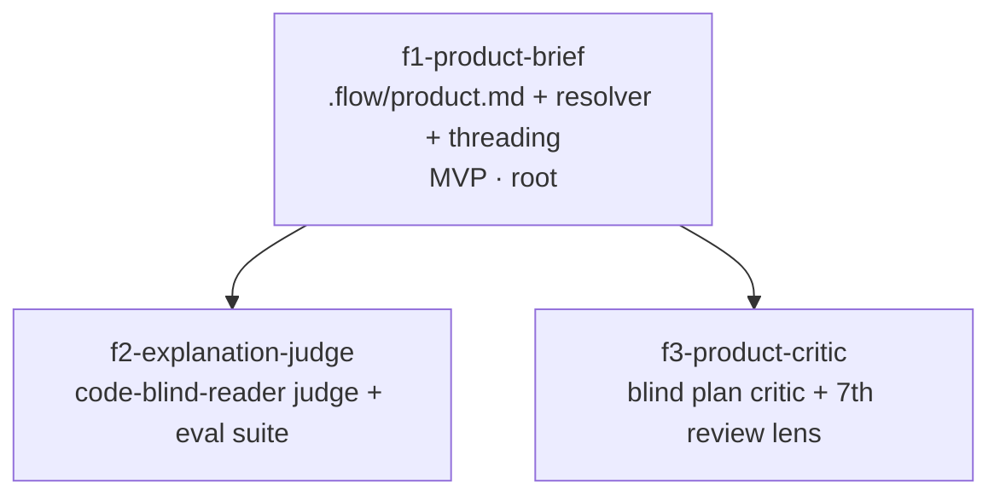

# Epic design — make flow reason from, and explain to, the product-manager perspective

## 1. Problem & intent

**Goal:** Make flow's decisions and explanations answer to the product manager's stated priorities, and make a code-blind reader able to act on every explanation flow emits.

flow already _has_ the rule. `output.lens` defaults to `pm`
(`bin/lib/output-lens.ts`), `references/output-style.md` carries "Frame every
explanation impact-first for a product-lens reader", and
`skills/pipeline/flow-pipeline/references/pause-output-contract.md` fixes a
`**TLDR:**`-first slot vocabulary. The rule measurably fails to land, and the
prior investigation (pipeline `should-i-redesign-flow-sub`) named three
mechanisms, none of which more prose can fix:

1. **The explaining agent's context is code.** A measured merged pipeline's
   supervisor root held roughly 335k characters of tool output against
   roughly 13k characters of prose. Whatever the rule says, the thing being
   summarized is a diff.
2. **The rule is one bullet inside ~80k tokens of skill prose.** flow's own
   `output.lens` switch controls render _verbosity_; it has no notion of what
   this particular PM optimizes for, so there is nothing for a decision to
   cite even when the agent wants to.
3. **Nothing fails when an explanation goes technical.** The pause lint
   checks slot structure, not perspective, and the eval harness
   (`bin/flow-eval.ts`, four committed suites) has no explanation-quality
   judge. An unchecked rule is a suggestion.

The underlying job is therefore not "write the rule better." It is to give
flow (a) a **stated set of PM priorities a decision can cite**, (b) an
**external check** that fails when an explanation is only legible to someone
who read the code, and (c) a **structurally independent perspective** that
was never shown the code at all. Research anchors settled in the prior
investigation: models cannot self-correct reasoning without external feedback
(Huang et al., ICLR 2024); persona labels alone do not improve judgment
(Principled Personas, EMNLP 2025; Zheng et al., EMNLP Findings 2024), but
structurally independent perspectives with a forced reconciliation step do
(SPP, NAACL 2024; Du et al. 2023); and multi-agent failures are system-design
failures, not model failures (MAST, NeurIPS 2025).

## 2. Clarified requirements

Epic-level, EARS-shaped (`WHEN <trigger> THE SYSTEM SHALL <response>`).
Per-feature acceptance lives in each feature's `acceptanceCriteria[]` in
`manifest.json`.

- **R1 — zero cost when absent.** WHEN a repo carries no `.flow/product.md`
  and the user has no `~/.flow/product.md` THE SYSTEM SHALL behave
  byte-identically to today: no added prompt text, no judge call, no critic
  spawn, no seventh review lens — verified by unit tests over each threading
  site's rendered string, not by inspection.
- **R2 — a citable brief.** WHEN a product brief resolves THE SYSTEM SHALL
  make its ranked priorities available verbatim to `/flow-product-planning`
  discovery, the step-3 cross-model plan-review battery prompt, the
  supervisor's TLDR authoring before every `flow-gate-summary` /
  `flow-pipeline-summary` render, and the PR body's `## Why` /
  `## User-facing changes`.
- **R3 — an external check.** WHEN one of the named pause blocks or PR-body
  sections is authored THE SYSTEM SHALL judge it against the rubric "could a
  reader who has not opened the code understand the consequence and act on
  this?", returning `pass` or `rewrite` on one JSON line and exiting 0 with a
  named skip reason when Claude is unavailable.
- **R4 — advisory, bounded.** WHEN the judge returns `rewrite` THE SYSTEM
  SHALL rewrite once, re-judge once, and then proceed regardless of the second
  verdict — never blocking a terminal state, never changing
  `flow-gate-decide`'s verdict, never looping.
- **R5 — measured, not asserted.** WHEN `flow-eval run --suite
pm-explanation-quality --ablation with-without` runs THE SYSTEM SHALL report
  a scored PM-readability delta between the with- and without- arms, so the
  effect is recorded before merge and regressions are caught later.
- **R6 — a code-blind critic at plan time.** WHEN step 3's discovery has
  written `plan.md` and a brief resolves THE SYSTEM SHALL produce
  `.flow-tmp/product-critique.md` from an agent that read the plan, the brief,
  and the verbatim request but never the code, and the plan's revision pass
  SHALL record every point as accepted or overridden with rationale.
- **R7 — a product lens at diff time.** WHEN `/flow-pr-review` step 3 fans out
  and a brief resolves THE SYSTEM SHALL run a product review lens over the
  diff's user-facing surfaces, the PR body's Test Steps, and the brief, with
  its findings merged by the consolidator like every other lens.
- **R8 — helper-emitted signal only.** WHEN the judge runs THE SYSTEM SHALL
  record the outcome through `bin/lib/telemetry.ts`'s `recordEvent` at the
  helper, never as agent prose.

### Before → after

| Surface                            | Today                                                                             | After this epic                                                                                     |
| ---------------------------------- | --------------------------------------------------------------------------------- | --------------------------------------------------------------------------------------------------- |
| What a decision cites              | `output.lens=pm` (render verbosity only) — no stated priorities exist             | A resolved `.flow/product.md` (repo) or `~/.flow/product.md` (user), quoted at five authoring sites |
| A technical explanation at a pause | Passes; the pause lint checks slot structure only                                 | Judged against a code-blind-reader rubric; one advisory rewrite, then proceed                       |
| Plan review perspective            | Cross-model reviewer with repo access; discovery author is the only product voice | Adds a critic that read the plan and brief and **never** the code, reconciled point-by-point        |
| PR review lenses                   | Six content-gated Claude lenses + an optional Gemini lens                         | Seven, the seventh gated on a brief resolving                                                       |
| Evidence the prose rule works      | None — no explanation-quality grader in `evals/`                                  | A committed suite with an `--ablation with-without` delta                                           |
| A repo with no brief               | —                                                                                 | Unchanged, byte-for-byte (R1)                                                                       |

**Lost:** not nothing. (a) Spend and latency rise: on the order of a few cents
per judged pause point, plus one extra Task spawn at step 3 and one more lens
at step 8 — paid only in repos that carry a brief. (b) The seven-exemption /
six-lens ledger gains a maintenance surface: the lens count is pinned in
`AGENTS.md`, `flow-pipeline/SKILL.md`, `flow-pr-review/SKILL.md`,
`bin/skill-md-lint.test.ts` (`extractSkillAgentKebabs().length === 6`),
`bin/flow-pr-agent-lens.ts`'s `AGENT_LENS_MAP`,
`bin/lib/review-lens-gates.ts`'s `ALL_AGENT_NAMES`, and
`bin/lib/agent-finding-schema.ts` — all of which must move together. (c) flow's
own `.flow/product.md` becomes a committed contract someone has to keep true.
(d) A rewrite pass can make a pause block blander; the eval suite is what keeps
that honest.

## 3. High-level design

ADR-shaped key decisions (Context / Decision / Consequences). This list **is**
the Parnas list of likely-to-change decisions; each secret sits behind one
stable interface, and the interfaces are what ride the DAG edges.

- **D1 — Where the PM's priorities live, and how absence is free.**
  _Context:_ nothing in flow states what this user optimizes for, so no
  decision can cite it; and flow ships to consumer repos that will never write
  one. _Decision:_ a human-legible `.flow/product.md`, precedent-matched to
  `.flow/design/foundation.md` (`references/consumer-repo-contract.md`
  "Design foundation"), with a `~/.flow/product.md` user-level fallback,
  resolved by one Bun PATH helper that prints `{found, scope, path, text}` on
  one JSON line and always exits 0. _Consequences:_ every reader shares one
  precedence rule and one absent-shape, so "zero-cost-when-absent" is a
  property of a single function rather than five hand-written guards.
  → **f1-product-brief**
- **D2 — How the brief reaches an authoring context.** _Context:_ discovery,
  the critic, and the review lens all run as subagents in the target/consumer
  worktree, where flow's `bin/lib` does not exist — a `bin/lib` import there is
  a known failure mode. _Decision:_ threading is by bare PATH name or `jq` over
  the resolved file, and the read is authored as an obligation with the same
  shape as `discovery-instructions.md`'s existing "(e) Committed foundation is
  REQUIRED context" rule. _Consequences:_ the brief is available identically
  from a supervisor, a helper, and a subagent; the cost is that the obligation
  is prose, which is precisely the weakness D3 exists to cover. Co-hidden with
  D1 in f1: the resolver and its first readers must change in lockstep, so by
  the Parnas rule they are one feature. → **f1-product-brief**
- **D3 — What makes a bad explanation fail.** _Context:_ a rule nothing checks
  is a suggestion; and a model cannot reliably self-correct without external
  feedback. _Decision:_ a fixed-model, fixed-effort, spend-capped judge run
  through `flow-claude-headless` (the only sanctioned headless site) with the
  rubric "could a reader who has not opened the code understand the consequence
  and act on this?", advisory-only, one rewrite then proceed.
  _Consequences:_ the check is external to the author and cheap to move —
  model, effort, cap and rubric are all flags on one helper — but it can never
  be load-bearing for a gate, which is the deliberate ceiling on its blast
  radius. → **f2-explanation-judge**
- **D4 — How the effect is proved.** _Context:_ AGENTS.md requires this be
  measured via `docs/eval`, not asserted, and today no grader scores prose
  quality. _Decision:_ a committed `evals/pm-explanation-quality/` suite whose
  PM-readability graders are the existing `command` grader kind shelling out to
  the f2 helper over `$ASSISTANT_TEXT` (`bin/lib/eval-graders.ts`
  `gradeCommand` already expands that placeholder in `argv`), run with
  `--ablation with-without`. _Consequences:_ no new grader kind and no new
  harness concept; the measurement instrument is the same helper the pipeline
  uses, so a rubric change moves both at once. Co-hidden with D3 in f2: the
  suite grades the judge it ships with. → **f2-explanation-judge**
- **D5 — Where a genuinely independent product perspective enters.**
  _Context:_ persona labels on an agent that already read the code do not
  change its judgment; structural independence plus forced reconciliation does.
  _Decision:_ two blind-by-construction sites, both riding **existing** Task
  exemptions — (a) a one-shot plan-time critic under the `/flow-product-planning`
  Discovery exemption, blindness contract modelled on
  `agents/core/flow-review-intent-guess.md`, writing `.flow-tmp/product-critique.md`
  in the six-slot pause vocabulary, reconciled point-by-point the way the
  `### Cross-model review (AGY)` subsection already is; and (b) a seventh
  review lens `agents/core/flow-review-product.md` under the `/flow-pr-review`
  Multi-Agent Review exemption, gated by `flow-review-scope`.
  _Consequences:_ no eighth exemption, no nesting, artifact-mediated, one-shot
  — but the lens count becomes a cross-file ledger that must move atomically.
  → **f3-product-critic**

**Why these cuts (Parnas + Simon):** f1 hides _what a product brief is and how
it is resolved_ behind one JSON envelope; f2 hides _what "good enough to act
on" means_ behind one verdict string; f3 hides _how an independent product
perspective is produced_ behind two artifact files. The edges carry only those
stable interfaces. f2 and f3 share no surface with each other — f2 touches
helper + pause-render prose + `evals/`; f3 touches agent definitions + the lens
ledger + the discovery revision pass — which is why they are genuinely
parallel and the edge set stays sparse (2 edges over 3 nodes).

## 4. Feature decomposition

Three features, ids fixed by the epic prompt. Each is one
`flow feature create` pipeline / one PR / one vertical slice that passes its
own gate. Ids, titles and edges here match `manifest.json` exactly.

### f1-product-brief · Standing product-brief contract + resolver + threading — **[MVP · walking-skeleton root]**

- **Secret hidden (D1 + D2):** what a product brief is, where it lives, how
  precedence and absence resolve, and how it reaches an authoring context.
- **Depends on:** nothing — the walking-skeleton root, and the thinnest
  end-to-end slice that already changes behaviour on its own (discovery and the
  plan-review battery start citing stated priorities).
- **Produces (edge artifacts consumed downstream):** `bin/flow-product-brief.ts`
  — a Bun PATH helper (auto-shipped by `discoverHelpers`, which picks up every
  non-`MAINTAINER_ONLY` `bin/*.ts`) printing `{found, scope, path, text}`, exit
  0 always; the `.flow/product.md` → `~/.flow/product.md` precedence contract;
  and the field vocabulary (who the PM is and what they optimize for; ranked
  priorities — cost/token spend, UX, content quality, reliability, …; what
  "good" looks like; non-goals; vocabulary to use and avoid).
- **Also in scope:** the read-obligation in
  `skills/pipeline/flow-product-planning/references/discovery-instructions.md`
  (Problem Statement, Decision-analysis stakes, and candidate value-prop blocks
  cite it); threading into `bin/lib/plan-review-prompt.ts`'s
  `buildBatteryPrompt` + `bin/flow-plan-review.ts`; the TLDR-authoring
  instructions ahead of `flow-gate-summary` / `flow-pipeline-summary` in
  `skills/pipeline/flow-pipeline/SKILL.md` and
  `references/failure-recovery.md`; the PR-body `## Why` /
  `## User-facing changes` template; documentation in
  `references/consumer-repo-contract.md`, `AGENTS.md` `## Consumer-repo notes`
  and `templates/AGENTS.md.template`; and flow's own committed
  `.flow/product.md`.
- **Honest limitation (feeds f2):** every site f1 threads is prose the agent
  may ignore. f1 makes the priorities _citable_; it does not make citing them
  _checked_. That gap is the whole reason f2 exists and is stated here so the
  reviewer does not mistake f1 for the fix.

### f2-explanation-judge · Code-blind-reader judge + eval scenario

- **Secret hidden (D3 + D4):** what counts as an explanation a code-blind
  reader can act on, and how that claim is measured.
- **Depends on:** **f1-product-brief** — _edge artifact: the
  `flow-product-brief` resolver envelope and the `.flow/product.md` field
  vocabulary the judge's rubric quotes when a brief resolves, plus the
  absent-shape that keeps the judge from firing at all when none does._
- **Produces:** `bin/flow-explain-judge.ts` (+ `bin/flow-explain-judge.test.ts`)
  — a fixed-model, fixed-effort, `--max-budget-usd`-capped call through
  `flow-claude-headless` via `bin/lib/claude-headless.ts`, one JSON line
  (`{verdict: "pass"|"rewrite", reasons[], ...}` or `{ran:false, skipReason}`),
  exit 0; wiring at the named pause sites (the step-3 plan-summary block, the
  AWAITING APPROVAL / GATED / MERGED / NEEDS HUMAN TLDR+WHY strings, the
  `triaged-no-change` answer) and on the PR body's Why / User-facing changes;
  `explain.judge` added to `TELEMETRY_EVENTS` in `bin/lib/telemetry.ts` with
  its row in `docs/configuration.md`; and `evals/pm-explanation-quality/`
  (suite + scenarios) graded through the existing `command` grader kind,
  runnable with `--ablation with-without`.
- **Invariant carried in its acceptance criteria:** advisory only — one
  rewrite, one re-judge, then proceed; never blocks a terminal state, never
  changes a gate verdict, never nests inside a `flow-claude-headless` child.

### f3-product-critic · Blind plan-time product critic + seventh review lens

- **Secret hidden (D5):** how a product perspective that never saw the code is
  produced and reconciled.
- **Depends on:** **f1-product-brief** — _edge artifact: the resolver envelope
  both sites read, and the "a brief resolves" signal that gates the review
  lens; without it the critic has no priorities to object from and the lens has
  no gate._
- **Produces:** `agents/core/flow-product-critic.md` (blindness contract
  modelled on `agents/core/flow-review-intent-guess.md` — plan, brief and
  verbatim request only, never repository code), spawned at step 3 after
  discovery writes `plan.md` under the existing `/flow-product-planning`
  Discovery exemption, writing `.flow-tmp/product-critique.md` in the
  pause-output six-slot vocabulary; the discovery revision pass recording each
  point accepted or overridden with rationale, same shape as
  `### Cross-model review (AGY)`; and `agents/core/flow-review-product.md` as
  the seventh `/flow-pr-review` lens with artifact
  `.flow-tmp/agent-output-product.json`, gated by `flow-review-scope` on a
  brief resolving and merged by the consolidator.
- **Ledger updates (must move atomically):** the "six review agents" wording in
  `AGENTS.md`, `skills/pipeline/flow-pipeline/SKILL.md`,
  `skills/pipeline/flow-pr-review/SKILL.md`, plus the mechanical pins —
  `bin/skill-md-lint.test.ts`'s `extractSkillAgentKebabs().length` assertion,
  `AGENT_LENS_MAP` in `bin/flow-pr-agent-lens.ts`, `ALL_AGENT_NAMES` and the
  gate rules in `bin/lib/review-lens-gates.ts`, and the agent enums in
  `bin/lib/agent-finding-schema.ts`.
- **No-regression gate (not a DAG edge):** f3 must leave
  `evals/pm-explanation-quality` green when that suite exists. It is recorded
  as an acceptance criterion rather than a `dependsOn` edge, because f3 does
  not consume an artifact f2 produces and the epic prompt requires f2 and f3 to
  run in parallel once f1 merges — see Open Questions.

**Walking-skeleton root, stated honestly:** f1 is the thinnest end-to-end slice
— a file contract, one resolver, and its first readers — and it is the sole
thing both other features consume. But its standalone value is the _resolver
plus the two structural read sites_ (discovery and the plan-review battery
prompt), where the brief actually enters a decision. The remaining threading
sites (the TLDR-authoring instructions, `failure-recovery.md`, the PR-body
template) are **preparatory wiring, not the fix** — they are more prose inside
the same skill files whose failure §1 diagnoses, and they become load-bearing
only once f2 checks them and f3 argues from them. Merging f1 is not the
milestone where a user sees better explanations; f2 or f3 is.

## 5. Dependency DAG

- **Topological build order:** `f1 → (f2 ∥ f3)`. After f1 merges, f2 and f3 are
  independent and build in parallel (Simon near-decomposability: no edge
  between them, and no shared file — f2 touches `bin/flow-explain-judge.ts`,
  the pause-render prose and `evals/`; f3 touches `agents/core/`, the lens
  ledger and the discovery revision pass).
- **MVP path:** `f1` alone is the thinnest slice that changes behaviour, and
  what changes is narrow — discovery and the plan-review battery start citing
  stated priorities. The epic's user-visible value lands when f2 (the external
  check) or f3 (the independent perspective) merges on top of it; f1's merge is
  a wiring milestone, not an outcome milestone.
- **DAG well-formedness:** 3 nodes, 2 edges, every `dependsOn` id resolves, no
  cycle, no disconnected node — exactly what `flow-epic-dag --validate`
  asserts about `manifest.json` (exit 0).

## 6. Open Questions

- **f2 → f3 is a gate, not an edge.** The prompt says f3 is "gated on f2's eval
  scenario as its no-regression gate" and also that "f2 and f3 run in parallel
  once f1 merges." Those cannot both be DAG edges. I encoded the no-regression
  gate as an f3 acceptance criterion ("leaves `evals/pm-explanation-quality`
  green when that suite exists") and left the edge set at `f1→f2`, `f1→f3`.
  **Recommended:** keep it as an acceptance criterion — an epic edge means B
  consumes an artifact A produces, and f3 consumes nothing from f2; adding the
  edge would serialize the two features against the prompt's own instruction.
  `[confidence: high]`
  `[anchor: skills/pipeline/flow-product-planning/references/epic-discovery-instructions.md:210]`
  **Stakes:** system — if the gate is meant to be hard, f3 could merge before
  any PM-readability baseline exists and a later regression would be invisible.
- **The seventh lens rides the optional-artifact contract, not the mandatory
  one.** See `## Decision analysis` — this is the one fork whose branches
  genuinely diverge downstream.
  **Recommended:** optional / tolerated-absent, Gemini-shaped.
  `[confidence: high]` `[anchor: skills/pipeline/flow-pr-review/SKILL.md:647]`
  **Stakes:** both — the mandatory branch would escalate
  `consolidator-missing-artifact` in every repo without a product brief,
  breaking R1 outright.
- **An opt-out config key for the judge.** The prompt fixes the judge as
  advisory and spend-capped but names no kill switch, and its own PM brief
  ranks cost/token spend as a priority.
  **Recommended:** add `product.judge` (default `true`, strict `false`
  disables) to `~/.flow/config.json` in f2, mirroring `review.lensGates`'s
  shape and documented in the same `docs/configuration.md` table — a user who
  wants the brief for reasoning but not the per-pause spend has no other lever.
  `[confidence: medium] [anchor: adjacent: docs/configuration.md:194]`
  **Stakes:** user — without it the only way to stop paying for the judge is to
  delete the product brief, which also disables f1 and f3.
- **"The f1-eval-harness suite" resolves to the existing harness, not a
  missing file.** No suite is named `f1-eval-harness`; that id is the feature
  in the `modernize-flow-s-supervisor-architecture` epic that _built_ the
  harness. I read the instruction as "add a scenario to the committed eval
  harness."
  **Recommended:** add a new sibling suite `evals/pm-explanation-quality/`
  rather than extending one of the four existing suites — the four each measure
  one named thing (three scaffold-isolation, one phase-write correctness), and
  bolting prose grading onto one of them would muddy its recorded baseline.
  `[confidence: high] [anchor: docs/eval/README.md:4]`
  **Stakes:** system — a wrong reading here would put PM-readability graders
  inside a suite whose historical deltas are the argument for a scaffold
  removal.
- **The judge's model and effort are left to f1-planning, not fixed here.** The
  prompt says fixed-model / fixed-effort without naming values, and
  `flow-claude-headless` requires `--effort` explicitly.
  **Recommended:** pick them in f2's own planning pass alongside the spend cap,
  and record the pair in `docs/configuration.md`'s model table next to the
  other fixed-model sites — an epic design fixes seams, not tuning constants.
  `[confidence: medium]`
  `[anchor: weighing: reversibility — a flag value is a one-line change, a seam is not]`
  **Stakes:** system — a too-weak judge passes everything and the epic's central
  check becomes decorative.
- **Spend cap is per judged block, and the number of judged blocks per pipeline
  is not fixed.** "A few cents per pause point" is the prompt's assumption; a
  pipeline that re-enters step 3 or re-renders a terminal block on resume pays
  again.
  **Recommended:** cap per call and additionally skip the judge when the text
  being judged is byte-identical to a block already judged this run — the same
  hash-guard discipline the cross-model plan review already uses to avoid
  re-firing. `[confidence: medium]`
  `[anchor: adjacent: skills/pipeline/flow-pipeline/SKILL.md:982]`
  **Stakes:** user — repeated resume cycles otherwise turn a few cents into an
  unbounded per-pipeline cost, against the brief's own top priority.
- **flow's own `.flow/product.md` is authored in f1, and its content is a
  judgment call.** I assumed the prompt's own sketch verbatim: flow's PM is its
  single user; priorities are reading outcomes not mechanisms, weighing
  cost/UX/content quality, and never assuming the code was read.
  **Recommended:** ship exactly that in f1 and let it be revised in place later
  — it is a committed markdown file with no schema, so revising it costs one
  commit. `[confidence: high] [anchor: user: "the flow repo's PM is its single
user; priorities: reads outcomes not mechanisms, weighs cost/UX/content
quality, never assumes the code was read"]`
  **Stakes:** both — this file is what every downstream citation resolves to,
  so a vague version makes every citation vague.
- **What happens when the rewrite also fails.** R4 fixes the judge as advisory —
  rewrite once, re-judge once, proceed regardless — which means a block that
  fails twice is still emitted to the user, and the epic's central check is
  then decorative for that block. Both cross-model reviewers raised this
  independently.
  **Recommended:** on a second `rewrite` verdict, render the deterministic
  six-slot pause template from the facts already in `state.json` / `plan.md`
  instead of the failed prose, and record the fallback via the same
  `explain.judge` telemetry event. This stays advisory (no block, no loop, no
  new form, no third judge call) and is a rendering choice inside f2's existing
  scope, not a new gate. `[confidence: medium]`
  `[anchor: skills/pipeline/flow-pipeline/references/pause-output-contract.md]`
  **Stakes:** user — without it, the failure mode the epic exists to fix
  survives the mechanism built to catch it, silently.
- **What keeps the seventh lens from being a seventh code reviewer.** Both
  reviewers noted the lens reads the same code-laden diff as the other six, so
  nothing structural makes its findings PM-shaped.
  **Recommended:** an explicit exclusion in `agents/core/flow-review-product.md`
  — flag only mismatches between user-visible behaviour/explanation and the
  brief's priorities; defer code-quality, performance and security to the
  lenses that own them. Encoded as an f3 acceptance criterion.
  `[confidence: high] [anchor: agents/core/flow-review-intent-guess.md]`
  **Stakes:** system — without the exclusion the lens duplicates six existing
  lenses and adds consolidator noise for the epic's own cost priority.
- **No UI surface is touched, so no design foundation or browser pass applies.**
  Taken from the prompt's stated assumptions and confirmed against the
  decomposition: every artifact is a markdown file, a Bun helper, an agent
  definition, or an eval fixture.
  **Recommended:** no `.flow/design/foundation.md` work and no
  `flow-ui-validate` pass in any of the three features.
  `[confidence: high] [anchor: user: "no UI surfaces are touched, so no design
foundation or browser pass applies"]`
  **Stakes:** system — a spurious UI gate would block three PRs on a browser
  pass with nothing to validate.

## Decision analysis

**Fork: does the seventh review lens ride the mandatory-lens contract or the
optional, tolerated-absent one?** This is a genuine decomposition fork, not a
naming choice: it decides whether f3 stays one PR and whether the epic can hold
R1 at all.

- **Branch A — mandatory seventh lens.** `flow-review-product` joins the six in
  `ALL_AGENT_NAMES` / `AGENT_LENS_MAP`, `flow-review-scope` writes a synthetic
  artifact for it when gated off, and the consolidator's missing-artifact
  escalation covers it. _Downstream:_ every repo — including every consumer
  repo with no product brief — now has a seventh artifact the consolidator
  expects. `skills/pipeline/flow-pr-review/SKILL.md`'s escalation is scoped to
  "the six mandatory Claude lenses"; widening it to seven means a brief-less
  repo either pays for a lens with nothing to review or trips
  `consolidator-missing-artifact`. R1 (byte-identical when absent) fails.
  f3 also grows: the synthetic-artifact path, the escalation scope and the
  consolidator instructions all move together, which pushes it toward two PRs.
- **Branch B — optional, tolerated-absent (Gemini-shaped).** The lens is
  spawned only when a brief resolves; its absence is tolerated by the
  consolidator exactly as `agent-output-gemini.json`'s already is (the existing
  seventh, optional input), and the six-mandatory escalation is untouched.
  _Downstream:_ the `.toBe(6)` agent-table pin and the "six review agents"
  prose still change (the lens is a real row when it runs), but the
  missing-artifact contract does not, so a brief-less repo is unchanged. f3
  stays one PR.

**Exclusive**, not complementary — the consolidator cannot both require and
tolerate the artifact. Ranked: **B** (holds R1, keeps f3 one PR, reuses a
contract that already exists for exactly this "conditional extra lens" case),
then **A** (marginally simpler to reason about, at the cost of the epic's
hardest constraint). **Verdict: Branch B**, which is what f3's scope above
encodes and what feeds `## Recommendation`.

### Cross-model review (AGY)

Deep tier, both reviewers engaged 6/6 lenses (Gemini 3.7 Flash High; Claude
Opus 4.6 Thinking), so the convergence rule applies: a point raised
independently by both is presumptively accepted.

**Accepted.**

- **[converged] f1's standalone value was overstated.** Both reviewers read
  "MVP · walking-skeleton root that ships value alone" as contradicting §1's own
  diagnosis, since three of f1's five threading sites are more prose in the same
  skill files. _Revision:_ §4's walking-skeleton paragraph and §5's MVP-path
  bullet now separate f1's real standalone value (the resolver plus the two
  structural read sites) from preparatory wiring, and state that f1's merge is a
  wiring milestone rather than an outcome milestone. The node itself is
  unchanged — the decomposition is fixed by the request.
- **[converged] A twice-failed rewrite still emits the failed prose.** Both
  reviewers noted R4's advisory ceiling lets the central check be entirely
  ineffective for a given block. _Revision:_ a new Open Question recommends
  rendering the deterministic six-slot pause template on a second `rewrite`
  verdict — advisory-preserving (no block, no loop, no third call, no new form).
- **[converged] The seventh lens reads the same code-laden diff as the other
  six.** _Revision:_ a new Open Question plus an f3 acceptance criterion
  requiring `agents/core/flow-review-product.md` to exclude code-quality,
  performance and security findings and flag only brief-mismatches.
- **[single-reviewer, accepted] The judge could rubber-stamp everything** (Opus,
  failure-modes). _Revision:_ an f2 acceptance criterion requiring a known-bad
  fixture in `evals/pm-explanation-quality` that fails the suite if the judge
  passes it — this is what keeps the "too-weak judge" stake already named in
  Open Questions from being unfalsifiable.

**Overridden.** Every override below traces to one rationale: the request fixes
the three-feature decomposition, the feature ids, the wired judge sites, and the
advisory-only ceiling, and instructs that they not be widened or re-cut. A
design pass is not the place to relitigate them; each is recorded here so the
human reviewer can overrule it deliberately.

- **[converged] Fold f1 into f2 / drop f1 as a node** (Gemini cut 2, Opus cut 1).
  Overridden: re-cutting the decomposition is explicitly out of scope. The
  substance is addressed by the framing correction above.
- **Cut the seventh review lens** (Gemini cut 1). Overridden: f3's two sites are
  named in the request; the redundancy concern is addressed by the exclusion
  criterion instead.
- **Cut `--ablation with-without`** (Opus cut 3). Overridden: the request names
  the ablation run, and AGENTS.md requires the effect be measured via
  `docs/eval` rather than asserted.
- **Judge only the PR body, not the pause blocks** (Opus alternative 3, ranked
  dominant). Overridden: the request enumerates the pause sites. Recorded as the
  strongest structural alternative if the eval delta later shows the per-pause
  arm is not earning its spend.
- **Generate pause summaries from an isolated context instead of judging them**
  (Gemini alternative 1). Overridden: this is the passthrough-translator /
  topology-redesign shape the prior investigation already decided against.
- **Constrain generation with a structured schema instead of an external judge**
  (Opus alternative 1). Overridden: the research anchor is that a model cannot
  self-correct without external feedback; a schema on the same author is not
  external. Compatible as a later complement, not a replacement.
- **Ship a default baseline product lens when no brief exists** (Gemini
  challenge 1). Overridden: this breaks R1 (byte-identical when absent), the
  epic's hardest constraint.
- **Block, or prompt the user, on a twice-failed explanation** (Gemini
  challenge 2 / option 3). Overridden: advisory-only is fixed, and a new
  interactive form is forbidden by the constraints. The deterministic-template
  fallback is the accepted form of this point.
- **Make f2 → f3 a hard DAG edge** (both, as an option). Overridden: the request
  requires f2 and f3 to run in parallel once f1 merges; the no-regression gate
  stays an f3 acceptance criterion.
- **Cut the point-by-point critique reconciliation** (Opus cut 2). Overridden:
  the request specifies the accepted/overridden-with-rationale shape, and the
  audit trail is what makes the critic non-ignorable.
- **Cut the three reminder-only threading sites from f1** (Opus cut 1) and **cut
  the `triaged-no-change` judge site** (Opus cut 4). Overridden: both are named
  in the request. The first is nonetheless reframed above as preparatory wiring
  rather than standalone value.
- **Drop the `product.judge` opt-out because it can disable the check** (Gemini).
  Overridden: the brief's own top priority is cost, so an opt-out is required;
  the known-bad fixture and the eval delta remain the guard against a silently
  disabled check.

## Recommendation

**Proceed** — the necessity check holds (`output.lens` is the only adjacent
capability and it controls verbosity, not priorities; no other planned epic
covers explanation quality), the three fixed nodes cut cleanly along D1+D2 /
D3+D4 / D5, and the DAG is a sparse 3-node, 2-edge graph with a walking-skeleton
root and a genuinely parallel pair.

## Plan risks

The weakest assumption is that **f1's threading is worth shipping as its own
node at all**: every f1 site is prose in a skill file, and the epic's own
diagnosis is that prose rules do not land — so if f2 and f3 turn out to need
only the resolver envelope and not the five threaded read-obligations, f1's
real content collapses to one helper plus a documented file, and the
decomposition will have spent a full PR and review cycle on the exact
intervention it was written to distrust.

## Revision 1 (post-merge, 2026-09-06)

Two changes applied to `manifest.json` after the design PR (#792) merged, from
the supervisor's own critical review of the design:

1. **f1 trimmed to its structural read sites.** The TLDR-authoring
   instructions (sites 3–4) and the PR-body `## Why` / `## User-facing changes`
   template (site 5) leave f1 and move to f2. §1's own diagnosis is that
   unchecked prose in those files does not land; f2 is where each site lands
   together with the judge that checks it. f1 keeps the resolver, flow's own
   `.flow/product.md`, the discovery read-obligation, the plan-review battery
   prompt, and the documentation. The walking-skeleton framing in §4 already
   said this; the manifest now matches it.
2. **f2 ships the PR-body judge before the pause sites.** Both cross-model
   reviewers ranked "judge only the PR body" as the dominant alternative; it was
   overridden only because the epic prompt enumerated the pause sites. That
   constraint is relaxed: the PR-body judge and the eval suite (known-bad
   fixture first) land first, the moved threading sites second, and the
   per-pause sites last and only behind a recorded ablation delta.

The DAG (`f1 → (f2 ∥ f3)`) and every acceptance criterion not named above are
unchanged.
