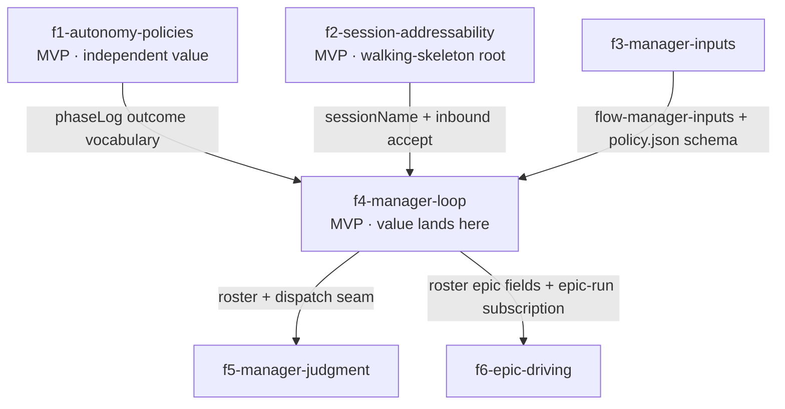

# Epic design — manager agent for flow (event-driven fleet manager + pipeline autonomy policies)

## 1. Problem & intent

**Goal:** Pipelines reach merge-ready PRs without a human unblocking every
designed checkpoint: policy pauses self-resolve by rule, judgment pauses
reach the user only when they need judgment.

flow's supervisor deliberately stops at human checkpoints — plan review,
the intent interview, clarification questions, the `gated` validation
gate, `needs-human` escalations, the epic design checkpoint — and the
design is that "the user walks away after approving the plan and reads the
result later" (`skills/pipeline/flow-pipeline/SKILL.md` Goal). In
practice the user does not come back on time. Read fresh on 2026-08-24
(`flow ls`, 34 rows across four repos), the stalls are:

| Pause                                    | Rows today                                                                                                                | Class       | Who could resolve it                                                  |
| ---------------------------------------- | ------------------------------------------------------------------------------------------------------------------------- | ----------- | --------------------------------------------------------------------- |
| `plan-pending-review`                    | 3 (`fmp-coverage-gate-remaining-endpoints`, `make-analysis-synthesis-generation-chain`, `fmp-yield-scale-disambiguation`) | policy      | a rule (the cross-model review already ran) or a plan critic          |
| `gated`                                  | 3 (#660, #758, #762)                                                                                                      | judgment    | only the user (UX/UI validation)                                      |
| `needs-human`                            | 1 (`email-delivery`)                                                                                                      | judgment    | a diagnoser, then the user                                            |
| `triage-pending-clarification` (crashed) | 1 (`toasts-should-show-same-time`)                                                                                        | policy      | the recommended default                                               |
| `epic-approved`, run never driven        | 2 (`watchlist-analysis-information-architect`, `modernize-flow-s-supervisor-architecture`)                                | policy      | merge the design PR + `flow epic run` + `launch-next`                 |
| `epic-design-pending-review` (crashed)   | 1 (`i-want-dramatically-improve-layout`)                                                                                  | judgment    | the user                                                              |
| `triaged-no-change` "(crashed)"          | 4                                                                                                                         | not a stall | answered Q&A pipelines; `flow ls` mislabels them — see Open Questions |

Two corrections to the prompt's numbers, both load-bearing for scope: (1)
four of the six rows `flow ls` lists under "pipelines needing resume" sit
at `triaged-no-change`, a **pending** phase (`bin/lib/state.ts`
`PENDING_PHASES`), so a dead session there is an answered question, not a
crash — "5 crashed unresumed" is really 2; (2) judgment pauses (`gated`
×3, `needs-human` ×1, design review ×1) are as numerous as the policy
pauses the autonomy flags remove (plan review ×3, clarification ×1, epic
frontier ×2). The prompt's own pushback holds — policy pauses need a
policy, not a manager — but the manager's judgment role is not a
long-tail nicety; it is half the backlog.

The underlying job (JTBD): the user wants to start work and come back to
PRs that are either merged or waiting on a decision only they can make —
with nothing waiting on them merely because a rule said "ask". Two
sub-jobs fall out: remove the rule-shaped waits entirely (they need no
manager), and put a delegate in the seat for the rest (plan critique,
diagnosis, epic frontiers, cross-pipeline overlap) that escalates the
genuinely human items with enough context to act on from a phone.

## 2. Clarified requirements

Epic-level, EARS-shaped. Per-feature acceptance lives in each feature's
`acceptanceCriteria[]` in `manifest.json`.

- **R1** — WHEN a feature pipeline launched with `--auto-approve-plan`
  reaches step 3's feature-intent end condition with the cross-model plan
  review run (`flow-plan-review` envelope `ran:true`, no demoted reviewer),
  plan.md's `## Recommendation` verdict `Proceed`, and `flow-plan-lint`
  clean THE SYSTEM SHALL advance to implementation in the same turn and
  record the gate in `phaseLog.outcome`; WHEN any part of that gate fails
  it SHALL pause at `plan-pending-review` as today with the skip reason
  recorded in `phaseLog.outcome`.
- **R2** — WHEN an interview or clarification pause carries a
  `Recommended:` default and the pipeline's opt-in interview timeout
  elapses with no reply THE SYSTEM SHALL adopt the recommendations (the
  existing `proceed` escape verb) and continue; WHEN the pause carries no
  default it SHALL escalate `NEEDS HUMAN` rather than guess.
- **R3** — WHEN `flow feature resume --all-crashed` runs THE SYSTEM SHALL
  resume every pipeline whose recorded process is dead at a non-terminal
  phase other than `triaged-no-change`, after one confirmation, inside the
  existing launch-concurrency semaphore.
- **R4** — WHEN any flow-launched Claude session starts THE SYSTEM SHALL
  name it by its slug (`--name`), record `sessionName` in
  `~/.flow/state/<slug>.json`, accept peer messages unattended
  (`crossSessionInbound: "accept"` in the flow-scoped `--settings` file),
  and show the name in `flow ls`.
- **R5** — WHEN a pipeline at a sanctioned pause point receives a message
  whose sender is the session named `flow-manager`, whose body starts
  with `MANAGER:`, and whose verb `flow-manager-inputs --check` accepts
  for that phase under `~/.flow/manager/policy.json` THE SYSTEM SHALL
  treat it exactly as the user's reply; at any other phase, from any
  other sender, or with no policy file it SHALL ignore the message
  (log-only) — never merge, never tick, never override.
- **R6** — WHEN the manager is running THE SYSTEM SHALL react to pipeline
  idle notices and state-file events, never poll `ListAgents`, and
  re-arm each one-shot idle subscription exactly once per handled event;
  a heartbeat no more frequent than every 20 minutes is the only
  time-driven wake, and on each heartbeat it SHALL re-arm a subscription
  for every live non-terminal pipeline that lacks one (a dropped or
  expired notice costs at most one heartbeat interval); it SHALL send at
  most one automated `MANAGER:` message per slug per phase transition
  before escalating (no wake/message ping-pong).
- **R7** — WHEN a pipeline reaches `gated`, `needs-human`, or an exhausted
  retry budget THE SYSTEM SHALL push one notification carrying the pause
  TLDR and a roster line, and SHALL NOT `gh pr merge`, tick a Test Steps
  item, or call `flow-merge-guard --record-override`; `flow-merge-guard`
  remains the only merge authority.
- **R8** — WHEN an epic reaches `epic-approved` under the tmux launcher
  THE SYSTEM SHALL open its `/flow-epic-run` session and drive
  `launch-next` while the reconciled frontier is non-empty and running
  features are below `epic.maxParallel`; `gated` children and
  `epic-design-pending-review` SHALL be escalated, never decided.
- **R9** — WHEN `flow manager stop` runs THE SYSTEM SHALL terminate the
  manager session via the `pid`/`procStartedAt` liveness signal, remove
  `~/.flow/manager/policy.json`, and leave every pipeline untouched; a
  pipeline that receives a `MANAGER:` message afterwards ignores it (R5).

**Before → after behavioral contrast (epic-grain):**

| Surface                                  | Before                                                                             | After                                                                                                                                             |
| ---------------------------------------- | ---------------------------------------------------------------------------------- | ------------------------------------------------------------------------------------------------------------------------------------------------- |
| Plan review on a routine feature         | always pauses at `plan-pending-review` until the user replies                      | opt-in `--auto-approve-plan` advances when the cross-model review ran and the plan's own verdict is `Proceed`; else pauses with a recorded reason |
| Interview / clarification with a default | waits indefinitely                                                                 | opt-in timeout adopts the `Recommended:` answers via `proceed`; no default ⇒ escalate                                                             |
| Crashed sessions                         | one `flow feature resume <slug>` per row, answered Q&A rows mislabeled "(crashed)" | `flow feature resume --all-crashed`; answered rows leave the needs-resume list                                                                    |
| Session identity                         | auto-named by the harness; unreachable by name                                     | named by slug, `sessionName` in state.json, `flow ls` column, inbound messages accepted unattended                                                |
| Who may answer a pause point             | only the human typing into the window                                              | the human, or the `flow-manager` session at the phase-keyed pause points `references/manager-inputs.md` names — nowhere else                      |
| Fleet oversight                          | `flow ls` when the user remembers                                                  | one manager session woken by idle notices + state events; pushes only judgment pauses                                                             |
| Epic execution                           | user merges the design PR, runs `flow epic run`, types `launch-next` per frontier  | the manager plays that human role above the unchanged playbook; `gated` and design approval still reach the user                                  |
| Merge authority                          | `flow-merge-guard` + step-10 backstop                                              | unchanged — the manager holds no merge, tick, or override authority                                                                               |

**Lost:** the guarantee that a human read every plan before implementation
(only for pipelines opted into `--auto-approve-plan`; the default stays
human-read); the guarantee that every interview answer is the user's own
(only under the opt-in timeout); `flow ls`'s "needing resume" list no
longer includes answered `triaged-no-change` rows; and the harness's
per-session auto-generated names for flow sessions (replaced by slugs).

## 3. High-level design

### Verified harness premises (re-verification record, 2026-08-24, Claude Code 2.1.243)

Every harness claim the prompt anchored on was re-checked against
code.claude.com/docs (cross-session-messaging, agent-view, scheduled-tasks,
cli-reference, settings, settings-reference, tools-reference,
permission-modes), the local `claude --help`, and — for the two tools this
session could load — the live tool schemas on 2.1.243. Nothing below is
anchored on an unverified claim; each `NOT VERIFIED` row is downgraded to
an Open Question.

| #   | Claim                                                               | Verdict                                     | What actually holds                                                                                                                                                                                                                                                                                                                                                                                                                                                                                                                                                                          | Design consequence                                                                                                                                                                                                                                                                                                                                                                                           |
| --- | ------------------------------------------------------------------- | ------------------------------------------- | -------------------------------------------------------------------------------------------------------------------------------------------------------------------------------------------------------------------------------------------------------------------------------------------------------------------------------------------------------------------------------------------------------------------------------------------------------------------------------------------------------------------------------------------------------------------------------------------- | ------------------------------------------------------------------------------------------------------------------------------------------------------------------------------------------------------------------------------------------------------------------------------------------------------------------------------------------------------------------------------------------------------------ | ---- | ------ | -------------------------------------------------------------- | --------------------------------------------------------------------------------------------------------------------------------------------------------------------------------------------------------------------------------------------- |
| 1   | `SendMessage notify_when_idle`: one-shot, 12h expiry, main-only     | **VERIFIED**                                | "The notice is one-shot … If no notice arrives within 12 hours, Claude Code drops the subscription and tells Claude." "Only the Claude in your main conversation can subscribe, and only to your sessions on this machine." A pure subscription (no message) "subscribes without starting a turn or spending tokens in the watched session, and sends the notice right away if that session is already idle." Needs v2.1.236+ in both sessions. The notice "can include the time that session's turn finished and a one-line status from that turn."                                         | The manager loop owns every subscription and re-arms after each notice (R6); sub-agents never subscribe. The one-line status carries the pipeline's pause TLDR to the manager for free.                                                                                                                                                                                                                      |
| 2   | Messages to idle sessions start a new turn                          | **VERIFIED**                                | "When the receiving session is idle, Claude Code starts a new turn with the message." Same for notices: "If the asking session is idle, Claude Code starts a new turn with the notice."                                                                                                                                                                                                                                                                                                                                                                                                      | A `MANAGER:` reply at a pending phase re-enters the supervisor exactly like a typed reply (f3).                                                                                                                                                                                                                                                                                                              |
| 3   | `crossSessionInbound` + HELD behaviour across permission classes    | **VERIFIED, sharpened**                     | Values `accept` / `hold` / `refuse`. With no value set, delivery is decided per message by class: a **prompting** receiver delivers except from a **bypassing** sender (held); a **bypassing** receiver holds everything except from a bypassing sender. `auto`, `acceptEdits`, `dontAsk` count as prompting; plan mode counts as bypassing only where bypass is available. Held messages expire after `dialogExpiry` (5 min default; `"never"` keeps them). `--settings` may carry `accept` for unattended workers; a **stricter** project/local value overrides managed/`--settings`/user. | Both directions bite, not just the manager's: a bypassing manager's messages are held by prompting pipelines, and a bypassing pipeline holds the manager. f2 writes `accept` into the flow-scoped `--settings` file (the launch path both backends share) and the manager launches through the same file. The user's `~/.claude/settings.json` sets `defaultMode: auto` (prompting class) — checked locally. |
| 4   | `--name <slug>` session flag                                        | **VERIFIED**                                | cli-reference: "`--name`, `-n` — Set a display name for the session … resume a named session with `claude --resume <name>` … if another live session … already uses the name, Claude Code applies a variant." Local `claude --help` lists `-n, --name <name>`. `/list-agents` shows each local session's cwd to tell same-named sessions apart; `@`-mention typeahead from v2.1.232.                                                                                                                                                                                                         | f2 passes `--name <slug>` on every flow launch (feature, resume, epic-create, epic-run) and records `sessionName`; the manager addresses by name and falls back to the `[ref]` disambiguator + cwd.                                                                                                                                                                                                          |
| 5   | `ListAgents` liveness fields (busy/idle)                            | **PARTIALLY VERIFIED**                      | The docs describe only what `ListAgents` lists, not its row fields. The **live `SendMessage` tool schema on 2.1.243** states: "A listed peer is alive and will process your message; messages enqueue and drain at the receiver's next tool round (its `ListAgents` row says whether it is busy or idle right now)" and "Every row leads with the agent's `name [ref]`." `claude agents --json` documents `state` (`working                                                                                                                                                                  | blocked                                                                                                                                                                                                                                                                                                                                                                                                      | done | failed | stopped`), `pid`, `status`, `waitingFor`, `sessionId`, `name`. | `ListAgents` is the reachability + busy/idle probe, never the sole liveness source: flow's own `pid`/`procStartedAt` verdict (`bin/lib/liveness.ts`) and `claude agents --json` are the documented fallbacks the roster records alongside it. |
| 6   | `Monitor` tailing `~/.flow/state/*.json`                            | **VERIFIED tool; idle-wake NOT VERIFIED**   | Monitor exists (command mode: `command`, `timeout_ms` default 300000 / max 3600000, `persistent`; every stdout line is an event; batched within 200ms; Bash permission rules apply; the auto-mode classifier reviews it). Docs say Claude "interjects when an event arrives" and the tool text says "notifications arrive in the chat" — **neither states that an event starts a new turn in an idle session.** Documented limitation: "Background Bash and monitor tasks are never restored on resume."                                                                                     | Monitor is the crash/new-pipeline detector **complement**, re-armed on every manager start, never the anchor (Open Questions). f4's acceptance test measures whether an idle manager wakes on a Monitor line; if not, the heartbeat + own-child socket post (row 11) cover the gap.                                                                                                                          |
| 7   | `ScheduleWakeup` 20–30 min fallback heartbeat                       | **NOT VERIFIED as standalone**              | ScheduleWakeup exists (60–3600 s clamp, `stop: true`) but is documented as "Reschedules the next iteration of a self-paced `/loop` … you don't call it directly." The documented direct primitive is `CronCreate`: session-scoped, min 1 minute, "fires between your turns … only while Claude Code is running and idle", 7-day expiry, jitter (up to half the interval sub-hourly; one-shots at :00/:30 fire up to 90 s early), restored on `--resume` if unexpired.                                                                                                                        | Heartbeat = a recurring `CronCreate` (every 20–30 min on a non-:00/:30 minute) that the manager re-creates before the 7-day expiry. ScheduleWakeup is used only if the manager is itself run as a self-paced `/loop` (Open Questions). f1's interview timeout is a one-shot `CronCreate`, not ScheduleWakeup.                                                                                                |
| 8   | `PushNotification` to the user on judgment pauses                   | **VERIFIED**                                | tools-reference: "Sends a desktop notification, and a phone push when Remote Control is connected … not accessible from Bedrock/…"; no permission prompt.                                                                                                                                                                                                                                                                                                                                                                                                                                    | R7's escalation channel. `flow-notify` (macOS, `FLOW_NOTIFY=1`) stays the per-pipeline terminal notifier; the manager does not duplicate it.                                                                                                                                                                                                                                                                 |
| 9   | `claude --bg` for a plain-shell manager                             | **VERIFIED flag; composition NOT VERIFIED** | `--bg`/`--background` "Start the session as a background agent and return immediately"; cannot combine with `-p`; background sessions appear in listings and can receive messages; a held dialog stays open while no terminal is attached. Not documented: whether `--bg` honours `--add-dir`/`--plugin-dir`/`--settings` together and auto-runs the positional seed.                                                                                                                                                                                                                        | The tmux launcher is the manager's primary host (the user's `~/.flow/config.json` already records `launcher: tmux`, and epic driving is tmux-only by hard constraint); `--bg` is settled empirically at f4 planning (Open Questions).                                                                                                                                                                        |
| 10  | A peer message can't answer `AskUserQuestion` or permission prompts | **VERIFIED**                                | "It can't approve anything: a message from another session never counts as your consent, so it can't answer a pending permission prompt." "A receiver never treats a message from another agent as your consent or approval." "Permission prompts still fire."                                                                                                                                                                                                                                                                                                                               | The trust boundary is mechanical at the harness: the step-9 gate-override form, `flow-merge-guard --record-override`, and every permission prompt are unreachable from the manager. f3 layers flow's own policy checkpoints on top (R5).                                                                                                                                                                     |
| 11  | Channel limits and script posting                                   | **VERIFIED**                                | Same-machine cap ≈1M chars; burst refusal at the sender; 50-message receive queue; per-sender rate limit + identical-repeat drop; loops "stop on their own". A hook or Bash child can post to its own session's socket (`CLAUDE_CODE_MESSAGING_SOCKET`, optional auth line on macOS); a message that asserts no permission class is **delivered** to a prompting receiver. The wire format beyond the auth line is **not documented.**                                                                                                                                                       | The manager batches roster updates and never message-loops. Script-posted state events (`flow-state-update` → manager socket) are a promising Monitor replacement but stay a spike inside f4 (Open Questions).                                                                                                                                                                                               |
| 12  | Version / availability                                              | **VERIFIED**                                | Local `claude --version` = 2.1.243 ≥ 2.1.236. Messaging is off when `CLAUDE_CODE_DISABLE_NONESSENTIAL_TRAFFIC`, `DISABLE_TELEMETRY`, `DO_NOT_TRACK`, or `DISABLE_GROWTHBOOK` disables feature-flag fetching; sockets are per-OS-user; containers/WSL split the namespace.                                                                                                                                                                                                                                                                                                                    | f2 warns at launch when any of those variables is set or the version is too old; the manager refuses to start on the same conditions.                                                                                                                                                                                                                                                                        |

### ADR-shaped key decisions

Per the methodology, this list IS the Parnas volatile-decision list — each
decision is hidden behind one feature boundary.

- **D1 — Policy pauses are removed by rule inside the pipeline, not by a
  manager.** _Context:_ plan review, interview/clarification defaults,
  crash resume, and epic frontier launch stop because a rule said "ask",
  not for lack of information; a manager that answers them re-introduces
  a judgment hop for a non-judgment decision, and the research's
  "one owner per decision" rule makes manager-approves vs
  pipeline-auto-approves exclusive. _Decision:_ opt-in pipeline policies
  (`--auto-approve-plan` mechanically gated on the cross-model review +
  the plan's own `## Recommendation` verdict; an interview timeout
  adopting `Recommended:` answers via the existing `proceed` verb;
  `flow feature resume --all-crashed`), each recording its outcome in
  `phaseLog.outcome` so a later reader knows _why_ a pipeline still
  paused. _Consequences:_ the policy thresholds are the volatile secret
  (they will be tuned); the stable interface is the phase vocabulary plus
  the `auto-approve: skipped (<reason>)` outcome strings the manager
  consumes. Precedent: step 3's `advance-to-step-5` no-checkpoint route
  with post-hoc PR-body disclosure. → **f1-autonomy-policies**
- **D2 — Session addressability rides the harness's own name + inbound
  setting, delivered through the flow-scoped `--settings` file.**
  _Context:_ sessions are auto-named today, so nothing can address a
  pipeline; inbound delivery depends on permission class unless a value
  is set; both launcher backends share `claudeArgv` and
  `ensureLaunchSettings` in `bin/lib/feature.ts`. _Decision:_ `--name
<slug>` on every flow launch, `sessionName` persisted in state.json,
  `crossSessionInbound: "accept"` written next to the seed hook in
  `~/.flow/launch-settings.json`, surfaced in `flow ls`. _Consequences:_
  one launch-path change covers feature, resume, epic-create and epic-run;
  a stricter project/local `refuse` still wins (documented precedence),
  which is the correct escape hatch for a repo that must not be managed.
  → **f2-session-addressability**
- **D3 — The manager-input trust contract is phase-keyed, mechanical, and
  marker-gated.** _Context:_ the harness tells a receiving Claude that a
  peer message is not the user; flow must define where a manager message
  nevertheless counts, without touching the gate, merge guard, stop
  guard, or the one `AskUserQuestion` form; the `modernize` epic may port
  steps 5–10 to a workflow, so step numbers are unstable but phases are
  not. _Decision:_ `references/manager-inputs.md` + a
  `flow-manager-inputs --check --phase 
 --verb <v>` helper that reads
  `~/.flow/manager/policy.json` (written only by `flow manager start`,
  absent otherwise); a message counts only when sender = `flow-manager`,
  body starts with `MANAGER:` and carries the random per-start token
  `flow manager start` wrote into `policy.json` (so a `MANAGER:` string
  that merely appears in an issue body, log, or fixture never passes),
  and the check passes; an explicit
  never-list (`gated`, `needs-human`, permission prompts, the
  gate-override form, any override token). AGENTS.md gains a
  `**Manager-input exemption: …**` bullet in the AskUserQuestion /
  auto-issue-create family — not a Task-tool exemption, so
  `bin/skill-md-lint.test.ts`'s nine-count is untouched. _Consequences:_
  an unmanaged install honours nothing (fail-closed); the contract
  survives the workflow port; the same-OS-user threat model (row 11) is
  accepted and named. → **f3-manager-inputs**
- **D4 — One event-driven manager session with a thin roster; wakes are
  notices, events, and a slow heartbeat — never a poll.** _Context:_ the
  rejected alternatives are a `/loop`-style tick (tokens per tick, cadence
  ≠ events), tmux `capture-pane`/`send-keys` scraping (needed a
  three-layer fusion in Fleet to be reliable), and persistent
  per-pipeline sub-agents (duplicate the supervisor, and only the main
  conversation can subscribe). _Decision:_ `flow manager start|stop|status`
  - `/flow-manager`; all manager state under its own directory
    `~/.flow/manager/` (`state.json` with `pid`/`procStartedAt`/
    `sessionName`/`startedAt`/`heartbeatExpiresAt`, `roster.json`,
    `policy.json`) — nothing in `~/.flow/state/`, which `listStates()`
    reads as pipelines, so no `manager` kind or `manager-idle` phase enters
    the pipeline vocabulary and no `listStates()` consumer (`flow ls`,
    `flow feature resume --all-crashed`, epic reconcile, `flow reap`) needs
    a special case; `flow-stop-guard` already exits 0 when the slug has no
    state.json, so the manager's turn-ends need no new phase; `flow ls`
    prints one manager status line from `~/.flow/manager/state.json`;
    identity env-first
    (`FLOW_KIND=manager FLOW_SLUG=manager`), never a pane option; model
    `fable` + effort `high` via `models.manager`; wake sources in order:
    `notify_when_idle` (one-shot, re-armed), a persistent `Monitor` over
    the state dir (re-armed on every start), a recurring `CronCreate`
    heartbeat every 20–30 min (re-created before the 7-day expiry). Each
    heartbeat also reconciles — it re-arms a subscription for every live
    non-terminal pipeline lacking one — and the roster records dispatch
    counts so the manager sends at most one automated message per slug per
    phase transition before escalating.
    _Consequences:_ cost scales with pause events, not wall-clock; the
    manager can crash and restart from disk (roster + state files) with
    zero pipeline impact; the judgment work is deliberately **not** in this
    feature (D5) so the loop ships as a thin, testable slice.
    → **f4-manager-loop**
- **D5 — Judgment is one-shot sub-agents reading disk artifacts, spawned
  by the manager, never by a pipeline.** _Context:_ plan critique and
  `needs-human` diagnosis need a fresh, bounded context over
  `.flow-tmp/plan.md`, `.flow-tmp/plan-review.md`, `phaseLog`, the PR,
  and CI logs — not the manager's roster context. _Decision:_ two named
  agent definitions (`agents/core/flow-manager-plan-critic.md`,
  `agents/core/flow-manager-diagnoser.md`) with typed JSON verdicts the
  manager maps onto f3 verbs (`approve` / `redirect: …` / escalate) or
  onto a push with the diagnosis attached; `/flow-manager` is documented
  in AGENTS.md as a separate sanctioned session with exactly these two
  Task fan-outs and zero `AskUserQuestion` forms. _Consequences:_ the
  critique prompts are the volatile secret; the stable interface is the
  verdict JSON + the f3 verbs. → **f5-manager-judgment**
- **D6 — Epic driving = the manager plays the human role above the
  unchanged `/flow-epic-run` playbook.** _Context:_ the playbook was
  deliberately rebuilt from a tick loop + judgment sub-agent into a
  one-step, human-in-the-loop recipe set; it must not regress. _Decision:_
  the manager merges the approved design PR only under the auto-merge
  rubric's own zero-unchecked-items condition (Open Questions), runs
  `flow epic run <slug>` (tmux-only by hard constraint — escalate under
  plain shell), subscribes to the epic-run session and sends
  `MANAGER: launch-next` while `flow-epic-dag --frontier` is non-empty and
  in-flight features are below `epic.maxParallel`, and turns sibling
  merges into `MANAGER: pull #N into the plan` at the affected sibling's
  next `plan-pending-review` (an already-sanctioned reply). `gated ⇒
escalate-only` and `epic-design-pending-review` stay human.
  _Consequences:_ zero playbook changes beyond f3's sanctioned-input
  sentence; the redirect surface reuses existing verbs, so no new redirect
  machinery. → **f6-epic-driving**

**Why these cuts (Parnas + Simon):** each feature hides one volatile
decision; every edge is a produced/consumed artifact (an outcome
vocabulary, a state field + settings key, a helper + policy schema, a
roster + dispatch seam); f1, f2, and f3 are independent strands that land
in parallel; f5 and f6 are parallel consumers of f4.

**Rejected (recorded so they are not re-litigated at feature planning):**
a periodic tick loop (`/loop 20m` with a `loop.md` — kept only as the
heartbeat mechanism); `capture-pane`/`send-keys`; persistent per-pipeline
sub-agents; the manager holding any merge/tick/override authority; a
judgment sub-agent or loop inside `/flow-epic-run`; any manager file
inside `~/.flow/state/` (`listStates()` would list it as a phantom
pipeline, or — as a PipelineState-shaped row — force a `manager` special
case into every consumer); a Bun daemon + per-event `claude -p` (see the
cross-model review under Decision analysis).

## 4. Feature decomposition

Six features. Each is one `flow feature create` pipeline / one PR-sized
vertical slice that passes its own gate. Ids, titles, and edges match
`manifest.json` exactly.

### f1-autonomy-policies · Pipeline autonomy policies: --auto-approve-plan, interview timeout, resume --all-crashed — **[MVP · independent value, no manager needed]**

- **Secret hidden (D1):** the policy thresholds (what counts as
  "reviewed enough" to self-approve; how long to wait for an answer).
- **Depends on:** nothing (independent strand).
- **Produces:** the three policies; the `phaseLog.outcome` vocabulary
  `auto-approve: <gate>` / `auto-approve: skipped (<reason>)` /
  `interview: auto-proceed` consumed by f4; `flow ls` no longer listing
  `triaged-no-change` rows as needing resume.

### f2-session-addressability · Name every flow session by slug and accept peer messages unattended — **[MVP · walking-skeleton root]**

- **Secret hidden (D2):** the identity/inbound carrier (harness `--name` +
  `crossSessionInbound` via the flow-scoped `--settings` file).
- **Depends on:** nothing (the seam everything manager-shaped hangs off).
- **Produces:** `--name <slug>` on every launch argv; `sessionName` in
  `PipelineState`; `crossSessionInbound: "accept"` in
  `~/.flow/launch-settings.json`; a SESSION column in `flow ls`; the
  version/env-var pre-flight warning.

### f3-manager-inputs · The manager-input trust contract: phase-keyed pause points, helper, AGENTS.md exemption

- **Secret hidden (D3):** which pause points accept which verbs from the
  manager, and the marker that turns delegation on.
- **Depends on:** nothing (prose + a pure helper over state.json).
- **Produces:** `skills/pipeline/flow-pipeline/references/manager-inputs.md`;
  `flow-manager-inputs --check` (phase + verb + the per-start token); the
  `~/.flow/manager/policy.json` schema (reader side, including the
  `token` field); the `flow-manager` name constant; one pointer sentence at
  each pause point in `/flow-pipeline`, `/flow-epic-create`, and
  `/flow-epic-run`; the AGENTS.md `**Manager-input exemption: …**` bullet;
  a lint asserting `flow-stop-guard`, `flow-merge-guard`, and step 10 are
  byte-untouched.

### f4-manager-loop · flow manager start|stop|status + the /flow-manager event-driven loop — **[MVP · value lands here]**

- **Secret hidden (D4):** the wake substrate (notices / events /
  heartbeat) and the roster shape.
- **Depends on:** **f1-autonomy-policies** — _edge artifact: the
  `phaseLog.outcome` vocabulary that tells the manager a policy pause was
  left unresolved and why;_ **f2-session-addressability** — _edge
  artifact: `sessionName` + the accept setting the manager needs to address
  and reach a pipeline;_ **f3-manager-inputs** — _edge artifact:
  `flow-manager-inputs` + the `policy.json` schema `flow manager start`
  writes._
- **Produces:** the `manager` verb (`bin/lib/manager.ts`, `verbs.ts`,
  completion, help); `~/.flow/manager/state.json` + `roster.json` (+
  `policy.json` per f3's schema, token included) — nothing in
  `~/.flow/state/`; a one-line manager status in `flow ls`;
  `/flow-manager` SKILL.md with the
  subscribe → classify → act/escalate → re-arm loop, `PushNotification`
  on judgment pauses, `flow feature resume <slug> --force` on dead
  non-terminal sessions; the event-dispatch seam f5/f6 plug into.

### f5-manager-judgment · One-shot plan-critic and needs-human diagnoser sub-agents

- **Secret hidden (D5):** the critique/diagnosis prompts and their
  verdict thresholds.
- **Depends on:** **f4-manager-loop** — _edge artifact: the roster + the
  dispatch seam that routes `plan-pending-review` (not self-approved) and
  `needs-human` events to a spawn._
- **Produces:** `agents/core/flow-manager-plan-critic.md`,
  `agents/core/flow-manager-diagnoser.md`, their typed verdict JSON
  (`.flow-tmp/manager-critic.json`, `.flow-tmp/manager-diagnosis.json`),
  the AGENTS.md "separate sanctioned session" bullet naming exactly these
  two fan-outs.

### f6-epic-driving · The manager plays the human role above /flow-epic-run

- **Secret hidden (D6):** the epic-driving recipe (when to merge the
  design PR, when to launch, when to redirect a sibling).
- **Depends on:** **f4-manager-loop** — _edge artifact: the roster's epic
  fields (`epic.slug`, feature id, sibling PRs' changed files) + the
  epic-run session subscription._
- **Produces:** the epic recipes in `/flow-manager`; the `MANAGER:
launch-next` / `pull #N into the plan` actuations; the tmux-only
  refusal notice under plain shell; the epic-membership line in every
  `gated` escalation push.

The walking-skeleton root is **f2**: without a name and an open inbox
there is no manager at all, and it is the thinnest end-to-end slice (one
launch-path change, one state field, one `flow ls` column). **f1 is the
independent-value strand** the prompt asked for — it ships first and
stands alone.

## 5. Dependency DAG

- **Topological build order:** `(f1 ∥ f2 ∥ f3) → f4 → (f5 ∥ f6)`. The
  three roots share no artifact and can run as three parallel pipelines;
  f5 and f6 are parallel consumers of f4.
- **MVP path:** `f1` alone removes the rule-shaped stalls; `f2 → f4`
  (with f3) is the thinnest manager that unblocks policy pauses and pushes
  judgment pauses. Judgment (f5) and epic driving (f6) add value on top.
- **DAG well-formedness:** 6 nodes, 5 edges, every `dependsOn` id
  resolves, no cycle — asserted by `flow-epic-dag --validate` (exit 0).

## 6. Open Questions

- **Manager state location vs `flow ls` phantom rows.** The prompt puts
  the roster in `~/.flow/state/manager.json`, but `bin/lib/state.ts`
  `listStates()` reads every `*.json` in that directory as a pipeline (the
  reason `turns/` is a subdirectory). **Decided (cross-model review,
  verified against `bin/flow-stop-guard.ts`):** all manager state lives
  under `~/.flow/manager/` (`state.json`, `roster.json`, `policy.json`);
  nothing is written to `~/.flow/state/`. The designer's first cut — a
  PipelineState-shaped row with a `manager-idle` phase — was dropped
  because `flow-stop-guard` already exits 0 for a slug with no
  state.json, so the row bought nothing the stop guard needed while
  forcing a `manager` special case into every `listStates()` consumer.
  `flow ls` shows a one-line manager status instead of a row.
- **Heartbeat primitive.** ScheduleWakeup is documented as `/loop`-internal
  (row 7). **Recommended:** a recurring `CronCreate` every 20–30 min on a
  non-:00/:30 minute, re-created before its 7-day expiry; the manager
  records `heartbeatExpiresAt` in the roster. Running the manager as a
  self-paced `/loop` (which _would_ use ScheduleWakeup and has a built-in
  ~20 min fallback wake) was weighed and rejected: each iteration re-runs
  the prompt, which is the tick loop by another name.
- **Does a Monitor event wake an idle manager?** Not documented (row 6).
  **Recommended:** keep Monitor as the crash/new-pipeline complement and
  make "idle manager wakes on a state-file event" an explicit f4
  acceptance test; if it fails, the heartbeat plus the own-child socket
  spike below carry the crash-detection latency (≤30 min) and the design
  does not change shape.
- **Script-posted state events instead of Monitor.** A `flow-state-update`
  that posts `{slug, phase}` to the manager's inbox socket would make
  every phase transition an event with no watcher process; the docs
  confirm delivery semantics but not the wire format (row 11).
  **Recommended:** a bounded spike inside f4's planning (probe the socket
  with a documented own-child post first); adopt only if the format is
  stable across the two Claude Code versions on the machine, else Monitor.
- **Plain-shell manager (`claude --bg`).** Flag verified, composition with
  `--add-dir`/`--plugin-dir`/`--settings` + seed auto-run not (row 9).
  **Recommended:** the tmux launcher is the primary host (the user's
  config already records `launcher: tmux`, and f6 is tmux-only by hard
  constraint); f4 settles `--bg` empirically and ships it or a named
  "plain-shell manager needs tmux" refusal.
- **The exact `--auto-approve-plan` gate.** `flow-plan-review` emits raw
  prose, not a verdict. **Recommended:** the three-part mechanical gate in
  R1 — review `ran:true` with no demoted reviewer (when `review.gemini` is
  off, the flag degrades to a named skip and the pipeline still pauses,
  since the user asked for the gate to be _on_ the cross-model review),
  plan.md `## Recommendation` verdict `Proceed` (the discovery's own
  first-class verdict enum), and `flow-plan-lint` clean; pre-ticked
  candidate issues proceed as authored with post-hoc disclosure, the
  existing `advance-to-step-5` precedent.
- **Interview timeout default.** **Recommended:** off by default; opt-in
  via `flow feature create --interview-timeout <dur>` and config
  `interview.autoProceedAfter`; a one-shot `CronCreate` whose prompt is
  `proceed`, armed at each interview/clarification pause and re-armed on
  resume; a stale auto-`proceed` at any other phase is a no-op; a
  clarification without a `Recommended:` line escalates instead of
  guessing (R2).
- **May the manager merge the approved design PR?** `/flow-epic-create`
  leaves it open "for the human to merge", and `flow epic run` refuses
  until the manifest is on the base branch — so an `epic-approved` epic
  stalls one step later without this. **Recommended:** yes, narrowly: only
  a PR `/flow-epic-create` opened, only after the user's own `approve` at
  the checkpoint (`epic-approved` in state.json), only with CI green and
  zero unchecked `- [ ]` items in its body — the same zero-unchecked
  condition the auto-merge rubric uses — else escalate. This is the one
  place the manager touches `gh pr merge`; it never applies to a feature
  PR or anything `gated`. Confirm you are content with that boundary.
- **Design approval stays human.** **Recommended:** `epic-design-pending-
review` is never answered by the manager; f5's critic may attach a
  one-paragraph critique to the push so the user can approve from a phone.
- **Default delegation set at `flow manager start`.** **Recommended:**
  interview/clarification `proceed`, `checkpoint-pending-clear`
  `continue`, crash resume, and epic `launch-next` are delegated by
  default; `plan-pending-review` `approve` is delegated only through f5's
  critic verdict (until f5 lands, an un-self-approved plan review is
  pushed to the user, not approved); `--delegate <list>` overrides.
- **Sender spoofing.** Any same-OS-user session could name itself
  `flow-manager`. **Recommended:** accept the same-user threat model (the
  socket is already restricted to the OS user and the harness disambiguates
  duplicate names with `[ref]` + cwd), require the `policy.json` marker,
  the `MANAGER:` prefix, and the random per-start token `flow manager
start` writes into `policy.json` and the manager echoes in every message
  (accepted from the cross-model review: one field closes the cheap case
  where a `MANAGER: proceed` string arrives in an issue body, log, or
  fixture rather than as a peer message), and log every honoured message
  with its sender `[ref]` in `phaseLog.outcome` — a per-message nonce or
  signed exchange is not worth its complexity for a single-user tool.
- **Stall-count correction.** Four of the six rows `flow ls` lists as
  needing resume are answered `triaged-no-change` Q&A pipelines.
  **Recommended:** f1 stops listing pending-terminal rows under "needing
  resume", labels them `(answered)`, and suggests `flow done`;
  `--all-crashed` excludes them.
- **Overlap with a live pipeline.** `i-want-improve-flow-ls` (flow repo,
  `planning` as of 2026-08-24) touches `bin/lib/ls.ts`, which f1 and f2
  also edit. **Recommended:** land f1/f2 after it merges or rebase across
  it — precisely the cross-pipeline overlap the manager's roster is meant
  to surface; note it in both feature prompts.
- **Manager model/effort.** **Recommended:** `fable` + `high`
  (`models.manager`, `--effort` override); `xhigh` is an opt-in — cost
  scales with pause events, so the effort dial is cheap to raise later.
- **`--name` on epic sessions too.** **Recommended:** yes — f6 must
  address the epic-run session by name, and epic-create windows are
  pause points f3 lists.
- **Right-sizing.** Genuinely epic-sized: six PR-sized features across the
  Bun CLI, state schema, three skills' prose, AGENTS.md, and a new
  skill + two agent definitions; not a single feature over-decomposed.

## Decision analysis

**Fork: one epic vs two (policies epic, manager epic).** Exclusive
packaging of complementary work. (a) Two epics keep the "no manager
needed" story pure and let f1 ship without the manager's review burden.
(b) One epic keeps the `f1 → f4` edge explicit — the manager's behaviour
at `plan-pending-review` is _defined_ by whether f1's gate already ran
(`phaseLog.outcome`), and splitting the epics would hide that
produced/consumed artifact behind an informal "ship f1 first". Downstream
DAG consequence: (a) yields two disconnected DAGs with an undocumented
cross-epic dependency; (b) yields one DAG with three parallel roots and f1
still shippable alone. **Verdict:** (b) — the edge is real and cheap to
keep visible; f1's independence is preserved by making it a root.

**Fork: manager loop + judgment sub-agents as one feature vs two.**
Exclusive. (a) One feature ships the "full" manager in one PR, but the
loop (harness primitives: subscriptions, Monitor, heartbeat, roster) and
the judgment (critique prompts, verdict thresholds) change for unrelated
reasons and review as different objects; the PR would mix a Bun verb, a
skill, two agent definitions, and an AGENTS.md governance change. (b) Two
features make f4 a thin, testable slice that already delivers value
(policy messages + judgment pushes) and let f5 and f6 land in parallel
off it. Downstream consequence: (a) makes f6 wait on the judgment work it
does not consume; (b) frees it. **Verdict:** (b) — the prompt's five
slices become six, with f4's scope narrowed rather than the epic widened.

**Fork: f2 and f3 as one "manager seam" feature vs two.** Exclusive. Both
are roots and both are prerequisites of f4, but f2 is Bun launch-path +
state code and f3 is skill prose + a pure helper + AGENTS.md governance;
they change for different reasons (a harness naming change vs a new pause
point) and f3's lint (guards byte-untouched) is a review object of its
own. **Verdict:** two features, parallel — the DAG stays sparse and each
PR has one coherent review.

### Cross-model review (AGY)

Run 2026-08-24 via `flow-plan-review --depth deep` over this file. Only
Gemini 3.7 Flash (High) engaged (6/6 lenses); the Opus 4.6 reviewer
skipped (`agy-error`), so the two-reviewer convergence rule does not
apply — every point below was weighed as single-reviewer input against
the codebase.

- **Accepted — manager state out of `~/.flow/state/`.** The cut "store
  manager state in `~/.flow/manager/` instead of faking a PipelineState
  row" checks out: `bin/flow-stop-guard.ts` exits 0 when the slug has no
  state.json, so the `manager-idle` phase bought nothing, and a row would
  have forced a `manager` special case into every `listStates()` consumer
  (`flow ls`, `--all-crashed`, epic reconcile, `flow reap`). Revised D4,
  f4, Rejected, Open Questions, and the manifest's f4 description and
  acceptance.
- **Accepted — heartbeat reconciliation.** Failure mode "the one-shot
  notice expires after 12 h and does not survive resume": each heartbeat
  now re-arms a subscription for every live non-terminal pipeline lacking
  one, so a dropped notice costs at most one heartbeat interval. Revised
  R6, D4, manifest f4.
- **Accepted — dispatch cap.** Failure mode "manager ping-pong on an
  unhandled pending phase": the roster records dispatch counts and the
  manager sends at most one automated `MANAGER:` message per slug per
  phase transition before escalating. Revised R6, D4, manifest f4.
- **Accepted — per-start token on manager messages.** The injection
  challenge (a `MANAGER: proceed` string inside an issue body or log):
  `flow manager start` writes a random token into `policy.json`, every
  manager message carries it, and `flow-manager-inputs --check` compares
  — one field, no nonce exchange; the same-OS-user threat model is
  otherwise unchanged. Revised D3, f3, Open Questions, manifest f3.
- **Overridden — `--auto-approve-plan` should fall back to lint-only when
  AGY is absent.** The prompt anchors the flag on the cross-model review
  by name; a silent lint-only tier would approve plans no second model
  read. The named skip lands in `phaseLog.outcome` and f5's critic is the
  sanctioned non-AGY path to an approval. f1 planning may add an explicit
  opt-in lint-only tier — a threshold, not a re-cut.
- **Overridden — let the manager clear mechanically verifiable Test
  Steps / `gated` items.** The pipeline already automates every locally
  verifiable Test Step before gating (AGENTS.md reserves manual gates for
  external/irreversible/subjective items), so what reaches `gated` is by
  construction the residue only the user can judge; the prompt's
  `gated ⇒ escalate-only` holds.
- **Already covered — the manager should be able to approve plans
  regardless of the launch flag.** f5's critic sends `MANAGER: approve`
  at `plan-pending-review` for pipelines launched without
  `--auto-approve-plan` (Open Questions, default delegation set).
- **Overridden — 30-min wake latency makes event-driven risky; cut
  Monitor.** The notice is the primary wake (verified: an idle receiver
  starts a turn immediately); the heartbeat is the floor only when a
  notice is lost, now bounded by the reconciliation above. Monitor stays a
  complement with an explicit kill criterion (f4's idle-wake test), not an
  anchor.
- **Overridden — f4 has negligible standalone value; cut f5 from the
  MVP.** f5 is already non-MVP. f4 alone delivers the phone push on every
  judgment pause, crash resume, and the delegated policy verbs for
  pipelines launched without f1's flags — the walk-away value the prompt
  asks for; the split exists so f5 and f6 land in parallel.
- **Overridden — fold f3 into f2/f4.** Weighed in the fork above: f3 is
  the governance object (three skills' pause-point prose, the AGENTS.md
  exemption, the guards-untouched lint), reviewed on its own; the prompt's
  slices carried it separately.
- **Overridden — "dominant alternative": a Bun daemon + per-event
  `claude -p`.** Conflicts with AGENTS.md ("not a long-running daemon";
  no `claude -p` from a supervisor) and the prompt's decided design, and a
  per-event headless call holds no cross-pipeline roster — the context
  the judgment role exists for. Recorded so it is not re-litigated; the
  file-based-inbox alternative is already the named fallback under
  `## Plan risks`.
- **Overridden — set `dialogExpiry: "never"`.** With
  `crossSessionInbound: "accept"` (row 3) messages are delivered, not
  held, and a busy receiver enqueues them for its next tool round (row
  11); `dialogExpiry` governs only the hold path this design removes. f2
  planning may still set it as belt-and-braces; not a design change.
- **Already covered — PID recycling.** R9 and row 5 already require both
  `pid` and `procStartedAt` (`bin/lib/liveness.ts`).

## Recommendation

**Proceed** — with the four verification-driven adjustments already
applied (heartbeat re-anchored from ScheduleWakeup to `CronCreate`;
Monitor demoted from anchor to complement pending an idle-wake test;
`ListAgents` liveness cross-checked against flow's own `pid` signal; the
manager state kept out of the pipeline state dir — see the cross-model
review) and the stall-count
correction folded into f1. Redundancy check: the nearest existing
capabilities are `/loop` + `loop.md` (the rejected tick loop, retained only
as the heartbeat mechanism), the `claude agents` dashboard (a human-facing
view, complementary), and `/flow-epic-run` (kept unchanged; the manager
plays its human role) — no existing capability delivers the outcome, and
no other planned epic overlaps (`modernize-flow-s-supervisor-architecture`
is orthogonal by construction: the manager reads state.json, messages, and
`gh` only).

## Plan risks

The weakest assumption is that a pipeline supervisor will reliably honour
a `MANAGER:` message at a pause point as the user's reply while the
harness itself frames every peer message as "not the user and never
consent" — the f3 contract is prose the model can rationalise in either
direction (over-trust: acting on an unsanctioned message; under-trust:
staying stalled with the manager's reply in its transcript). If that
holds, f4 degrades to a notification bot and the seam has to be re-cut
around a file-based inbox the supervisor reads on resume (`~/.flow/state/
<slug>.answer.json` + `flow feature resume`) — a different decomposition,
which is why f3 makes the check mechanical (`flow-manager-inputs
--check`) and why f4's acceptance test is a live round-trip on a real
paused pipeline, not a unit test.
