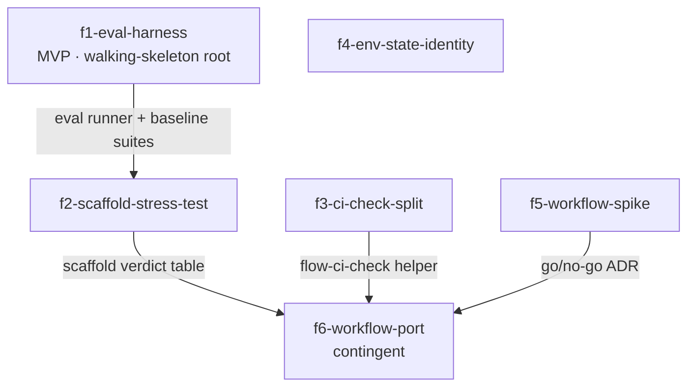

# Epic design — modernize flow's supervisor architecture

## 1. Problem & intent

**Goal:** Replace hand-rolled supervisor scaffolding with harness-native
primitives: eval-gated scaffold removals, native CI-wait wakeups,
env/state-only session identity, and a measured go/no-go on a deterministic
steps-5–10 workflow.

flow's supervisor was architected against the 2025 Claude Code harness:
~200k-token context windows, no nested subagents, no background-completion
events, no deterministic orchestration primitive. Each constraint got a
hand-rolled compensation — a 2,733-line prose state machine
(`skills/pipeline/flow-pipeline/SKILL.md`), a nine-exemption Task-tool
governance ledger, context-isolation subagents (verify-loop, haiku
gatekeeper), checkpoint-pending-clear state plumbing, a 1,851-line owned
poll loop (`bin/flow-ci-wait.ts`, the source of the false-ci-hang bug
class), and tmux-pane identity plumbing that predates the plain-shell
default launcher. The 2026 harness has since shipped the primitives those
compensations stood in for. The underlying need is **not** a rewrite — the
completed research review (pipeline `review-research-related-even-newer`)
confirmed the discovery → coder → multi-lens review split, the
artifact/state/reset architecture, the active-evaluator UI pass, and the
auto-merge rubric as keepers. The need is to retire, one measured step at a
time, the scaffolding whose motivating constraint no longer exists — and to
keep, with recorded evidence, the scaffolding that still earns its
complexity. flow's differentiators (the auto-merge gate rubric, cross-model
review, resource-teardown discipline) are preserved unchanged throughout.

## 2. Clarified requirements

Epic-level, EARS-shaped. Per-feature acceptance lives in each feature's
`acceptanceCriteria[]` in `manifest.json`.

- **R1** — WHEN a scaffold removal is proposed THE SYSTEM SHALL provide a
  repeatable, locally-runnable eval producing before/after scores, so every
  keep/remove verdict is measured rather than vibes-based (skips cleanly
  with a named notice where `claude` is absent, e.g. CI).
- **R2** — WHEN a stress-tested scaffold fails to earn its complexity under
  the eval THE SYSTEM SHALL remove it; WHEN it still earns its complexity
  THE SYSTEM SHALL record a keep-verdict with the measured evidence — never
  a silent retention.
- **R3** — WHEN a pipeline waits on CI/Copilot THE SYSTEM SHALL wait via
  harness-native primitives (background-completion notification,
  Monitor/ScheduleWakeup) and compute the verdict via a one-shot
  deterministic helper from live GitHub state plus timestamps persisted in
  `~/.flow/state/<slug>.json` — a suspended or slept host process SHALL NOT
  be able to produce a false `ci-hang`.
- **R4** — WHEN any helper or skill resolves pipeline identity (slug, kind,
  phase) outside the epic-orchestration surfaces that are tmux-only by hard
  constraint THE SYSTEM SHALL resolve from `FLOW_SLUG` / state.json only,
  never from a tmux pane option.
- **R5** — WHEN the workflow-port verdict is *go* THE SYSTEM SHALL drive
  pipeline steps 5–10 from a deterministic workflow script while triage,
  plan review, and the merge gate remain human-in-the-loop supervisor
  turns; WHEN the verdict is *no-go* THE SYSTEM SHALL retain the prose
  state machine for those steps and record why.

**Before → after behavioral contrast (epic-grain):**

| Surface | Before | After |
| --- | --- | --- |
| Scaffold removals | argued in prose, decided by intuition | gated by a local eval harness with recorded before/after deltas |
| Verify-loop isolation, haiku gatekeeper, checkpoint-pending-clear | permanent fixtures | each holds a measured keep-verdict or is removed |
| CI/Copilot wait | 1,851-line helper-owned poll loop; suspension ⇒ false `ci-hang` | harness-native wait + one-shot `flow-ci-check` verdict from live state; suspension-immune |
| Session identity | env-first but pane-option reads persist across ~17 helpers | env/state-only everywhere except the documented tmux-only epic surfaces |
| Pipeline steps 5–10 | 2,733-line prose state machine + nine-exemption ledger | deterministic workflow script (if spike + measurements say go), supervisor keeps the human gates |

**Lost:** the pane-option identity fallback outside epic surfaces (a
tmux-window recovery path when `FLOW_SLUG` is stripped from the env — after
this epic, a stripped env resolves to "no pipeline" rather than recovering
via the pane); flow-ci-wait's self-contained single-process wait (the wait
becomes a harness-session collaboration, so a detached `flow-ci-wait <PR>`
run outside a Claude session no longer loops — it becomes a one-shot
check); and, if the port lands, the step-5–10 prose narrative in the
supervisor transcript (progress moves to the workflow runtime's view).

## 3. High-level design

### Verified platform premises (re-verification record, 2026-08-19)

The epic prompt flagged five low-confidence claims sourced partly from
third-party blogs. Each was re-verified against primary sources
(code.claude.com/docs, platform.claude.com/docs) plus the live harness
before any feature below anchored on it. Outcomes:

| # | Claim | Verdict | What actually holds | Design consequence |
| --- | --- | --- | --- | --- |
| 1 | Workflow tool (deterministic JS orchestration) | **CONFIRMED, narrowed** | Dynamic Workflows are GA (code.claude.com/docs/en/workflows.md): a JS script orchestrates subagents, runs in the background, is resumable within a session (completed agents return cached results). NOT in the Agent SDK. Per-agent model/effort overrides and token budgets are **not documented** as workflow-level parameters — model routing stays in named-agent frontmatter (flow already has 16 named `agents/*.md` definitions, so this fits). | Feature E survives but split: a spike (f5) empirically settles the undocumented residue before the port (f6) is committed. |
| 2 | Nested subagents: depth 5, observable | **CONFIRMED, corrected** | Nesting is supported and tree-observable in the subagent panel, but the default cap is **3** (it moved 5 → 1 → 3 across v2.1.172 → v2.1.217 → v2.1.219+; env-overridable via `CLAUDE_CODE_MAX_SUBAGENT_SPAWN_DEPTH`). flow's `docs/nested-subagents-assessment.md` cites the stale 5. | The flat-fan-out policy's *platform* rationale is confirmed gone; flow's own context-economy rationale (re-ratified in that assessment) still stands, so the ledger is not re-litigated wholesale — it dissolves only where f6 ports the sites into deterministic code. f2 corrects the stale citation. |
| 3 | Background completion re-invokes the session | **PARTIALLY CONFIRMED** | Three distinct primitives, not one: (a) background tasks/agents surface a completion notification and land results in the transcript — no polling needed; (b) `ScheduleWakeup` re-invokes on a timer (clamped 60–3600s); (c) `Monitor` watches a condition/log. Machine sleep is handled: processes resume on wake and the supervisor reconnects rather than treating the gap as idle. | Feature C restructured onto the real primitives: a dumb, restartable waiter whose exit wakes the session, plus a one-shot deterministic verdict helper. The 60s ScheduleWakeup floor supersedes flow-ci-wait's 30s early cadence — acceptable. |
| 4 | `claude plugin eval` stable enough to gate removals in CI | **FAILS the bar (early access)** | The command exists (v2.1.198+) with JSON/report output, but is gated per-organization and not publicly documented; additionally flow's CI installs no `claude` at all, so *no* claude-driven eval can be a CI gate today. | Feature A restructured: a **flow-owned** local eval harness (the `flow-plugin-contract-lint` pattern: maintainer-run, named skip in CI), with `claude plugin eval` recorded as the adoption path once GA. Do not anchor on the early-access gate. |
| 5 | Current models run multi-hour coherent sessions (window claim) | **CONFIRMED, with caveat** | Current-generation models (incl. the model flow runs on) carry **1M-token** context windows at standard pricing; server-side auto-compaction exists on 4.6+ models. Caveat: context rot is a documented phenomenon — a big window is not free coherence. | The 200k-era sizing premise behind the isolation scaffolds is genuinely outdated, which justifies *stress-testing* them (feature B) — but the rot caveat is exactly why removals are eval-gated rather than blanket. |

### ADR-shaped key decisions

Per the methodology, this list IS the Parnas volatile-decision list — each
decision is one feature boundary.

- **D1 — Measurement substrate.** *Context:* removals need a gate;
  `claude plugin eval` is org-gated early access and flow's CI has no
  `claude` binary (verdict 4). *Decision:* a flow-owned eval harness —
  headless scenario runs plus deterministic graders over the artifacts
  flow already emits (state.json, `.flow-tmp/*` result JSONs, transcripts)
  — local-first like `flow-plugin-contract-lint`, vitest remains the CI
  gate. *Consequences:* the eval mechanics (runner, grader shape, scoring)
  are the volatile secret hidden behind a stable `flow-eval` CLI + report
  schema; swapping the backend to `claude plugin eval` later is a runner
  change, not a consumer change. → **f1-eval-harness**
- **D2 — Scaffold keep/remove policy.** *Context:* three named scaffolds
  were sized for 200k windows (verdict 5): the verify-loop subagent
  isolation, the haiku gatekeeper, checkpoint-pending-clear. *Decision:*
  eval-gated, one-candidate-at-a-time stress-test — remove, measure the
  delta, keep-or-drop with recorded evidence; verdicts land in a committed
  table the port consumes. *Consequences:* which scaffolds survive is
  volatile (it depends on measurements); the stable interface is the
  verdict record + the eval suites. → **f2-scaffold-stress-test**
- **D3 — CI-wait mechanism: separate waiting from deciding.** *Context:*
  `flow-ci-wait` owns both the wait (a sleep loop whose in-process elapsed
  clock inflates under suspension — the false-ci-hang class) and the
  verdict (a pure, well-tested decision matrix). Verdict 3 gives
  harness-native waiting. *Decision:* split — a dumb, restartable,
  policy-free waiter runs in the background and its exit wakes the
  session; a one-shot `flow-ci-check` recomputes the verdict fresh from
  live GitHub state plus timestamps persisted in state.json. The pure
  matrix functions and their ~5,000 test lines move, not rewrite.
  *Consequences:* suspension cannot fabricate `ci-hang` (elapsed derives
  from persisted wall-clock anchors — preferring immutable GitHub-side
  timestamps such as check-run `completed_at` / review `submitted_at` over
  any host clock — and the verdict is recomputed from truth at wake time);
  the CI/Copilot decision matrix stays deterministic and unit-tested.
  → **f3-ci-check-split**
- **D4 — Session-identity carrier.** *Context:* `bin/lib/session-identity.ts`
  is already env-first, but pane-option reads persist across ~17 helpers
  and several skills, while plain shell is the default launcher.
  *Decision:* env/state-only identity everywhere except the two
  epic-orchestration surfaces that are tmux-only by independent hard
  constraint (`resolveKindAmbient`'s documented contract); pane options
  become publish-only mirrors, deleted where nothing consumes them.
  *Consequences:* one identity code path under both launchers; the
  epic-surface exception keeps its bidirectional producing/consuming-site
  comments. → **f4-env-state-identity**
- **D5 — Orchestration substrate for steps 5–10 (two-stage: evidence,
  then port).** *Context:* verdict 1 confirms workflows but leaves
  flow-critical capabilities undocumented (invoking Bash helpers,
  plugin-qualified named-agent spawns, hand-back at a human gate,
  cross-session resume against state.json); the port is also mutually
  exclusive with keeping prose enforcement for those steps, and the epic
  prompt makes it contingent on B's measurements. *Decision:* mirror the
  repo's `p6-distribution-eval` / `p6-distribution-impl` precedent — a
  throwaway spike ADR (f5) settles the undocumented capabilities
  empirically; the port (f6) consumes that ADR plus f2's verdicts and
  f1's no-regression gate, and is cancelled at the epic-run checkpoint on
  a no-go rather than force-run. *Consequences:* the biggest-blast-radius
  feature carries a kill-switch grounded in evidence; the Task-tool
  exemption prose for ported sites dissolves into workflow code only if
  the port lands. → **f5-workflow-spike**, **f6-workflow-port**

**Why these cuts (Parnas + Simon):** each feature hides exactly one
volatile decision; every edge is a produced/consumed artifact (eval suites,
a verdict table, a helper CLI, an ADR); f3 and f4 are deliberately
disconnected strands — they share no artifact with the measurement chain
and can land in parallel.

## 4. Feature decomposition

Six features. Each is one `flow feature create` pipeline / one PR-sized
vertical slice. Ids, titles, and edges match `manifest.json` exactly.

### f1-eval-harness · Flow-owned eval harness + baseline scaffold suites — **[MVP · walking-skeleton root]**

- **Secret hidden (D1):** how supervisor behavior is scored (runner,
  grader shape, scoring thresholds).
- **Depends on:** nothing (walking-skeleton root).
- **Produces:** the `flow-eval` runner + report schema; committed baseline
  suites for the three f2 candidates; the named-skip-when-no-claude
  contract (CI stays vitest).

### f2-scaffold-stress-test · Eval-gated stress-test of the three 200k-era scaffolds

- **Secret hidden (D2):** which scaffolds survive (a measurement outcome,
  not an architecture commitment).
- **Depends on:** **f1-eval-harness** — *edge artifact: the `flow-eval`
  runner + the three baseline suites and their recorded baseline scores.*
- **Produces:** a committed keep/remove verdict table with before/after
  deltas; the removals themselves (one candidate per commit); the
  corrected nested-subagent depth-cap citation in
  `docs/nested-subagents-assessment.md`.

### f3-ci-check-split · Split flow-ci-wait into a harness-native wait + one-shot flow-ci-check

- **Secret hidden (D3):** how waiting happens (a swappable harness
  primitive) — decoupled from how verdicts are computed (the stable,
  tested matrix).
- **Depends on:** nothing (independent strand).
- **Produces:** the one-shot `flow-ci-check` helper + persisted-timestamp
  contract in state.json; the updated `polling-protocol.md`; the
  suspension-immunity regression test.

### f4-env-state-identity · Finish env/state-only session identity

- **Secret hidden (D4):** the identity carrier (env/state vs pane),
  settled once behind `session-identity.ts`.
- **Depends on:** nothing (independent strand).
- **Produces:** zero pane-option *reads* outside the documented epic
  surfaces; publish-only mirror status (or deletion) for each tmux option;
  a grep-style structural lint keeping it that way.

### f5-workflow-spike · Throwaway workflow spike + go/no-go ADR for the steps-5–10 port

- **Secret hidden (D5, evidence half):** whether the workflow runtime
  actually supports flow's four load-bearing capabilities (Bash helper
  calls, plugin-qualified named-agent spawns, human-gate hand-back,
  resume against state.json).
- **Depends on:** nothing (evidence-gathering; runs in parallel with the
  measurement chain).
- **Produces:** a committed ADR with a go/no-go verdict and per-capability
  evidence; nothing user-shipping.

### f6-workflow-port · Port pipeline steps 5–10 to a deterministic workflow script — **[contingent]**

- **Secret hidden (D5, commitment half):** the orchestration substrate for
  the mechanical middle of the pipeline.
- **Depends on:** **f5-workflow-spike** — *edge artifact: the go/no-go ADR
  + spike script*; **f2-scaffold-stress-test** — *edge artifact: the
  verdict table naming which scaffolds survive into the ported steps (and,
  transitively through f2, the f1 eval suites as the no-regression
  gate)*; **f3-ci-check-split** — *edge artifact: the one-shot
  `flow-ci-check` helper the ported step 7 invokes.*
- **Produces:** the committed workflow script; a slimmed
  `flow-pipeline/SKILL.md` (human-gate phases only); the ported sites'
  exemption prose dissolved into code. **Contingent:** cancelled at the
  epic-run checkpoint if f5 records no-go or f2's measurements undercut
  the port's premise — never force-run.

The walking-skeleton root is **f1**: it is the thin slice the epic's core
bet (measured removals) hangs off, and it de-risks the methodology before
any behavior changes ship. f3, f4, and f5 are legal disconnected strands.

## 5. Dependency DAG

## 6. Open Questions

- **`claude plugin eval` enablement.** The command is org-gated early
  access; flow's account may or may not obtain enablement during this
  epic. **Recommended:** build the flow-owned harness now (D1) and record
  a forward check at f1's planning — adopt `claude plugin eval` as a
  runner backend when it reaches GA; the report-schema seam makes that a
  swap, not a rewrite.
- **Eval token cost and determinism.** Headless scenario runs spend real
  tokens, and LLM-behavioral evals are noisy. **Recommended:** a small
  fixed scenario set per candidate, deterministic artifact graders over
  emitted JSON/state (not free-form LLM judgment), multiple runs only
  where variance demands it; maintainer-run local, mirroring
  `flow-plugin-contract-lint`'s CI-skip pattern. Seed the scenarios from
  historical, complex pipeline runs (the largest merged flow PRs and their
  recorded state/artifact trails) rather than hand-authored toy examples —
  a direct counter to the named plan risk that too-small scenarios
  green-light removals they cannot falsify.
- **Workflow availability in flow's exact environment.** Docs say GA on
  paid plans (a `/config` toggle on Pro); per-agent model overrides and
  token budgets are undocumented at the workflow layer. **Recommended:**
  f5 settles all of it empirically before f6 commits; model routing rides
  the existing named-agent frontmatter either way.
- **The nine-exemption ledger's fate.** With nesting supported and
  observable, the ledger's platform rationale is gone (verdict 2), but
  `docs/nested-subagents-assessment.md` re-ratified the flat policy on
  context-economy and auditability grounds. **Recommended:** do not
  re-litigate the ledger as its own feature — f6 dissolves the exemption
  prose only for the sites it ports; a standalone ledger rewrite was
  considered and rejected (it would be rework the moment f6 lands, and
  pure-prose governance weight is not epic-shaped on its own).
- **Scaffold candidate set is fixed at three.** Other isolations (e.g.
  the discovery subagent, `/flow-coder` routing) are deliberately out of
  this epic's candidate set. **Recommended:** yes — those isolations were
  re-confirmed as keepers by the research review's planner/generator/
  evaluator finding; further candidates ride the same harness later.
- **checkpoint-pending-clear interacts with recent work.** PR #640 (an
  orientation turn on `/clear` in finished windows) touches the same
  machinery. **Recommended:** f2 treats this candidate as keep-biased —
  the eval must specifically cover the post-`/clear` resume path before
  any removal.
- **ScheduleWakeup's 60s floor vs the 30s early poll cadence.**
  **Recommended:** accept the 60s floor; CI that finishes inside 60s just
  gets its verdict on the first wake — no correctness impact, only
  seconds of latency.
- **Prompt right-sizing.** This is genuinely epic-sized (six PR-sized
  features across four independent surfaces plus a contingent port), not
  an over-decomposed single feature.

## Decision analysis

**Fork: ship the port as one feature vs a spike + port pair.** Exclusive
branches. (a) A single `f-workflow-port` feature is one fewer pipeline,
but its planning phase would have to both settle undocumented platform
capabilities *and* commit the highest-blast-radius change of the epic in
one PR — and a mid-implementation capability failure strands a
half-ported supervisor. (b) The spike + port pair puts a cheap, throwaway
evidence node in parallel with the measurement chain, gives the epic-run
checkpoint a real kill-switch (cancel f6 on a recorded no-go), and mirrors
the repo's own `p6-distribution-eval` → `p6-distribution-impl` precedent.
Downstream DAG consequence: (a) makes f6 the sole sink with three
unverified premises; (b) converts one premise into a consumed edge
artifact. **Verdict:** (b) — ranked strictly better; the extra pipeline is
the cost of not designing the port on unverified capability claims.

**Fork: stress-test the three scaffolds as one feature vs three.**
Exclusive branches. Three per-candidate features maximize review focus but
triple pipeline overhead for what are individually small deletions, and
they share one root cause (200k-era sizing) and one method (the f1
harness). One feature with a one-candidate-per-commit discipline keeps a
single coherent review object — the verdict table — matching how the repo
reviews evaluation-shaped work. **Verdict:** one feature (f2), with the
per-candidate commit + delta discipline written into its acceptance
criteria.

### Cross-model review (AGY)

Deep-tier review ran with one engaged reviewer (Gemini 3.1 Pro, 6/6
lenses); the second reviewer (Claude Opus 4.6) skipped on `agy-error`, so
the two-reviewer convergence rule does not apply — every point below was
weighed as single-reviewer input.

- **Accepted — seed eval scenarios from historical pipeline runs.**
  Revision: the "Eval token cost and determinism" open question now
  mandates seeding f1's scenarios from the largest merged flow PRs'
  recorded state/artifact trails, not hand-authored toy examples —
  directly countering the named plan risk.
- **Accepted — anchor elapsed math on GitHub-side timestamps.** Revision:
  D3's consequence now prefers immutable GitHub API timestamps (check-run
  `completed_at`, review `submitted_at`) over any host clock, hardening
  the suspension-immunity claim.
- **Overridden — use Promptfoo instead of a flow-owned `flow-eval`.**
  flow's evals grade its own emitted artifacts (state.json, `.flow-tmp`
  result JSONs), not prompt/response pairs; the stable CLI + report-schema
  seam already makes the runner backend swappable (to `claude plugin eval`
  at GA, or an off-the-shelf framework if one ever fits), so adopting a
  dependency now buys nothing the seam doesn't.
- **Overridden — delete all tmux pane options outright.** The publish-only
  mirrors have a real consumer outside identity resolution: the opt-in
  tmux launcher's status-line UX. D4 already deletes every option nothing
  consumes; deleting consumed ones would regress the tmux launcher for no
  identity gain.
- **Overridden — dissolve the whole nine-exemption ledger.** Deliberately
  rejected in Open Questions: the flat-fan-out policy was re-ratified on
  context-economy and auditability grounds independent of the platform
  constraint, and a standalone ledger rewrite becomes rework the moment
  f6 lands. f6 dissolves exemption prose exactly where it ports sites
  into code.
- **Overridden — `FLOW_WORKFLOW_ENABLED` legacy dual-path in f6.** R5
  makes the two substrates mutually exclusive, and a permanent env-gated
  dual path is the backwards-compat shim the repo bans; the spike ADR +
  the cancel-at-checkpoint contingency is the chosen risk control.
- **Overridden — cut f4 to a separate tech-debt epic.** f4 is a parallel
  strand that blocks nothing on the critical path, and env/state-only
  identity is a named goal of the epic prompt, not incidental hygiene.
- (The reviewer's missing-`## Cut list` note is off-contract for this
  artifact shape — `design.md` is deliberately Cut-list-exempt.)

## Recommendation

Proceed — with the two verification-driven restructures already applied
(A rebuilt off the org-gated `claude plugin eval` onto a flow-owned
harness; E split into spike + contingent port) and C re-anchored on the
three real primitives (background completion, Monitor, ScheduleWakeup)
rather than the blogs' single "re-invocation" claim.

## Plan risks

The weakest assumption is that a small, locally-run eval suite can detect
the *absence* of scaffold value at all — if the three candidates' benefits
manifest only in rare long-tail sessions (deep context pressure, unusual
PR shapes), f2's before/after deltas will read "no regression" for
scaffolds that still matter, the removals will look measured while being
noise, and f6 will then port a supervisor whose safety margins were
quietly stripped — the pre-mortem for this decomposition is "the eval
harness green-lit removals its scenarios were too small to falsify."
