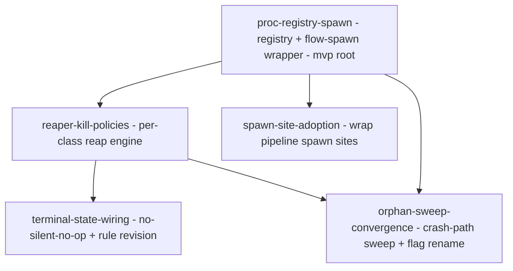

# Epic design: process-lifecycle registry and reaper

## 1. Problem & intent

**Goal:** Every process a flow pipeline spawns is tracked at launch and provably closed at terminal state, with failures surfaced instead of swallowed.

Pipelines leak processes. Two measured shapes: chrome-devtools-mcp servers plus their Chrome instances (25 leaked server pairs on this host before PR #491), and toolchain processes — vitest/node/npm/dev-servers/backgrounded helpers (33 in-session toolchain processes across 10 live claude sessions, 2026-07-31) that leak once their session dies and they reparent to PPID 1.

The current contract — point-of-use teardown plus PR #491's ancestry-based `flow-browser-teardown` (`bin/flow-browser-teardown.ts`) — has two structural blind spots:

- **Ancestry cannot see a reparented process.** A PPID walk stops working the moment the parent dies and the child reparents to PPID 1 — the *common* leak shape.
- **Identity-by-name is dangerous for generic argv0s.** `node`/`npm`/`bun` command lines are indistinguishable by name; a substring match in `flow-browser-teardown` was caught live SIGTERMing an unrelated in-session `sleep` and its own invoking shell (fixed in `ab80be2` by argv-position anchoring — see the `isMcpServerCommand` doc comment).

A third failure was observed live: the `|| true` on the terminal-state `flow-browser-teardown` call sites hid a real leak (helper missing from PATH → Chrome and its MCP server survived a gated terminal state with zero signal). The reaper must never silently no-op.

The job to be done is not "kill orphans harder" — it is *identity at launch*: record who was spawned, in a channel that survives reparenting (a process group + a registry row), so teardown becomes a lookup instead of a forensic reconstruction. This epic **extends** `flow-browser-teardown`, `bin/lib/liveness.ts` (`pidStartEpoch`), and the 8 terminal-state wiring sites in `skills/pipeline/flow-pipeline/SKILL.md` — it builds no parallel teardown helper.

## 2. Clarified requirements

Epic-level EARS acceptance criteria:

- WHEN a pipeline launches a subprocess through the launch wrapper THE SYSTEM SHALL start it in its own fresh process group and append a registry row `{pgid, pid, startEpoch, slug, class, argv}` to `~/.flow/state/procs/<slug>.jsonl` (externally failable: spawn a sleeper via the wrapper, assert `pgid == pid` via `ps -o pgid=` and the JSONL row exists and parses).
- WHEN the reaper runs for a slug THE SYSTEM SHALL, for each live registered row whose `startEpoch` still matches the live process, apply the row's class kill policy — default class: SIGTERM → bounded wait → SIGKILL on `-pgid`; `mcp-server` class: SIGTERM to the server pid only, never the group, never escalated (failable: unit tests over an injected proc table + a live sleeper-tree test asserting the whole subtree exits).
- WHEN a registered pid has exited or its `startEpoch` no longer matches THE SYSTEM SHALL skip it without signalling anything (pid-reuse guard; failable: unit test with a mismatched-epoch fixture asserts zero kill calls).
- WHEN a terminal-state reap fails to run (helper missing, non-zero exit, malformed output) THE SYSTEM SHALL surface the failure in the terminal-state output the user reads and record it durably, instead of `|| true`-swallowing it (failable: rename the helper off PATH in a test harness, assert the failure marker appears).
- WHEN the orphan sweep runs THE SYSTEM SHALL select registry rows whose recording session is dead (session pid+startEpoch liveness), report them, and signal them only with explicit confirmation (`--yes`), report-only otherwise (failable: fixture registry with a dead session pid).
- WHEN a process was spawned outside the wrapper (registry miss) THE SYSTEM SHALL fall back to the existing ancestry walk for the mcp-server surface, not silently skip (failable: teardown test with an empty registry still finds the in-session server).
- WHEN a user runs the process-orphan sweep and the state-file sweep THE SYSTEM SHALL present them under non-colliding flag/command names (today `flow done --orphans` sweeps state files while `flow-browser-teardown --orphans` sweeps processes — same flag, unrelated sweeps).

Before → after behavioral contrast:

| Surface | Before | After |
|---|---|---|
| Subprocess launch | Ad-hoc `Bash`/`Bun.spawn`, shares the caller's process group, no record | `flow-spawn` wrapper: own pgid, JSONL registry row |
| Terminal-state teardown | `flow-browser-teardown --json \|\| true` (MCP server only; silent on failure) | Registry-driven reap of all classes; browser-teardown demoted to registry-miss fallback; failure surfaced and recorded |
| Reparented (PPID 1) leak | Invisible to ancestry walk | Reaped via `kill(-pgid)` from the registry row, which survives reparenting |
| Crash-path orphans | `--orphans` heuristic sweep by command-line shape only | Registry rows with dead recording sessions swept deterministically; shape heuristics remain for unregistered strays |
| Sweep flag names | `flow done --orphans` vs `flow-browser-teardown --orphans` collide | Converged/renamed, one documented surface |

**Lost:** the `|| true` never-blocks guarantee at terminal-state call sites is narrowed — the reaper still never *blocks* a terminal state, but its failure is now loud and recorded rather than invisible; and the AGENTS.md standing rule "cleanup happens at point-of-use, not via a swept safety net" is revised (user-authorized) to admit the registry+sweep layer.

## 3. High-level design

ADR-shaped decisions — this list IS the Parnas volatile-decision list; each is a candidate feature boundary.

**D1 — Identity channel: process group + on-disk registry, not ancestry or env labels.**
Context: ancestry dies with the parent; macOS `ps -E` env reading is unreliable (measured); open-fd labels mark only the root of a tree. Verified on this host: `Bun.spawn(cmd, {detached:true})` and Node `spawn(..., {detached:true})` both yield `child pgid == child pid`, and `kill(-pgid)` reaps the whole subtree even after reparenting.
Decision: a `flow-spawn` launch wrapper puts each subprocess in its own fresh process group and appends `{pgid, pid, startEpoch, slug, class, argv}` to `~/.flow/state/procs/<slug>.jsonl` (append-only JSONL; one row per launch; consistent with the "no database" rule — markdown/JSON state files only).
Consequences: teardown is a registry lookup; pid/pgid reuse is closed by re-verifying `startEpoch` (extending `bin/lib/liveness.ts`'s `pidStartEpoch`) before any signal. Cost: only wrapped launches are covered — unwrapped spawns need the fallback (D3). Concurrent wrapper invocations append under an advisory `flock` (or O_APPEND single-write rows ≤ PIPE_BUF) so parallel launches cannot interleave malformed JSONL.

**D2 — Per-class kill policy, encoded in the registry row.**
Context: one signal discipline does not fit all. The MCP server must receive SIGTERM to its own pid only — only its `shutdown()` closes Chrome cleanly; group-killing or SIGKILL orphans Chrome (the exact PR #491 failure mode). Test runners/dev servers/helpers want the opposite: TERM → wait → KILL on the whole group so grandchildren die too.
Decision: `class` is recorded at spawn time; the reaper dispatches policy by class: `default` = TERM → bounded wait → KILL on `-pgid`; `mcp-server` = SIGTERM to pid only, never the group, never escalated.
Consequences: policy lives in data, not call sites; adding a class (e.g. a future `dev-server` graceful-stop hook) is a row-schema addition, not new kill code. The TERM→KILL wait is strictly bounded; a process that survives SIGKILL (uninterruptible sleep) is recorded as a zombie in the reap's JSON result and the pipeline proceeds — the failure-surfacing shape (D4) makes it loud.

**D3 — Ancestry walk demotes to registry-miss fallback; browser-teardown is extended, not duplicated.**
Context: the MCP server is spawned by the Claude Code harness, not by flow, so `flow-spawn` cannot wrap it at launch — its registry coverage is inherently post-hoc or absent. `flow-browser-teardown`'s ancestry walk plus `isMcpServerCommand` (argv-position-anchored) is proven and merged.
Decision: the reaper consumes the registry first; for the mcp-server surface it invokes the existing ancestry path as the fallback and **registers what it finds post-hoc** (an ancestry hit writes an `mcp-server` registry row), so a server discovered in-session survives into the registry even if the session later dies and reparenting blinds the ancestry walk. No parallel teardown helper is built; new logic lands in `flow-browser-teardown.ts` / shared `bin/lib/` modules.
Consequences: coverage is layered — registry (survives reparenting) → ancestry (in-session, unregistered) → shape-heuristic orphan sweep (crashed sessions, unregistered).

**D4 — No silent no-op: failure surfacing replaces `|| true`.**
Context: the live gated-state leak was caused by `|| true` masking a missing helper.
Decision: terminal-state call sites invoke the reap through a shape that (a) never blocks the terminal transition, but (b) emits a visible failure marker in the gate/terminal summary and records the failure durably (state.json or a `.flow-tmp` artifact) when the reap did not run or did not exit clean.
Consequences: a leak caused by infrastructure failure is now a signal, not silence; the 8 SKILL.md wiring sites change in one sweep, plus `skill-md-lint` enforcement so a future site cannot regress to bare `|| true`.

**D5 — Crash-path sweep keyed on recording-session liveness; `--orphans` collision resolved.**
Context: a crashed session leaves registry rows behind; those rows are the deterministic complement to the shape-heuristic `--orphans` sweep. Separately, `flow done --orphans` (state files) and `flow-browser-teardown --orphans` (processes) collide on a flag name for unrelated sweeps.
Decision: the sweep selects rows whose recording session (session pid + startEpoch, via `bin/lib/session-identity.ts` / `liveness.ts`) is dead; report-only unless `--yes`; never touches a row whose session is alive (never signal a sibling session's processes). Converge the user-facing sweep surfaces under one documented command shape (recommended: a `flow reap` verb hosting process sweeps, leaving `flow done --orphans` for state files — final naming is a feature-level decision).
Consequences: crashed-session leaks are reaped without shape guessing; the flag collision becomes a doc'd, non-ambiguous surface.

**D6 — Standing-rule revision (user-authorized).**
Context: AGENTS.md "Don't leave spawned resources running" and SKILL.md's "cleanup happens at the point of use" framing partially contradict a registry+sweep design.
Decision: revise the rule to a layered contract — point-of-use teardown remains the first line; the registry+reaper is the guaranteed backstop; the sweep is the crash-path safety net — landing with the wiring feature so docs and behavior change together.
Consequences: future agents stop treating the sweep as forbidden; the rule text names all three layers and their precedence.

## 4. Feature decomposition

Walking-skeleton root: **F1** — the registry and wrapper are the seam every other feature hangs off; it is mergeable alone (pure additive helper + lib, no behavior change to existing pipelines).

| id | Feature | Hides (volatile decision) | Consumes → produces |
|---|---|---|---|
| `proc-registry-spawn` (F1, mvp) | `flow-spawn` wrapper + `bin/lib/proc-registry.ts` (row schema, JSONL append/read, own-pgid launch, `startEpoch` capture) | D1 (identity channel & row schema) | produces: registry file format, `flow-spawn` CLI, `proc-registry` lib API |
| `reaper-kill-policies` (F2) | reap engine: per-class policy dispatch, startEpoch verification, TERM→wait→KILL on `-pgid`, mcp-server pid-only rule, `--dry-run`/`--json`; extends `flow-browser-teardown.ts`/shared lib, ancestry demoted to registry-miss fallback | D2 + D3 (kill policy encoding; fallback layering) | consumes: F1's registry lib + row schema. produces: `flow-reap` reap API/CLI with typed JSON result |
| `spawn-site-adoption` (F3) | routing pipeline spawn sites through the wrapper: ui-smoke/ui-validation dev-server launches, backgrounded `flow-ci-wait`, verify/test-runner launches where the skill (not the harness) owns the spawn; class assignment per site | D1's *adoption* surface (which sites can be wrapped; harness-owned spawns cannot) | consumes: F1's `flow-spawn` CLI contract. produces: registry rows during real pipelines |
| `terminal-state-wiring` (F4) | replacing the 8 `flow-browser-teardown --json \|\| true` SKILL.md sites with the failure-surfacing reap invocation; durable failure record; `skill-md-lint` guard against bare `\|\| true` regression; AGENTS.md/SKILL.md standing-rule revision (D6) | D4 (failure-surfacing shape) + D6 (rule text) | consumes: F2's reap CLI + JSON result shape. produces: revised standing-rule text, lint rule |
| `orphan-sweep-convergence` (F5) | crash-path sweep of dead-session registry rows; convergence/rename of the colliding `--orphans` surfaces; docs for the layered cleanup contract's sweep tier | D5 (sweep selection criterion & command naming) | consumes: F1's registry format + F2's kill-policy engine. produces: one documented sweep surface |

Rationale notes:

- F3 and F4 are split because they change in different places for different reasons: F3 is producer-side (spawn sites, mostly skill prose + helper flags), F4 is consumer-side (terminal-state runbook blocks + lint + rule text). F4 does **not** depend on F3 — the reap is correct over an empty registry (falls through to the ancestry fallback), so the two can land in either order after F2.
- Every kill-path change (F2, F4, F5) is destructive-action code: strictest review lens, report-only/dry-run first on the live host, never signal a sibling session's processes. Contrived validation pipelines run in `~/code/me/pokemon` with `--no-auto-merge` and MUST NOT merge.

## 5. Dependency DAG

## 6. Open Questions

- **Registry file lifecycle.** Assumed `~/.flow/state/procs/<slug>.jsonl` is pruned when its rows' processes are confirmed dead (reap-time compaction) and the file removed alongside `flow done` state cleanup, rather than growing forever. **Recommended:** compact on reap, delete on state cleanup — mirrors the existing `~/.flow/state/<slug>.json` lifecycle and keeps `flow done --orphans` semantics coherent.
- **Harness-owned spawns (the MCP server, claude's own children) cannot be wrapped.** Assumed the mcp-server class stays ancestry-first (D3) with optional post-hoc registration when the reaper observes it, rather than attempting to intercept the harness's spawn. **Recommended:** ancestry-first for mcp-server — the harness owns that launch; intercepting it is out of flow's control surface.
- **`--orphans` convergence shape.** The epic scope requires resolving the collision but not how. **Recommended:** host process sweeps under a `flow reap [--orphans] [--yes]` verb (with `flow-browser-teardown --orphans` delegating or deprecating), leaving `flow done --orphans` untouched for state files — renaming the state-file flag would break the documented `flow done` surface for no leak-related gain. Final call is F5's plan-review decision.
- **Vitest processes spawned by `flow-pre-commit` inside the session.** Assumed in-scope only where flow owns the spawn (F3 wraps `flow-pre-commit`'s own child launches or records them via the lib, not the user's manual `npm run test`). **Recommended:** wrap at the helper layer (`flow-pre-commit`, `flow-ci-wait`, ui-smoke launcher) — the skill prose never spawns directly, helpers do, so adoption is a code change, not a prose contract.
- **Never-blocks vs never-silent tension at terminal states (D4).** Assumed the reap still must not block a terminal transition; failure is surfaced in the gate summary and recorded, not turned into a hard stop. **Recommended:** never-block + loud marker — a leak is recoverable, a wedged terminal state is worse.
- **Scope of the AGENTS.md rule rewrite (D6).** User authorized revision "where it makes sense". Assumed a targeted rewrite of the "Don't leave spawned resources running" bullet plus SKILL.md's "Resource cleanup" section into the three-layer contract, not a broader doc overhaul. **Recommended:** targeted — lands in F4 alongside the behavior it describes.
- **Dev-server PORT allocation** is confirmed out of scope ({{PORT_*}} sentinels cover it; allocation is not cleanup) — nothing in the decomposition found it load-bearing.

## Decision analysis

Fork: **wire terminal states before or after spawn-site adoption (F4 vs F3 ordering), or fuse them into one feature?** Branches are complementary, not exclusive. (a) Fused F3+F4: one PR touching 8 runbook blocks, multiple helpers, lint, and rule text — too large for one coherent review of destructive-action code. (b) F4-before-F3: terminal states get failure surfacing immediately (fixes the observed `|| true` leak class) while the registry is still sparsely populated; reap degrades gracefully to the ancestry fallback. (c) F3-before-F4: registry fills first but the silent-no-op hole stays open longer. Ranking: split with no F3↔F4 edge (b/c order-free) > fused. Verdict: split, order-free — feeds `Proceed`.

### Cross-model review (AGY)

Deep review ran with two reviewers; the Opus reviewer's output truncated before producing findings, so the convergence rule does not apply — each Gemini point was weighed as input:

- **Post-hoc registration of the harness-owned MCP server** — **accepted.** D3's "optionally registers what it finds post-hoc" was firmed to a requirement: an ancestry hit writes an `mcp-server` registry row, so the canonical leak vector gains registry coverage that survives reparenting.
- **Concurrent JSONL append corruption** — **accepted.** D1 now specifies `flock`/atomic-append discipline for parallel wrapper invocations.
- **Un-killable zombie (survives SIGKILL)** — **accepted.** D2 now bounds the wait and records a zombie marker in the reap result rather than hanging.
- **Block the terminal transition on reap failure** — **overridden.** The settled requirement is never-block + loud marker: a wedged terminal state (blocked merge waiting on a stuck dev server) is strictly worse than a surfaced, recorded leak, and the no-silent-no-op contract already makes the failure actionable.
- **Auto-kill dead-session orphans without `--yes`** — **overridden.** Live-host discipline for this epic mandates report-only-first for every new kill path and never signalling sibling sessions; loosening the confirmation gate is a candidate follow-up after the sweep's dead-session detection has field history, not a v1 default.
- **IPC/fd-heartbeat (or flock-based) self-termination as a dominant alternative** — **overridden.** Both require the child to cooperate (watch an fd/lock and exit on EOF); vitest, npm, dev servers, Chrome, and the MCP server are third-party processes that will not. The registry+pgid design works for non-cooperative processes, which is the actual population.
- **Cut the per-class kill policy as dead code** — **overridden.** Its premise (no `mcp-server` rows ever reach the registry) is removed by the accepted post-hoc registration point, and pid-only-SIGTERM for the MCP server is a settled, evidence-backed input (group-kill orphans Chrome — the PR #491 failure mode).

## Recommendation

Proceed — the leak evidence is measured, the mechanism (own-pgid + registry + startEpoch) is host-verified, and the decomposition extends merged PR #491 code rather than duplicating it.

## Plan risks

The weakest assumption is that all meaningful non-MCP leaks flow through spawn sites flow itself owns (F3's helper-layer adoption); if the dominant leak source turns out to be harness-owned or Bash-tool-launched processes that `flow-spawn` can never wrap, the registry's coverage — and with it F4/F5's value — shrinks to the sweep heuristics we already have.
