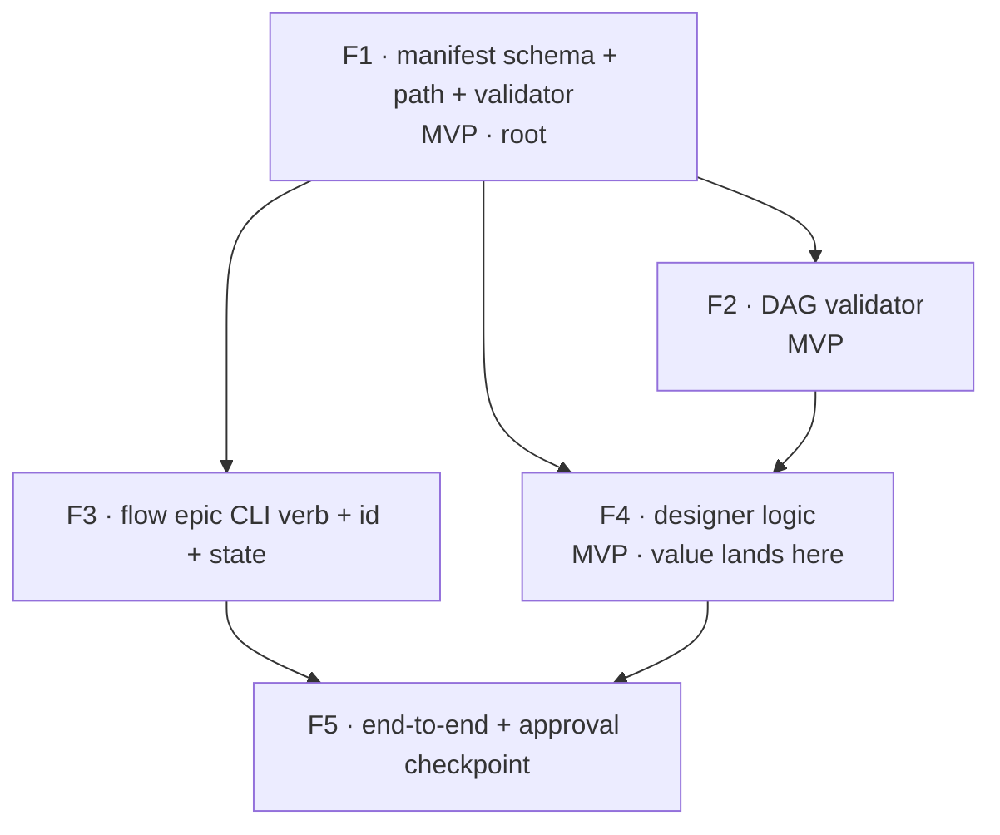

# Build plan — implementing the epic designer

> **The recursion, made literal.** The thing being designed decomposes an epic into a dependency DAG of PR-sized features. So this build plan _is_ that artifact, applied to the epic **"build the epic designer."** It is written in the exact two-part shape `02-design-spec.md` §5 prescribes — a human-facing `design.md` (this document) plus an embedded machine-facing `manifest.json` (the fenced block in §B). The decomposition obeys the same rules it specifies (`02` §6) and the embedded manifest is constructed to pass the very validators it plans (`02` §7: acyclic, no orphan edges, unique ids). **If this DAG were a flat list, the methodology would have failed its own test.** It is not: it has a walking-skeleton root, a parallel pair, a core-value feature, and a diamond-closing integration.

---

## 1. Problem & intent

flow can design _one feature_ (`/product-planning`) and execute _one feature_ (`/flow-pipeline`). It has no way to take a body of work larger than one PR — an "epic" — and turn it into a reviewed, dependency-ordered set of PR-sized features. Today the developer decomposes by hand and runs `flow new` N times, sequencing the features in their head. The underlying need is **a trustworthy decomposition**: a high-level design plus a feature DAG, reviewed once, that each existing per-feature pipeline can then build. (Orchestrating the _execution_ of that DAG is explicitly deferred and out of scope — see `02` §0.)

## 2. Clarified requirements (EARS acceptance criteria)

- **R1** — WHEN the developer runs the designer on an epic prompt THE SYSTEM SHALL emit a committed `design.md` and a schema-valid `manifest.json` under `.flow/epics/<epic-slug>/`, then stop (no launch, no merge).
- **R2** — WHEN the designer emits a `manifest.json` THE SYSTEM SHALL guarantee its feature graph is acyclic and free of orphan dependency edges (validated mechanically, not by inspection).
- **R3** — WHEN the epic prompt contains a material ambiguity (one whose answer changes the feature set or DAG shape) THE SYSTEM SHALL ask one bounded round of clarifying questions before decomposing; WHEN it contains none THE SYSTEM SHALL proceed autonomously and surface residual assumptions as Open Questions.
- **R4** — WHEN the design is emitted THE SYSTEM SHALL present it at an approval checkpoint and SHALL NOT proceed to any execution.
- **R5** — WHEN any feature in the manifest is later handed to `flow new` THE SYSTEM SHALL have given it a self-contained description sufficient to run one standard pipeline.

## 3. High-level design — key decisions (ADR-shaped; each is a Parnas "secret")

Per `02` §4, the design artifact's decisions _are_ the list of likely-to-change decisions that become feature boundaries. Five decisions, five secrets, five features:

- **D1 — Manifest shape & storage path.** _Context:_ every other piece reads or writes the manifest. _Decision:_ a typed `manifest.json` (mirroring `bin/lib/state.ts` + the four `*-schema.ts` validators) committed under `.flow/epics/<slug>/`. _Consequence:_ the shape is the most-depended-on contract, so it is the root feature; changing it later ripples, which is exactly why it is hidden behind a schema + validator. → **F1**
- **D2 — DAG correctness algorithm.** _Context:_ a decomposition is only trustworthy if the graph is provably well-formed. _Decision:_ a pure Kahn's-algorithm helper (acyclic / orphan / ready-set), unit-tested in isolation. _Consequence:_ the graph-theory choice is hidden from everything else behind a `--validate` CLI. → **F2**
- **D3 — CLI surface & epic identity.** _Context:_ the designer needs an invocation verb and a stable id for the future `run`/`status`. _Decision:_ a `flow epic` verb (`bin/lib/epic.ts` + `verbs.ts` + dispatch + completion) minting an epic-id via the existing `slug.ts`. _Consequence:_ CLI wiring and id/state storage are hidden behind one verb module. → **F3**
- **D4 — The design methodology itself.** _Context:_ turning a prompt into requirements + design + a decomposition is the actual intelligence. _Decision:_ an epic-grain extension of `/product-planning`'s discovery implementing pipeline ① (`02` §4) — hybrid clarify (`02` §3), EARS criteria, Parnas/Simon vertical-slice decomposition (`02` §6), Mermaid DAG, Open Questions. _Consequence:_ the methodology is the most volatile part (it will be tuned often), so it is isolated in one skill/discovery surface that emits the stable manifest contract. → **F4**
- **D5 — End-to-end flow & the human checkpoint.** _Context:_ the pieces must compose into `flow epic design "<prompt>"` with a review gate. _Decision:_ wire CLI → designer → validators → an `epic-design-pending-review` checkpoint mirroring `plan-pending-review`. _Consequence:_ the approval contract is hidden behind the integration feature, which closes the DAG. → **F5**

**Why these cuts (Parnas + Simon, `01` §Headline):** each feature hides exactly one volatile decision (D1–D5); the edges between them are the _stable_ interfaces (the manifest shape, the validator CLI, the verb surface). Inter-feature coupling is sparse by construction — every edge is a concrete produced/consumed artifact, never a "feels-later" — so each feature is independently buildable in the near-decomposable sense.

## 4. Feature decomposition

Five features. Each is one `flow new` pipeline / one PR, sized per `02` §6 (vertical slice, passes its own gate, 1 cohesive review). For each: the secret it hides, its dependency edges (with the concrete artifact on each edge), and EARS acceptance criteria.

### F1 · `epic-manifest-schema` — manifest schema + path contract + validator **[MVP · walking-skeleton root]**

- **Secret hidden (D1):** the shape of epic/feature data and where artifacts live.
- **Depends on:** nothing (root).
- **Produces (edge artifacts consumed downstream):** `bin/lib/epic-manifest-schema.ts` (`EpicManifest`/`Feature` types + `isEpicManifest` type guard, mirroring `state.ts`); a bare-name CLI validator added to `discoverValidators` (mirroring the four existing `*-schema.ts` validators); the path contract `.flow/epics/<slug>/{design.md,manifest.json}`; `bin/lib/epic-manifest-schema.test.ts`.
- **Acceptance:** WHEN given a well-formed manifest THE SYSTEM SHALL exit 0 and print `{ok:true}`; WHEN given a malformed manifest THE SYSTEM SHALL exit non-zero with a reason; `npm run test -- bin/lib/epic-manifest-schema.test.ts` passes.
- **Skill:** `testing` (helper authoring). **Size:** small–medium.

### F2 · `epic-dag-validator` — acyclic / orphan / ready-set helper **[MVP]**

- **Secret hidden (D2):** the graph algorithm for DAG correctness.
- **Depends on:** **F1** — _edge artifact: the `Feature[]` / `dependsOn` shape it operates over._
- **Produces:** `bin/flow-epic-dag.ts` (pure functions: cycle detection, orphan-edge check, unique-id/self-dep check, Kahn ready-set; `--validate` exits non-zero naming the offending cycle/edge); `bin/flow-epic-dag.test.ts` covering empty, linear chain, diamond, disconnected components, cycle, and orphan-edge cases.
- **Acceptance:** WHEN given an acyclic orphan-free manifest THE SYSTEM SHALL exit 0; WHEN given a cycle THE SYSTEM SHALL exit non-zero and name the cycle; WHEN given a `dependsOn` referencing an absent id THE SYSTEM SHALL exit non-zero; `bun bin/flow-epic-dag.test.ts` passes.
- **Skill:** `testing`. **Size:** small–medium.

### F3 · `epic-cli-verb` — `flow epic` verb + epic-id + epic state

- **Secret hidden (D3):** CLI invocation surface + epic identity/state storage.
- **Depends on:** **F1** — _edge artifact: the manifest/path contract it reads and writes._
- **Produces:** `"epic"` in `bin/lib/verbs.ts`; `bin/lib/epic.ts` (`runEpicCli` dispatching `design`/`run`/`status`/`ls`, where `run`/`status`/`ls` are out-of-scope stubs that print "deferred — orchestrator phase"); epic-id minting via `slug.ts`; minimal epic-state read/write; a `runVerb` case in `bin/flow`; completion entries; tests.
- **Acceptance:** WHEN `flow epic --help` runs THE SYSTEM SHALL print usage and exit 0; WHEN `flow epic design --help` runs THE SYSTEM SHALL short-circuit before any side effect (mirror the `flow new --help` guard); WHEN two epics are minted from colliding prompts THE SYSTEM SHALL produce distinct ids (slug `task-<hash>` fallback); the completion-parity test (which imports `VERBS`) passes.
- **Skill:** `testing` (CLI wiring). **Size:** medium. **Note:** independently mergeable — ships the verb skeleton even before the designer logic exists; `design` is wired to the brain in F5.

### F4 · `designer-logic` — epic-grain discovery → design.md + manifest.json **[MVP · first real user value]**

- **Secret hidden (D4):** the design methodology (prompt → requirements → design → decomposition → DAG).
- **Depends on:** **F1** — _edge artifact: it must emit a schema-valid manifest;_ and **F2** — _edge artifact: it self-checks its own DAG before writing._
- **Produces:** the epic-design discovery extension (extend `skills/pipeline/product-planning/references/discovery-instructions.md`, or a sibling `epic-design` skill that reuses discovery) implementing `02` §4 pipeline ①: the materiality-gated hybrid clarification round (`02` §3, via `AskUserQuestion`), EARS acceptance criteria, ADR-shaped design decisions = the Parnas volatile-decision list, Parnas/Simon vertical-slice decomposition (`02` §6), a Mermaid DAG render, and Open Questions; writes `design.md` (six sections) + a schema-valid `manifest.json` to the F1 path, self-validating via F2.
- **Acceptance:** WHEN run on a sample epic prompt THE SYSTEM SHALL write a `design.md` containing all six sections AND a `manifest.json` that passes F1's validator (exit 0) and F2's DAG validator (exit 0); WHEN the produced decomposition is inspected THE SYSTEM SHALL show only vertical-slice features with produced/consumed edges (no horizontal layers, no vibe edges); WHEN a deliberately cyclic manifest is fed to the self-check THE SYSTEM SHALL refuse it.
- **Skill:** `product-planning` (reused/extended). **Size:** large but cohesive (it is the methodology). **Possible sub-split if it proves too big:** ship "prompt → design.md + manifest (autonomous)" first, add the hybrid clarification round second — a _vertical_ re-cut (each still emits valid artifacts), never a horizontal one.
- **MVP marker:** **F1 + F2 + F4 is the minimal valuable designer** — invokable as a skill, producing a reviewed, validated decomposition, before any `flow epic` CLI ergonomics exist.

### F5 · `epic-design-end-to-end` — `flow epic design` + approval checkpoint

- **Secret hidden (D5):** the end-to-end invocation + the human approval contract.
- **Depends on:** **F3** — _edge artifact: the `flow epic design` verb entry;_ and **F4** — _edge artifact: the designer that produces the artifacts._
- **Produces:** the wiring `flow epic design "<prompt>"` → mint id (F3) → run designer (F4) → write artifacts → run F1 + F2 validators as a gate → surface `design.md` at an `epic-design-pending-review` checkpoint (mirror `plan-pending-review`: approve / redirect / cancel); tests for the end-to-end happy path + the redirect path.
- **Acceptance:** WHEN `flow epic design "<sample epic>"` runs THE SYSTEM SHALL write committed `design.md` + `manifest.json`, pass both validators, and halt at the approval checkpoint without launching or merging anything; WHEN the developer redirects at the checkpoint THE SYSTEM SHALL re-run the designer with the redirect appended; WHEN approved THE SYSTEM SHALL stop (handing off to the deferred orchestrator is out of scope).
- **Skill:** `testing` / `flow-pipeline` patterns (CLI + checkpoint wiring). **Size:** medium.

## 5. Dependency DAG



- **Topological build order:** `F1 → (F2 ∥ F3) → F4 → F5`. After F1, **F2 and F3 are independent and can be built in parallel** (Simon near-decomposability: no edge between them).
- **MVP path (thinnest valuable slice):** `F1 → F2 → F4`. Ships a manually-invokable designer that produces a reviewed, mechanically-validated decomposition. **F3 + F5 add CLI ergonomics and the formal checkpoint** — in scope, but the core value lands at F4.
- **DAG well-formedness (the recursion's self-check):** 5 nodes, 6 edges, every `dependsOn` id resolves (no orphans), no cycle (the topo order proves it), no node disconnected. This is exactly what F2 would assert about the manifest in §B.

## 6. Open Questions (for the approval checkpoint)

- **F4 surface — extend `/product-planning` vs a sibling `epic-design` skill?** Recommended: extend discovery-instructions with an epic-grain mode (maximizes reuse per `02` §1), but a sibling skill is cleaner if the epic prompts diverge enough. Decide at F4 kickoff.
- **F3 `run`/`status`/`ls` stubs — ship as visible "deferred" stubs, or omit until the orchestrator phase?** Recommended: ship as loud `deferred` stubs so the verb surface is coherent and the seam (`02` §10) is visible; omitting risks a confusing partial verb.
- **`design.md` requirements section depth.** EARS criteria for an _epic_ are coarser than for a feature; confirm the granularity (epic-level acceptance vs per-feature acceptance living in the manifest) at F4.

---

## §B. Embedded `manifest.json` (the machine artifact — dogfooding proof)

This is the same build plan as a schema-valid manifest in the `02` §5 shape — the literal output the designer would emit for the epic "build the epic designer." It is constructed to pass F1 (schema) and F2 (acyclic, no orphan edges, unique ids).

```json
{
  "epicId": "build-the-epic-designer",
  "prompt": "Build the epic designer: flow's epic-layer design phase that turns an epic prompt into a reviewed design + a dependency DAG of PR-sized features, then stops.",
  "createdAt": "2026-06-19T00:00:00Z",
  "features": [
    {
      "id": "f1-manifest-schema",
      "title": "Epic manifest schema + path contract + validator",
      "description": "Add bin/lib/epic-manifest-schema.ts (EpicManifest/Feature types + isEpicManifest guard, mirroring state.ts), a bare-name CLI validator wired into discoverValidators, the .flow/epics/<slug>/ path contract, and tests.",
      "dependsOn": [],
      "rationale": "Hides D1 (manifest shape + storage path) — the most-depended-on contract; the walking-skeleton root.",
      "acceptanceCriteria": [
        "WHEN given a well-formed manifest THE SYSTEM SHALL exit 0",
        "WHEN given a malformed manifest THE SYSTEM SHALL exit non-zero with a reason"
      ],
      "flowNewHints": { "copilotReview": "auto", "effort": "medium" },
      "mvp": true
    },
    {
      "id": "f2-dag-validator",
      "title": "DAG validation helper (acyclic / orphan / ready-set)",
      "description": "Add bin/flow-epic-dag.ts — pure Kahn's-algorithm cycle detection, orphan-edge + unique-id checks, ready-set; --validate exits non-zero naming the offending cycle/edge; tests cover empty/linear/diamond/disconnected/cycle/orphan.",
      "dependsOn": ["f1-manifest-schema"],
      "rationale": "Hides D2 (graph-correctness algorithm); makes a decomposition mechanically trustworthy.",
      "acceptanceCriteria": [
        "WHEN given an acyclic orphan-free manifest THE SYSTEM SHALL exit 0",
        "WHEN given a cycle THE SYSTEM SHALL exit non-zero and name the cycle"
      ],
      "flowNewHints": { "copilotReview": "auto", "effort": "medium" },
      "mvp": true
    },
    {
      "id": "f3-epic-cli",
      "title": "flow epic CLI verb + epic-id + epic state",
      "description": "Add 'epic' to verbs.ts; bin/lib/epic.ts (runEpicCli dispatching design/run/status/ls, run/status/ls as deferred stubs); epic-id minting via slug.ts; runVerb case in bin/flow; completion entries; tests.",
      "dependsOn": ["f1-manifest-schema"],
      "rationale": "Hides D3 (CLI surface + epic identity/state); independently mergeable verb skeleton.",
      "acceptanceCriteria": [
        "WHEN flow epic design --help runs THE SYSTEM SHALL short-circuit before any side effect",
        "WHEN the completion-parity test runs THE SYSTEM SHALL pass"
      ],
      "flowNewHints": { "copilotReview": "auto", "effort": "medium" }
    },
    {
      "id": "f4-designer-logic",
      "title": "Epic-grain designer logic → design.md + manifest.json",
      "description": "Extend /product-planning discovery to epic grain: materiality-gated hybrid clarification round, EARS criteria, ADR-shaped decisions = Parnas volatile-decision list, Parnas/Simon vertical-slice decomposition, Mermaid DAG, Open Questions; emit schema-valid manifest.json + design.md, self-validating via the DAG helper.",
      "dependsOn": ["f1-manifest-schema", "f2-dag-validator"],
      "rationale": "Hides D4 (the design methodology) — the most volatile part, isolated behind the stable manifest contract; where MVP value lands.",
      "acceptanceCriteria": [
        "WHEN run on a sample epic prompt THE SYSTEM SHALL write a six-section design.md and a manifest.json passing both validators",
        "WHEN the decomposition is inspected THE SYSTEM SHALL contain only vertical-slice features with produced/consumed edges"
      ],
      "flowNewHints": { "copilotReview": "always", "effort": "high" },
      "mvp": true
    },
    {
      "id": "f5-end-to-end",
      "title": "flow epic design end-to-end + approval checkpoint",
      "description": "Wire flow epic design '<prompt>' → mint id (F3) → run designer (F4) → write artifacts → run F1+F2 validators as a gate → surface design.md at an epic-design-pending-review checkpoint (approve/redirect/cancel); stop (no execution).",
      "dependsOn": ["f3-epic-cli", "f4-designer-logic"],
      "rationale": "Hides D5 (end-to-end flow + human approval contract); the diamond-closing integration.",
      "acceptanceCriteria": [
        "WHEN flow epic design '<sample epic>' runs THE SYSTEM SHALL write committed artifacts, pass both validators, and halt at the checkpoint without launching or merging",
        "WHEN the developer redirects at the checkpoint THE SYSTEM SHALL re-run the designer with the redirect appended"
      ],
      "flowNewHints": { "copilotReview": "always", "effort": "high" }
    }
  ]
}
```

**Dogfooding verdict:** this manifest has 5 unique ids, 6 edges all resolving to existing ids (no orphans), and a valid topological order `f1 → {f2, f3} → f4 → f5` (no cycle) — so it would pass F1 and F2. The build plan for the designer is itself a well-formed instance of what the designer emits. The recursion closes.
